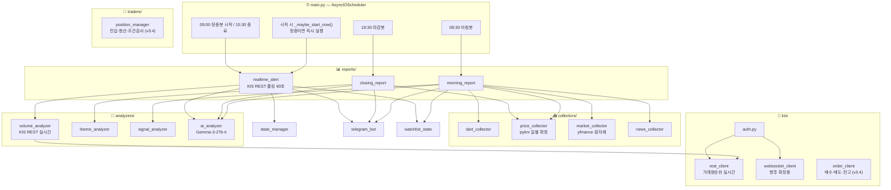

# 🇰🇷 한국주식 봇 — 아키텍처 설계 문서 v3.0

> **이 문서의 목적**: AI에게 유지보수 요청 시 반드시 이 문서를 첨부할 것.
> AI가 전체 구조를 파악하고 엉뚱한 파일을 건드리는 할루시네이션을 방지한다.

---

## 🚨 KIS WebSocket 운영 규칙 (위반 시 IP·앱키 차단)

> **출처**: 한국투자증권 Open API 공식 공지  
> **위반 결과**: IP 및 앱키 일시 차단 → 봇 전체 중단

### ✅ 정상 사용 흐름 (반드시 이 순서 준수)

```
연결 → 종목 구독 → 데이터 수신 → 불필요 종목 구독해제 → 연결 종료
```

### ❌ 절대 금지 패턴 (차단 대상)

```
비정상 케이스 1: 웹소켓 연결 후 종료를 바로 반복
   → websocket_client.py는 장 시작(09:00)에 한 번만 연결
     장 마감(15:30)에 한 번만 종료

비정상 케이스 2: 구독 후 수신 검증 없이 무한 등록/해제 반복
   → 종목 구독 후 반드시 ack 수신 확인 절차 포함
   → 구독/해제를 루프로 반복하는 코드 절대 금지
```

### kis/websocket_client.py 필수 구현 규칙

```python
class KISWebSocketClient:
    def __init__(self):
        self.connected = False
        self.subscribed_tickers = set()

    async def connect(self):
        if self.connected: return   # 이미 연결 시 즉시 return

    async def subscribe(self, ticker):
        if ticker in self.subscribed_tickers: return   # 중복 구독 금지
        await self._wait_for_ack(ticker)               # ack 대기 필수
        self.subscribed_tickers.add(ticker)

    async def disconnect(self):
        for ticker in list(self.subscribed_tickers):   # 전체 해제 후 종료
            await self.unsubscribe(ticker)
```

> **v2.5+ 참고**: 장중봇(realtime_alert.py)은 KIS WebSocket 미사용.
> KIS REST 거래량 순위 API 폴링 방식. websocket_client.py는 향후 확장용 보존.

---

## 📁 전체 파일 구조

```
korea_stock_bot/
│
├── ARCHITECTURE.md          ← 이 문서 (AI 유지보수 시 필수 첨부)
├── .env                     ← API 키 모음 (절대 공유 금지)
├── main.py                  ← AsyncIOScheduler 진입점 + 장중 재시작 감지
├── config.py                ← 모든 설정값 상수
├── requirements.txt
│
├── collectors/
│   ├── dart_collector.py    ← DART 공시 수집
│   ├── price_collector.py   ← pykrx 일별 확정 데이터 (마감 후 전용)
│   ├── market_collector.py  ← 미국증시(yfinance), 원자재
│   └── news_collector.py    ← 리포트·뉴스 (네이버 검색 API)
│
├── analyzers/
│   ├── volume_analyzer.py        ← 장중 급등 감지 (KIS REST 실시간) + T2 갭상승
│   ├── theme_analyzer.py         ← 테마 그룹핑, 순환매 소외도
│   ├── signal_analyzer.py        ← 신호 1~5
│   ├── ai_analyzer.py            ← Gemma-3-27b-it 2차 분석
│   ├── closing_strength.py       ← [v3.2] T5 마감 강도 트리거 (마감봇용, pykrx)
│   ├── volume_flat.py            ← [v3.2] T6 횡보 거래량 급증 (마감봇용, pykrx)
│   └── fund_inflow_analyzer.py   ← [v3.2] T3 시총 대비 자금유입 (마감봇용, pykrx)
│
├── notifiers/
│   └── telegram_bot.py      ← 텔레그램 포맷 + 발송
│
├── reports/
│   ├── morning_report.py    ← 아침봇 08:30
│   ├── closing_report.py    ← 마감봇 18:30
│   ├── realtime_alert.py    ← 장중봇 (KIS REST 폴링 60초)
│   └── weekly_report.py     ← [v3.3] 주간 성과 리포트 (월요일 08:45)
│
├── kis/
│   ├── auth.py              ← 토큰 발급·갱신 (실전 + v3.4 VTS 분리)
│   ├── websocket_client.py  ← 향후 확장용 보존 (현재 미사용)
│   ├── rest_client.py       ← 현재가, 거래량 순위 조회
│   └── order_client.py      ← [v3.4] 모의/실전 매수·매도·잔고 (Phase 4 신규)
│
└── utils/
    ├── logger.py
    ├── date_utils.py        ← is_market_open() 포함
    ├── state_manager.py     ← 쿨타임·중복 알림 방지
    ├── watchlist_state.py   ← 아침봇↔장중봇↔마감봇 WebSocket 워치리스트 공유 (v3.1/v3.2)
    └── rate_limiter.py      ← [v3.2] KIS API Rate Limiter (초당 19회 제한)
│
└── tracking/                ← [v3.3] Phase 3 DB + 성과 추적 패키지 (신규)
│   ├── db_schema.py         ← SQLite DDL + init_db() + get_conn()
│   ├── alert_recorder.py    ← 장중봇 알림 발송 시 DB 기록 (realtime_alert에서만 호출)
│   ├── performance_tracker.py ← 1/3/7일 수익률 추적 배치 + 주간 통계 조회
│   ├── ai_context.py        ← [v3.5] AI 프롬프트 컨텍스트 조회 전담 (Phase 5 신규)
│   └── principles_extractor.py ← [v3.5] 매매 원칙 추출 배치 (Phase 5 신규)
│
└── traders/                 ← [v3.4] Phase 4 자동매매 패키지 (신규)
    └── position_manager.py  ← 포지션 진입·청산·조건 검사 + DB 기록
```

---

## 🔗 파일 의존성 지도

```
파일명                     → 영향받는 파일
─────────────────────────────────────────────────────────────
config.py                 → 모든 파일
date_utils.py             → dart_collector, morning_report, closing_report, main
watchlist_state.py        → morning_report (write), realtime_alert (read)
state_manager.py          → realtime_alert
dart_collector.py         → morning_report, signal_analyzer
price_collector.py        → closing_report, morning_report, signal_analyzer
market_collector.py       → morning_report, signal_analyzer
news_collector.py         → morning_report, signal_analyzer
volume_analyzer.py        → realtime_alert
theme_analyzer.py         → closing_report, morning_report
signal_analyzer.py        → morning_report
ai_analyzer.py            → morning_report (analyze_dart + analyze_closing v2.4), closing_report, realtime_alert
telegram_bot.py           → morning_report, closing_report, realtime_alert
kis/auth.py               → kis/rest_client, kis/websocket_client
kis/rest_client.py        → volume_analyzer (거래량 순위 + 등락률 순위 + 시가 제공)
kis/websocket_client.py   → (향후 확장용 보존)
utils/rate_limiter.py     → kis/rest_client (API 호출 보호)
analyzers/closing_strength.py → reports/closing_report (T5 마감 강도)
analyzers/volume_flat.py  → reports/closing_report (T6 횡보 거래량)
analyzers/fund_inflow_analyzer.py → reports/closing_report (T3 시총 자금유입)
kis/order_client.py       → kis/auth (get_vts_access_token / get_access_token)
kis/order_client.py       → utils/rate_limiter (API 호출 보호)
traders/position_manager.py → tracking/db_schema (get_conn)
traders/position_manager.py → kis/order_client (buy, sell, get_current_price)
traders/position_manager.py → notifiers/telegram_bot (format_trade_executed, format_trade_closed)
traders/position_manager.py ← reports/realtime_alert (can_buy, open_position, check_exit)
traders/position_manager.py ← main.py (force_close_all 14:50 cron)
tracking/db_schema.py             → tracking/alert_recorder, tracking/performance_tracker
tracking/alert_recorder.py        ← reports/realtime_alert (유일 호출처)
tracking/performance_tracker.py   ← main.py (18:45 cron), reports/weekly_report
reports/weekly_report.py          ← main.py (월요일 08:45 cron)
reports/weekly_report.py          → tracking/performance_tracker, notifiers/telegram_bot
```

---

## 🗺️ 시스템 흐름도



---

## ⏱️ 봇별 실행 타임라인

```
[컨테이너 시작 시]
    _maybe_start_now() 즉시 호출
    → 현재 시각 09:00~15:30 AND 개장일 → start_realtime_bot() 즉시 실행
    → 그 외 시간 → 대기 (cron 스케줄에 위임)

07:00  KIS 토큰 갱신

08:30  ─── 아침봇 ────────────────────────────────────────────
       ① is_market_open() 확인
       ② dart_collector → 전날 공시
       ③ market_collector → 미국증시·원자재
       ④ news_collector → 리포트
       ⑤ price_collector → 전날 가격·수급 (pykrx 확정치)
       ⑥ signal_analyzer → 신호 1~5
       ⑦ ai_analyzer.analyze_dart() — 공시 호재/악재 점수화
       ⑦-b ai_analyzer.analyze_closing(price_data) — 신호4 AI 교체 (v2.4 신규)
           "상한가 순환매"/"KOSPI 급등 순환매" → 실제 테마명(바이오신약 등)
           실패 시 기존 신호4 유지 (graceful fallback)
       ⑧ theme_analyzer — AI 테마 기반 소외도 계산
       ⑨ morning_report 조립
       ⑩ telegram_bot 발송

09:00  ─── 장중봇 시작 ──────────────────────────────────────
       (컨테이너가 이미 장중에 있으면 시작 시 즉시 실행됨)
       asyncio.create_task(_poll_loop()) 백그라운드 시작
       ↓ POLL_INTERVAL_SEC(60초)마다:
           volume_analyzer.poll_all_markets()
               [v2.9 듀얼 소스 병합]
               → KIS REST get_volume_ranking("J"/"Q") 거래량 순위 각 30종목
                   대형주·테마 대장주 포착 (거래량 많은 종목)
               → KIS REST get_rate_ranking("J"/"Q")   등락률 순위 각 최대 30종목
                   [v3.0 개편] 코스닥: 노이즈전부제외 / 코스피: 중형+소형합산
                   등락률 0~10% 구간만 → 초기 급등 조기 포착
                   종목코드 필드 버그 수정 (stck_shrn_iscd)
               → 종목코드 기준 중복 제거 → 최대 60종목 델타 감지
               [v2.8 델타 기준 감지]
               → 첫 사이클: 워밍업 (스냅샷 저장만, 알림 없음)
               → 이후 사이클: 직전 poll 대비 1분간 변화량 판단
                 Δ등락률 ≥ PRICE_DELTA_MIN(1%) AND Δ거래량 ≥ VOLUME_DELTA_MIN(5%)
                 × CONFIRM_CANDLES(2)회 연속 충족 → 알림
               → 알림 포맷: 감지소스 배지 표시 (📊거래량포착 / 📈등락률포착)
               [v3.4 Phase 4 추가] AUTO_TRADE_ENABLED=true 시:
               position_manager.check_exit() — 익절/손절 조건 검사
               → TAKE_PROFIT_1(+5%) / TAKE_PROFIT_2(+10%) / STOP_LOSS(-3%) 충족 시
                 order_client.sell() → position_manager.close_position() → 텔레그램 청산 알림

           → can_alert() 쿨타임 확인
           → 1차 알림 즉시 발송
           → ai_analyzer.analyze_spike() 비동기
           → 2차 AI 알림
           [v3.5 Phase 5 추가] AI 판단 전 컨텍스트 주입:
           ai_context.build_spike_context(ticker, source) — 동기, run_in_executor
           → trigger_stats 뷰: 트리거별 7일 승률 (tracked >= 5건)
           → trading_history: 해당 종목 과거 거래 최대 3건 이력
           → trading_principles: confidence='high' 원칙 최대 3개
           → ai_analyzer.analyze_spike(analysis, ai_context=ctx) 에 주입
           → Gemma가 과거 데이터를 참고해 판단 정확도 향상

           [v3.4 Phase 4 추가] AUTO_TRADE_ENABLED=true + AI판단=='진짜급등' 시:
           등락률 3~10% 구간 필터 → position_manager.can_buy() 검사
           → order_client.buy() 매수 → position_manager.open_position() DB 기록
           → 텔레그램 매수 체결 알림
           ※ 10% 초과 종목: 추격 금지, 패스

03:00  ─── 매매 원칙 추출 (Phase 5, v3.5, 매주 일요일) ───────────
       principles_extractor.run_weekly_extraction()
       → trading_history 집계 → trigger_source별 승률 계산
       → trading_principles 신규 INSERT / 기존 UPDATE
       → win_rate >= 65% → confidence='high' (AI 프롬프트 주입 대상)
       → 텔레그램 원칙 DB 업데이트 요약 알림

14:50  ─── 강제청산 (Phase 4, v3.4) ─────────────────────────
       AUTO_TRADE_ENABLED=true 일 때만 실행
       position_manager.force_close_all()
       → positions 테이블에서 미청산 전종목 시장가 매도
       → trading_history UPDATE (close_reason="force_close")
       → 텔레그램 청산 알림 발송

15:30  ─── 장중봇 종료 ──────────────────────────────────────
       _poll_task.cancel()
       volume_analyzer.reset()
       state_manager.reset()

18:30  ─── 마감봇 ────────────────────────────────────────────
       price_collector → 마감 확정치
       ai_analyzer.analyze_closing()
       theme_analyzer → 순환매 지도
       [v3.2] closing_strength → T5 마감 강도 상위 종목   ← v3.6에서 dead code 복원
       [v3.2] volume_flat     → T6 횡보 거래량 급증 종목  ← v3.6에서 dead code 복원
       [v3.2] fund_inflow_analyzer → T3 시총 자금유입     ← v3.6에서 dead code 복원
       [v3.2] watchlist_state 보강: T5+T6 종목 → 내일 WebSocket 워치리스트 추가  ← v3.6 복원
       telegram_bot 발송 (T3/T5/T6 섹션 포함)

18:45  ─── 수익률 추적 배치 (Phase 3, v3.3) ────────────────────
       performance_tracker.run_batch()
       → done_Xd=0 미추적 행 조회 (1/3/7일 전 발송 알림)
       → pykrx 마감 확정치 전종목 종가 일괄 조회
       → 수익률 계산 → performance_tracker UPDATE
       → 트리거별 승률 로그 출력

매주 월요일 08:45  ─── 주간 성과 리포트 (Phase 3, v3.3) ────────
       performance_tracker.get_weekly_stats() → 지난 7일 DB 조회
       telegram_bot.format_weekly_report() → 메시지 포맷
       → 텔레그램 발송 (트리거별 승률 + 상위/하위 종목)

───────────────────── v3.1 방법B+A 하이브리드 ──────────────────────
08:30  아침봇 완료 후 ⑧ 추가:
       _build_ws_watchlist(price_data, signal_result)
         ① 전날 상한가 전체 (우선순위1)
         ② 전날 급등 상위 20 (우선순위2)
         ③ 기관 순매수 상위 10 (우선순위3)
         ④ 신호 관련종목 각 3개 (우선순위4)
       → 종목코드 기준 중복 제거 → 최대 50개 → watchlist_state 저장

09:00  장중봇 start() 에서 2개 Task 병렬 시작:

  [방법 B] WebSocket 고정 구독 (_ws_loop)
       ws_client.connect() → watchlist 50종목 subscribe (1회, 변경 없음)
       H0STCNT0 틱 수신 → volume_analyzer.analyze_ws_tick(tick, prdy_vol)
       조건: 누적 등락률 >= PRICE_CHANGE_MIN(3.0%)
       → 즉시(0초 지연) 알림

  [방법 A] REST 폴링 (_poll_loop) — 간격 30s→10s 단축
       기존 로직 동일 (Δ등락률+Δ거래량 기준)
       역할: 워치리스트 外 당일 신규 테마 종목 커버

  [쿨타임 공유] state_manager.can_alert() — WS/REST 공통 30분 쿨타임
       WS가 먼저 감지하면 REST는 30분간 같은 종목 알림 억제

15:30  ws_client.disconnect() → REST 폴링 cancel → watchlist_state.clear()
```

---

## 📦 파일별 핵심 규격

### config.py 상수 목록

```python
# v2.8: 델타 기준 (감지 조건)
PRICE_DELTA_MIN      = 1.0      # 1분간 최소 추가 등락률 (%)
VOLUME_DELTA_MIN     = 5        # 1분간 최소 추가 거래량 (전일 거래량 대비 %)
CONFIRM_CANDLES      = 2        # 연속 충족 횟수
POLL_INTERVAL_SEC    = 60       # KIS REST 폴링 간격 (초)
ALERT_COOLTIME_MIN   = 30       # 중복 알림 방지 쿨타임
WS_MAX_RECONNECT     = 3
WS_RECONNECT_DELAY   = 30

# deprecated v2.8 (하위 호환 보존만)
VOLUME_SPIKE_RATIO   = 10       # deprecated: 누적 거래량 배율
PRICE_CHANGE_MIN     = 3.0      # deprecated: 누적 등락률

# v3.2: KIS API Rate Limit (python-kis 스펙 참조)
KIS_RATE_LIMIT_REAL    = 19     # 초당 최대 호출 횟수 (실전)
KIS_RATE_LIMIT_VIRTUAL = 2      # 초당 최대 호출 횟수 (모의)
WS_RECONNECT_DELAY     = 5      # v3.2: 30초 → 5초 (무한 재연결 간격)

# v3.4: Phase 4 자동매매 설정
TRADING_MODE         = "VTS"          # "VTS"=모의 / "REAL"=실전 (환경변수 TRADING_MODE)
AUTO_TRADE_ENABLED   = False          # 기본 False (환경변수 AUTO_TRADE_ENABLED="true")
KIS_VTS_APP_KEY      = ...            # 환경변수 (없으면 KIS_APP_KEY 폴백)
KIS_VTS_APP_SECRET   = ...            # 환경변수 (없으면 KIS_APP_SECRET 폴백)
KIS_VTS_ACCOUNT_NO   = ...            # 환경변수 (없으면 KIS_ACCOUNT_NO 폴백)
KIS_VTS_ACCOUNT_CODE = "01"
POSITION_MAX         = 3              # 동시 보유 한도 (환경변수 POSITION_MAX)
POSITION_BUY_AMOUNT  = 1_000_000      # 1회 매수 금액 원 (환경변수 POSITION_BUY_AMOUNT)
TAKE_PROFIT_1        = 5.0            # 1차 익절 기준 (%)
TAKE_PROFIT_2        = 10.0           # 2차 익절 기준 (%)
STOP_LOSS            = -3.0           # 손절 기준 (%)
DAILY_LOSS_LIMIT     = -3.0           # 당일 누적 손실 한도 (%)
MIN_ENTRY_CHANGE     = 3.0            # 매수 진입 최소 등락률 (%)
MAX_ENTRY_CHANGE     = 10.0           # 추격 금지 상한 등락률 (%)
FORCE_CLOSE_TIME     = "14:50"        # 강제 청산 시각

# v3.2: Phase 2 트리거 임계값
GAP_UP_MIN             = 1.0    # T2 갭업 최소 비율 (%)
CLOSING_STRENGTH_MIN   = 0.75   # T5 마감 강도 최소값 (0~1)
CLOSING_STRENGTH_TOP_N = 7
VOLUME_FLAT_CHANGE_MAX = 5.0    # T6 횡보 인정 등락률 절대값 상한 (%)
VOLUME_FLAT_SURGE_MIN  = 50.0   # T6 거래량 급증 최소 비율 (%)
VOLUME_FLAT_TOP_N      = 7
FUND_INFLOW_CAP_MIN    = 100_000_000_000  # T3 최소 시가총액 (1000억)
FUND_INFLOW_TOP_N      = 7
```

### 반환값 규격 (인터페이스 계약)

```python
# rest_client.get_volume_ranking(market_code) → list[dict]
{"종목코드": str, "종목명": str, "현재가": int,
 "등락률": float, "누적거래량": int, "전일거래량": int}

# volume_analyzer.poll_all_markets() → list[dict]
{"종목코드": str, "종목명": str, "등락률": float,
 "직전대비": float,               # v2.8 신규: 1분간 추가 상승률 (핵심)
 "거래량배율": float,             # v2.8 변경: 1분간 Δvol / 전일거래량
 "조건충족": bool, "감지시각": str,
 "감지소스": str}                 # v2.9: "volume"(거래량)|"rate"(등락률) / v3.2: "gap_up"(T2 갭상승)

# dart_collector.collect() → list[dict]
{"종목명": str, "종목코드": str, "공시종류": str,
 "핵심내용": str, "공시시각": str, "신뢰도": str, "내부자여부": bool}

# price_collector.collect_daily() → dict
{"date": str, "kospi": dict, "kosdaq": dict,
 "upper_limit": list, "top_gainers": list, "top_losers": list,
 "institutional": list, "short_selling": list,
 "by_name": dict, "by_code": dict, "by_sector": dict}

# order_client.buy() → dict
{"success": bool, "order_no": str|None, "ticker": str, "name": str,
 "qty": int, "buy_price": int, "total_amt": int, "mode": str, "message": str}

# order_client.sell() → dict
{"success": bool, "order_no": str|None, "ticker": str, "name": str,
 "qty": int, "sell_price": int, "mode": str, "message": str}

# order_client.get_balance() → dict
{"holdings": list[{ticker,name,qty,avg_price,current_price,profit_rate}],
 "available_cash": int, "total_eval": int, "total_profit": float}

# position_manager.can_buy() → (bool, str)
(True, "OK") | (False, "사유 메시지")

# position_manager.close_position() → dict | None
{"ticker": str, "name": str, "buy_price": int, "sell_price": int,
 "qty": int, "profit_rate": float, "profit_amount": int, "reason": str, "mode": str}
```

### KIS REST API 구현 현황

```
tr_id            함수명                   용도
─────────────────────────────────────────────────
FHKST01010100    get_stock_price()        단일 종목 현재가
FHPST01710000    get_volume_ranking()     거래량 순위 (대형주·테마 대장주)
FHPST01700000    get_rate_ranking()       등락률 순위 (v2.9 신규 / v3.0 개편)
                                          코스닥: 모든 노이즈 제외, 등락률 0~10%
                                          코스피: 중형+소형 합산, 등락률 0~10%

[order_client.py — v3.4 신규]
VTTC0012U/TTTC0012U  buy()              시장가 매수 (VTS/REAL)
VTTC0011U/TTTC0011U  sell()             시장가 매도 (VTS/REAL)
VTTC8434R/TTTC8434R  get_balance()      잔고 조회  (VTS/REAL)

[Base URL 분기]
REAL: https://openapi.koreainvestment.com:9443
VTS:  https://openapivts.koreainvestment.com:29443
```

### 데이터 소스 선택 기준

```
데이터 종류          소스        이유
─────────────────────────────────────────────────────────
장중 실시간 시세     KIS REST    지연 없음, 공식 API
일별 확정 OHLCV     pykrx       마감 후 확정치 전용
기관/외인 수급       pykrx       일별 집계, 장중 의미 없음
미국증시/원자재      yfinance    KIS 미제공 영역
공시                DART API    공식 전용
```

### AI 모델

```
gemma-3-27b-it  14,400회/일  ✅ 채택
gemini-2.5-flash   20회/일   ❌ 부족
```

---

## ⚠️ 절대 금지 규칙

```
[KIS WebSocket — 차단 위험]
1. websocket_client.py 연결/종료 루프 금지
2. 구독/해제 반복 루프 금지
3. ack 없는 구독 금지
4. 장중 connect() 여러 번 호출 금지

[아키텍처]
5. collectors/ 에 분석 로직 금지
6. telegram_bot.py 에 분석 로직 금지
7. 반환값 key 변경 시 의존성 지도 확인 후 연결 파일 동시 수정
8. config.py 변수명 변경 시 전체 영향 주의
9. ai_analyzer.py 에 수집/발송 로직 금지

[데이터 소스]
10. 장중 실시간 → KIS REST (pykrx 장중 사용 금지 — 15~20분 지연)
11. 일별 확정 데이터 → pykrx 사용 가능

[종목명 하드코딩 금지]
12. config.py 에 종목명 직접 쓰지 않음 (업종명 키워드만)
13. 대장주는 signal_analyzer가 by_sector에서 동적 결정

[Phase 2 트리거 규칙 — v3.2 추가]
14. T5(마감강도)/T6(횡보거래량)/T3(시총자금유입): 마감봇 전용 — pykrx 허용 (확정치)
15. T2(갭상승모멘텀): 장중봇 전용 — KIS REST 실시간만 (pykrx 장중 사용 금지)
16. T5/T6/T3 분석기는 closing_report.py 에서만 호출 (morning_report에서 호출 금지)
17. rate_limiter.acquire()는 kis/rest_client.py 내부에서만 호출 (외부에서 중복 호출 금지)

[Phase 3 DB 규칙 — v3.3 추가]
18. tracking/ 모듈은 DB 기록·조회만 담당 — 분석·발송·수집 로직 절대 금지
19. alert_recorder.record_alert()는 realtime_alert._dispatch_alerts()에서만 호출
    (morning_report, closing_report 등 다른 모듈 호출 금지)
20. performance_tracker.run_batch()는 main.py 18:45 cron에서만 호출
    (장중 직접 호출 금지 — pykrx 당일 미확정 데이터 방지)
21. DB 파일 경로는 config.DB_PATH 단일 상수로 관리 (경로 하드코딩 금지)

[Phase 4 자동매매 규칙 — v3.4 추가]
22. kis/order_client.py는 주문·잔고 조회만 담당 — 포지션 관리·알림·DB 기록 금지
    모든 order 함수는 동기(sync) 함수 — asyncio.run() 내부 호출 금지
23. traders/position_manager.py는 포지션 관리만 담당 — 급등 감지·AI 분석·텔레그램 직접 포맷 생성 금지
    모든 함수는 동기(sync) — realtime_alert / main.py 에서 run_in_executor 경유 호출
24. position_manager.can_buy() / open_position() → realtime_alert._send_ai_followup() 에서만 호출
25. position_manager.check_exit() → realtime_alert._poll_loop() 매 사이클에서만 호출
26. position_manager.force_close_all() → main.py 14:50 cron에서만 호출
27. TRADING_MODE="REAL" 전환 시 반드시 KIS_APP_KEY/SECRET와 별개의 실전 계좌 키 사용
    VTS 테스트 없이 REAL 모드 운영 금지
28. AUTO_TRADE_ENABLED 는 Railway Variables에서 명시적 "true" 설정 시에만 활성
    기본값 false — 의도치 않은 자동매매 방지

[Phase 5 AI 학습 피드백 규칙 — v3.5 추가]
29. tracking/ai_context.py는 DB 조회 + 문자열 반환만 담당
    AI API 호출·텔레그램 발송·매수 로직 절대 금지
    모든 함수는 동기(sync) — realtime_alert에서 run_in_executor 경유 호출
30. tracking/principles_extractor.py는 trading_principles 갱신 배치만 담당
    AI API 호출·텔레그램 직접 발송·매수 로직 절대 금지
    main.py 매주 일요일 03:00 cron에서만 호출
    데이터 부족(total < 5건) 시 원칙 등록 건너뜀 — 신뢰도 없는 원칙 방지

[아침봇 AI 순환매 규칙 — v3.6 추가]
31. ai_analyzer.analyze_closing()은 morning_report에서도 호출 가능 (v2.4~)
    → 전날 price_data를 전달해 신호4 제네릭 라벨을 실제 테마명으로 교체
    → T5/T6/T3 분석기(rule #16)와 달리 ai_analyzer는 양쪽 호출 허용
    → AI 실패 시 기존 신호4(상한가 순환매 등) 유지 — 의존성 없는 graceful fallback
```

---

## 🔄 버전 관리

| 버전 | 날짜 | 변경 내용 |
|------|------|---------|
| v1.0 | 2026-02-24 | 최초 설계 |
| v1.1 | 2026-02-24 | AsyncIOScheduler, state_manager, ai_analyzer 추가 |
| v1.2 | 2026-02-24 | KIS WebSocket 차단 방지 규칙 추가 |
| v2.0 | 2026-02-25 | AI 엔진 교체: Claude → Gemma-3-27b-it |
| v2.1 | 2026-02-25 | 아침봇 독립화, 신호4, 섹터 ETF 연동 |
| v2.2 | 2026-02-25 | price_collector 등락률 0% 버그 수정 |
| v2.3 | 2026-02-25 | 종목 하드코딩 전면 제거, by_sector 동적 조회 |
| v2.4 | 2026-02-25 | 장중봇: KIS WebSocket → pykrx REST 폴링 구조 전환 |
| v2.5 | 2026-02-25 | 장중봇 데이터: pykrx(지연) → KIS REST(실시간) |
|      |            | rest_client: get_volume_ranking() 추가 (tr_id FHPST01710000) |
|      |            | volume_analyzer: pykrx 의존성 완전 제거 |
| v2.6 | 2026-02-25 | **장중 재배포/재시작 대응** |
|      |            | main.py: _maybe_start_now() 추가 |
|      |            | 시작 시 09:00~15:30 + 개장일이면 즉시 start_realtime_bot() 호출 |
|      |            | _realtime_started 플래그로 cron과 즉시 실행 중복 방지 |
| v2.7 | 2026-02-25 | **KIS volume-rank API 파라미터 버그 수정** |
|      |            | rest_client: FID_COND_MRKT_DIV_CODE 항상 "J" 고정 |
|      |            | 코스피/코스닥 구분: FID_INPUT_ISCD "0001"/"1001" 으로 전환 |
| v2.8 | 2026-02-25 | **장중봇 감지 방식 전면 전환 — 누적→델타** |
|      |            | volume_analyzer: _prev_snapshot 캐시 도입 |
|      |            | 감지 조건: 누적 등락률/거래량 → 1분간 변화량(Δ)으로 전환 |
|      |            | 첫 사이클=워밍업(알림없음), 이후 "지금 막 터지는" 종목만 포착 |
|      |            | 반환값: "직전대비" key 추가 (1분간 추가 상승률) |
|      |            | config: PRICE_DELTA_MIN(1%), VOLUME_DELTA_MIN(5%) 신규 추가 |
|      |            | telegram_bot: 알림 포맷에 "1분 +X.X%" 표시 추가 |
| v2.9 | 2026-02-25 | **장중봇 감지 커버리지 2배 확장 — 등락률 순위 API 병행** |
|      |            | rest_client: get_rate_ranking() 신규 (tr_id: FHPST01700000) |
|      |            | volume_analyzer: 거래량TOP30 + 등락률TOP30 병합, 중복제거 후 감지 |
|      |            | 소형주·디모아형(거래량 적음, 등락률 높음) 포착 가능 |
|      |            | 반환값: "감지소스" key 추가 ("volume" or "rate") |
|      |            | telegram_bot: 감지소스 배지 표시 (📊거래량포착 / 📈등락률포착) |
|      |            | API 호출: 사이클당 2회 → 4회 (분당 8회, KIS 제한 여유 있음) |
| v3.0 | 2026-02-25 | **등락률 순위 필터 전면 개편 — 초기 급등 조기 포착** |
| v3.1 | 2026-02-25 | **방법B+A 하이브리드 — WebSocket 고정구독 + REST 폴링 단축** |
| v3.2 | 2026-02-26 | **Phase 1+2 병렬 업그레이드 (python-kis + prism-insight 흡수)** |
| v3.4 | 2026-02-26 | **Phase 4 — 자동매매(모의투자) 연동** |
| v3.5 | 2026-02-26 | **날짜버그 수정 + Phase 5 — AI 학습 피드백 루프** |
|      |            | utils/date_utils.py: get_today() KST 타임존 명시 (Railway UTC 서버 버그 수정) |
|      |            | tracking/ai_context.py 신규: AI 프롬프트 컨텍스트 조회 (트리거 승률+종목 이력+원칙) |
|      |            | tracking/principles_extractor.py 신규: 매매 원칙 추출 배치 (매주 일요일 03:00) |
|      |            | tracking/db_schema.py: trading_principles 테이블 추가 |
|      |            | analyzers/ai_analyzer.py: analyze_spike() ai_context 파라미터 추가 |
|      |            | reports/realtime_alert.py: _send_ai_followup()에서 ai_context 빌드 후 주입 |
|      |            | main.py: run_principles_extraction() 추가, 일요일 03:00 스케줄 등록 |
|      |            | kis/order_client.py 신규: VTS/REAL 시장가 매수·매도·잔고조회 |
|      |            | kis/auth.py: get_vts_access_token() 추가 (실전 토큰과 완전 분리) |
|      |            | traders/position_manager.py 신규: 포지션 진입·청산·조건 검사 |
|      |            | tracking/db_schema.py: positions 테이블 추가 (오픈 포지션 전용) |
|      |            | trading_history: profit_amount/close_reason 컬럼 추가 |
|      |            | config.py: TRADING_MODE/AUTO_TRADE_ENABLED/POSITION_MAX/BUY_AMOUNT/TAKE_PROFIT/STOP_LOSS 등 추가 |
|      |            | reports/realtime_alert.py: _send_ai_followup()에 자동매매 필터 체인 추가 |
|      |            | _poll_loop()에 position_manager.check_exit() 추가 |
|      |            | _handle_trade_signal() / _check_positions() / _handle_exit_results() 신규 |
|      |            | notifiers/telegram_bot.py: format_trade_executed() / format_trade_closed() 추가 |
|      |            | main.py: 14:50 run_force_close() 스케줄 추가 |
|      |            | 절대 금지 규칙 22~28 추가 (Phase 4 자동매매 규칙) |
|      |            | 환경변수: TRADING_MODE/AUTO_TRADE_ENABLED/POSITION_MAX/POSITION_BUY_AMOUNT/KIS_VTS_* |
|      |            | tracking/db_schema.py 신규: SQLite DDL (alert_history, performance_tracker, trading_history, trigger_stats 뷰) |
|      |            | tracking/alert_recorder.py 신규: 장중봇 알림 발송 시 DB 기록 (동기 함수) |
|      |            | tracking/performance_tracker.py 신규: 1/3/7일 수익률 배치 + 주간 통계 조회 |
|      |            | reports/weekly_report.py 신규: 주간 성과 리포트 (월요일 08:45, 트리거별 승률+상위/하위 종목) |
|      |            | config.py: DB_PATH 상수 추가 (환경변수 DB_PATH 오버라이드 가능) |
|      |            | main.py: init_db() 기동 시 1회 호출, 18:45 perf_batch, 월요일 08:45 weekly_report 스케줄 추가 |
|      |            | reports/realtime_alert.py: _dispatch_alerts()에 alert_recorder.record_alert() 추가 |
|      |            | notifiers/telegram_bot.py: format_weekly_report() 추가 |
|      |            | 절대 금지 규칙 18~21 추가 (tracking 모듈 규칙) |
|      |            | config: WS_WATCHLIST_MAX 50→40 (KIS 실제 한도, python-kis 확인) |
|      |            | utils/rate_limiter.py 신규: KIS API 초당 19회 제한 (python-kis 구조 이식) |
|      |            | kis/rest_client.py: rate_limiter.acquire() 전 API 호출 전 삽입 |
|      |            | kis/rest_client.py: get_stock_price()에 시가(stck_oprc) 필드 추가 (T2용) |
|      |            | kis/websocket_client.py: 무한 재연결 (MAX 3회 제한 제거, 5초 간격) |
|      |            | analyzers/closing_strength.py 신규: T5 마감 강도 (pykrx, 마감봇용) |
|      |            | analyzers/volume_flat.py 신규: T6 횡보 거래량 급증 (pykrx, 마감봇용) |
|      |            | analyzers/fund_inflow_analyzer.py 신규: T3 시총 대비 자금유입 (pykrx, 마감봇용) |
|      |            | analyzers/volume_analyzer.py: T2 갭 상승 모멘텀 감지 추가 (장중봇, KIS REST) |
|      |            | reports/closing_report.py: T3/T5/T6 분석 통합 + watchlist 마감봇 보강 |
|      |            | notifiers/telegram_bot.py: gap_up 배지 + T5/T6/T3 마감 리포트 섹션 추가 |
|      |            | 감지소스 확장: volume/rate/websocket/gap_up 4종 체계 완성 |
|      |            | utils/watchlist_state.py 신규 — 아침봇→장중봇 공유 상태 |
|      |            | morning_report: _build_ws_watchlist() 추가 (상한가+급등+기관+신호) |
|      |            | realtime_alert: _ws_loop() 추가 (방법B), POLL_INTERVAL_SEC 10s |
|      |            | volume_analyzer: analyze_ws_tick() 추가 (누적 등락률 기준) |
|      |            | websocket_client: _parse_tick() 필드 수정 ([12]→[5] 등락률, [13] 누적거래량) |
|      |            | config: POLL_INTERVAL_SEC 30→10, WS_WATCHLIST_MAX=50 추가 |
|      |            | config: PRICE_CHANGE_MIN deprecated→WebSocket 감지 임계값으로 재활성 |
|      |            | telegram_bot: "websocket" 소스 배지 추가 (🎯 워치리스트) |
|      |            | rest_client: get_rate_ranking() 개편 |
|      |            | 종목코드 필드 버그 수정: mksc_shrn_iscd → stck_shrn_iscd |
|      |            | 코스닥(Q): 모든 노이즈 제외 (FID_TRGT_EXLS_CLS_CODE="1111111") |
|      |            | 코스피(J): 중형+소형 2회 호출 합산 → 대형주 실질 제외 |
|      |            | 등락률 범위 0~10% (FID_RSFL_RATE2="10") — 상한가 전 초기 급등 포착 |
|      |            | FID_COND_MRKT_DIV_CODE 항상 "J" 고정 (rate API도 통일) |
|      |            | 내부 헬퍼 _fetch_rate_once() 분리 |
| v3.6 | 2026-02-26 | **버그 수정 6종 — 아침봇 AI 순환매 강화 + Phase 2/4 안정화** |
|      |            | [BUG-1] collectors/price_collector.py: _fetch_index() 등락률 0% 버그 수정 |
|      |            | pykrx 등락률 컬럼 의존 제거 → 마지막 두 행 종가로 직접 계산 |
|      |            | 조회 범위 10일 → 20일 확장 (공휴일 연속 구간 안전 마진) |
|      |            | [BUG-2] reports/morning_report.py: 순환매 지도 제네릭 라벨 수정 |
|      |            | 신호4 "상한가 순환매"/"KOSPI 급등 순환매" → ai_analyzer.analyze_closing()으로 교체 |
|      |            | Gemma가 전날 상한가+급등 종목을 실제 테마명(바이오신약, 방산 등)으로 그룹핑 |
|      |            | AI 실패 시 기존 신호4 유지 (graceful fallback) |
|      |            | [BUG-3] reports/closing_report.py: T5/T6/T3 데드코드 복원 |
|      |            | closing_strength / volume_flat / fund_inflow_analyzer .analyze() 호출 추가 |
|      |            | _update_watchlist_from_closing() 호출 추가 (이전엔 정의만 되고 호출 없음) |
|      |            | report 딕셔너리에 "closing_strength" / "volume_flat" / "fund_inflow" 키 추가 |
|      |            | [BUG-4] traders/position_manager.py: DATE() 포맷 불일치 수정 |
|      |            | strftime("%Y%m%d") → "%Y-%m-%d" (SQLite DATE() 반환 형식과 통일) |
|      |            | 기존: 당일 손실 한도 체크 항상 0 → 안전장치 무력화됨 |
|      |            | [BUG-5] utils/rate_limiter.py: VTS 모의투자 rate limit 수정 |
|      |            | 기존: TRADING_MODE 무관하게 REAL(19req/s) 고정 |
|      |            | 수정: TRADING_MODE=VTS → 2req/s / REAL → 19req/s 동적 선택 |
|      |            | [BUG-6] analyzers/closing_strength.py, volume_flat.py: 주말 전일 버그 수정 |
|      |            | _get_prev_date() timedelta(days=1) → get_prev_trading_day() |
|      |            | 월요일 입력 시 일요일(데이터 없음) 반환 → 금요일 반환으로 수정 |

---

## 📋 환경변수 목록 (.env)

```bash
# 필수
TELEGRAM_TOKEN=
TELEGRAM_CHAT_ID=
DART_API_KEY=

# 권장
GOOGLE_AI_API_KEY=
NAVER_CLIENT_ID=
NAVER_CLIENT_SECRET=

# 장중봇 필수
KIS_APP_KEY=
KIS_APP_SECRET=
KIS_ACCOUNT_NO=
KIS_ACCOUNT_CODE=01

# Phase 3: DB 경로 (선택 — 미설정 시 /data/bot_db.sqlite)
# Railway Volume 마운트 시 /data 경로 권장 (재시작 후에도 데이터 유지)
DB_PATH=/data/bot_db.sqlite

# Phase 4: 자동매매 (선택 — 미설정 시 자동매매 비활성)
TRADING_MODE=VTS                    # VTS=모의투자(기본) / REAL=실전 (극도 주의)
AUTO_TRADE_ENABLED=false            # true로 변경 시 자동매매 활성화
POSITION_MAX=3                      # 동시 보유 한도 (기본 3)
POSITION_BUY_AMOUNT=1000000         # 1회 매수 금액 (원, 기본 100만원)
# VTS 모의투자 전용 앱키 (미설정 시 KIS_APP_KEY/SECRET 폴백)
# KIS 모의투자 앱키가 실전과 다른 경우 반드시 별도 설정
KIS_VTS_APP_KEY=
KIS_VTS_APP_SECRET=
KIS_VTS_ACCOUNT_NO=
```

*v3.0 | 2026-02-25 | 등락률 순위 필터 전면 개편: 코스닥 노이즈제외 / 코스피 중형+소형 / 0~10% 구간*