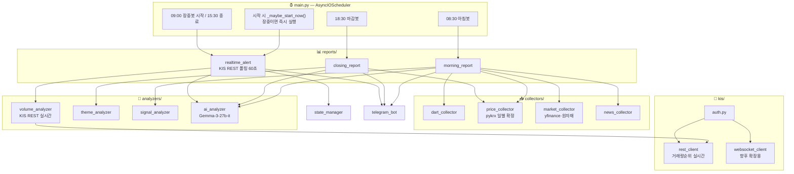

# 🇰🇷 한국주식 봇 — 아키텍처 설계 문서 v2.7

> **이 문서의 목적**: AI에게 유지보수 요청 시 반드시 이 문서를 첨부할 것.
> AI가 전체 구조를 파악하고 엉뚱한 파일을 건드리는 할루시네이션을 방지한다.

---

## 🚨 KIS WebSocket 운영 규칙 (위반 시 IP·앱키 차단)

> **출처**: 한국투자증권 Open API 공식 공지  
> **위반 결과**: IP 및 앱키 일시 차단 → 봇 전체 중단

### ✅ 정상 사용 흐름 (반드시 이 순서 준수)

```
연결 → 종목 구독 → 데이터 수신 → 불필요 종목 구독해제 → 연결 종료
```

### ❌ 절대 금지 패턴 (차단 대상)

```
비정상 케이스 1: 웹소켓 연결 후 종료를 바로 반복
   → websocket_client.py는 장 시작(09:00)에 한 번만 연결
     장 마감(15:30)에 한 번만 종료

비정상 케이스 2: 구독 후 수신 검증 없이 무한 등록/해제 반복
   → 종목 구독 후 반드시 ack 수신 확인 절차 포함
   → 구독/해제를 루프로 반복하는 코드 절대 금지
```

### kis/websocket_client.py 필수 구현 규칙

```python
class KISWebSocketClient:
    def __init__(self):
        self.connected = False
        self.subscribed_tickers = set()

    async def connect(self):
        if self.connected: return   # 이미 연결 시 즉시 return

    async def subscribe(self, ticker):
        if ticker in self.subscribed_tickers: return   # 중복 구독 금지
        await self._wait_for_ack(ticker)               # ack 대기 필수
        self.subscribed_tickers.add(ticker)

    async def disconnect(self):
        for ticker in list(self.subscribed_tickers):   # 전체 해제 후 종료
            await self.unsubscribe(ticker)
```

> **v2.5+ 참고**: 장중봇(realtime_alert.py)은 KIS WebSocket 미사용.
> KIS REST 거래량 순위 API 폴링 방식. websocket_client.py는 향후 확장용 보존.

---

## 📁 전체 파일 구조

```
korea_stock_bot/
│
├── ARCHITECTURE.md          ← 이 문서 (AI 유지보수 시 필수 첨부)
├── .env                     ← API 키 모음 (절대 공유 금지)
├── main.py                  ← AsyncIOScheduler 진입점 + 장중 재시작 감지
├── config.py                ← 모든 설정값 상수
├── requirements.txt
│
├── collectors/
│   ├── dart_collector.py    ← DART 공시 수집
│   ├── price_collector.py   ← pykrx 일별 확정 데이터 (마감 후 전용)
│   ├── market_collector.py  ← 미국증시(yfinance), 원자재
│   └── news_collector.py    ← 리포트·뉴스 (네이버 검색 API)
│
├── analyzers/
│   ├── volume_analyzer.py   ← 장중 급등 감지 (KIS REST 실시간)
│   ├── theme_analyzer.py    ← 테마 그룹핑, 순환매 소외도
│   ├── signal_analyzer.py   ← 신호 1~5
│   └── ai_analyzer.py       ← Gemma-3-27b-it 2차 분석
│
├── notifiers/
│   └── telegram_bot.py      ← 텔레그램 포맷 + 발송
│
├── reports/
│   ├── morning_report.py    ← 아침봇 08:30
│   ├── closing_report.py    ← 마감봇 18:30
│   └── realtime_alert.py    ← 장중봇 (KIS REST 폴링 60초)
│
├── kis/
│   ├── auth.py              ← 토큰 발급·갱신
│   ├── websocket_client.py  ← 향후 확장용 보존 (현재 미사용)
│   └── rest_client.py       ← 현재가, 거래량 순위 조회
│
└── utils/
    ├── logger.py
    ├── date_utils.py        ← is_market_open() 포함
    └── state_manager.py     ← 쿨타임·중복 알림 방지
```

---

## 🔗 파일 의존성 지도

```
파일명                     → 영향받는 파일
─────────────────────────────────────────────────────────────
config.py                 → 모든 파일
date_utils.py             → dart_collector, morning_report, closing_report, main
state_manager.py          → realtime_alert
dart_collector.py         → morning_report, signal_analyzer
price_collector.py        → closing_report, morning_report, signal_analyzer
market_collector.py       → morning_report, signal_analyzer
news_collector.py         → morning_report, signal_analyzer
volume_analyzer.py        → realtime_alert
theme_analyzer.py         → closing_report, morning_report
signal_analyzer.py        → morning_report
ai_analyzer.py            → morning_report, closing_report, realtime_alert
telegram_bot.py           → morning_report, closing_report, realtime_alert
kis/auth.py               → kis/rest_client, kis/websocket_client
kis/rest_client.py        → volume_analyzer (거래량 순위 제공)
kis/websocket_client.py   → (향후 확장용 보존)
```

---

## 🗺️ 시스템 흐름도



---

## ⏱️ 봇별 실행 타임라인

```
[컨테이너 시작 시]
    _maybe_start_now() 즉시 호출
    → 현재 시각 09:00~15:30 AND 개장일 → start_realtime_bot() 즉시 실행
    → 그 외 시간 → 대기 (cron 스케줄에 위임)

07:00  KIS 토큰 갱신

08:30  ─── 아침봇 ────────────────────────────────────────────
       ① is_market_open() 확인
       ② dart_collector → 전날 공시
       ③ market_collector → 미국증시·원자재
       ④ news_collector → 리포트
       ⑤ price_collector → 전날 가격·수급 (pykrx 확정치)
       ⑥ signal_analyzer → 신호 1~5
       ⑦ ai_analyzer.analyze_dart()
       ⑧ theme_analyzer
       ⑨ morning_report 조립
       ⑩ telegram_bot 발송

09:00  ─── 장중봇 시작 ──────────────────────────────────────
       (컨테이너가 이미 장중에 있으면 시작 시 즉시 실행됨)
       asyncio.create_task(_poll_loop()) 백그라운드 시작
       ↓ POLL_INTERVAL_SEC(60초)마다:
           volume_analyzer.poll_all_markets()
               → KIS REST get_volume_ranking("J") 코스피 상위 100
                   (내부: FID_COND_MRKT_DIV_CODE="J", FID_INPUT_ISCD="0001")
               → KIS REST get_volume_ranking("Q") 코스닥 상위 100
                   (내부: FID_COND_MRKT_DIV_CODE="J", FID_INPUT_ISCD="1001")
               → 등락률 ≥ 3% AND 거래량배율 ≥ 10% AND 2회 연속 충족
           → can_alert() 쿨타임 확인
           → 1차 알림 즉시 발송
           → ai_analyzer.analyze_spike() 비동기
           → 2차 AI 알림

15:30  ─── 장중봇 종료 ──────────────────────────────────────
       _poll_task.cancel()
       volume_analyzer.reset()
       state_manager.reset()

18:30  ─── 마감봇 ────────────────────────────────────────────
       price_collector → 마감 확정치
       ai_analyzer.analyze_closing()
       theme_analyzer → 순환매 지도
       telegram_bot 발송
```

---

## 📦 파일별 핵심 규격

### config.py 상수 목록

```python
VOLUME_SPIKE_RATIO   = 10       # 전일 거래량 대비 오늘 누적 (%)
PRICE_CHANGE_MIN     = 3.0      # 최소 등락률 (%)
CONFIRM_CANDLES      = 2        # 연속 충족 횟수
POLL_INTERVAL_SEC    = 60       # KIS REST 폴링 간격 (초)
ALERT_COOLTIME_MIN   = 30       # 중복 알림 방지 쿨타임
WS_MAX_RECONNECT     = 3
WS_RECONNECT_DELAY   = 30
```

### 반환값 규격 (인터페이스 계약)

```python
# rest_client.get_volume_ranking(market_code) → list[dict]
{"종목코드": str, "종목명": str, "현재가": int,
 "등락률": float, "누적거래량": int, "전일거래량": int}

# volume_analyzer.poll_all_markets() → list[dict]
{"종목코드": str, "종목명": str, "등락률": float,
 "거래량배율": float, "조건충족": bool, "감지시각": str}

# dart_collector.collect() → list[dict]
{"종목명": str, "종목코드": str, "공시종류": str,
 "핵심내용": str, "공시시각": str, "신뢰도": str, "내부자여부": bool}

# price_collector.collect_daily() → dict
{"date": str, "kospi": dict, "kosdaq": dict,
 "upper_limit": list, "top_gainers": list, "top_losers": list,
 "institutional": list, "short_selling": list,
 "by_name": dict, "by_code": dict, "by_sector": dict}

# ai_analyzer.analyze_spike() → dict
{"판단": str, "이유": str}   # 진짜급등 | 작전주의심 | 판단불가
```

### KIS REST API 구현 현황

```
tr_id            함수명                   용도
─────────────────────────────────────────────────
FHKST01010100    get_stock_price()        단일 종목 현재가
FHPST01710000    get_volume_ranking()     거래량 순위 (장중봇 핵심)
```

### 데이터 소스 선택 기준

```
데이터 종류          소스        이유
─────────────────────────────────────────────────────────
장중 실시간 시세     KIS REST    지연 없음, 공식 API
일별 확정 OHLCV     pykrx       마감 후 확정치 전용
기관/외인 수급       pykrx       일별 집계, 장중 의미 없음
미국증시/원자재      yfinance    KIS 미제공 영역
공시                DART API    공식 전용
```

### AI 모델

```
gemma-3-27b-it  14,400회/일  ✅ 채택
gemini-2.5-flash   20회/일   ❌ 부족
```

---

## ⚠️ 절대 금지 규칙

```
[KIS WebSocket — 차단 위험]
1. websocket_client.py 연결/종료 루프 금지
2. 구독/해제 반복 루프 금지
3. ack 없는 구독 금지
4. 장중 connect() 여러 번 호출 금지

[아키텍처]
5. collectors/ 에 분석 로직 금지
6. telegram_bot.py 에 분석 로직 금지
7. 반환값 key 변경 시 의존성 지도 확인 후 연결 파일 동시 수정
8. config.py 변수명 변경 시 전체 영향 주의
9. ai_analyzer.py 에 수집/발송 로직 금지

[데이터 소스]
10. 장중 실시간 → KIS REST (pykrx 장중 사용 금지 — 15~20분 지연)
11. 일별 확정 데이터 → pykrx 사용 가능

[종목명 하드코딩 금지]
12. config.py 에 종목명 직접 쓰지 않음 (업종명 키워드만)
13. 대장주는 signal_analyzer가 by_sector에서 동적 결정
```

---

## 🔄 버전 관리

| 버전 | 날짜 | 변경 내용 |
|------|------|---------|
| v1.0 | 2026-02-24 | 최초 설계 |
| v1.1 | 2026-02-24 | AsyncIOScheduler, state_manager, ai_analyzer 추가 |
| v1.2 | 2026-02-24 | KIS WebSocket 차단 방지 규칙 추가 |
| v2.0 | 2026-02-25 | AI 엔진 교체: Claude → Gemma-3-27b-it |
| v2.1 | 2026-02-25 | 아침봇 독립화, 신호4, 섹터 ETF 연동 |
| v2.2 | 2026-02-25 | price_collector 등락률 0% 버그 수정 |
| v2.3 | 2026-02-25 | 종목 하드코딩 전면 제거, by_sector 동적 조회 |
| v2.4 | 2026-02-25 | 장중봇: KIS WebSocket → pykrx REST 폴링 구조 전환 |
| v2.5 | 2026-02-25 | 장중봇 데이터: pykrx(지연) → KIS REST(실시간) |
|      |            | rest_client: get_volume_ranking() 추가 (tr_id FHPST01710000) |
|      |            | volume_analyzer: pykrx 의존성 완전 제거 |
| v2.6 | 2026-02-25 | **장중 재배포/재시작 대응** |
|      |            | main.py: _maybe_start_now() 추가 |
|      |            | 시작 시 09:00~15:30 + 개장일이면 즉시 start_realtime_bot() 호출 |
|      |            | _realtime_started 플래그로 cron과 즉시 실행 중복 방지 |
| v2.7 | 2026-02-25 | **장중봇 KIS API 파라미터 버그 수정** |
|      |            | rest_client.get_volume_ranking(): FID_COND_MRKT_DIV_CODE 항상 "J" 고정 |
|      |            | (기존 "Q" 사용 시 → OPSQ2001 ERROR INVALID FID_COND_MRKT_DIV_CODE) |
|      |            | 코스피/코스닥 구분: FID_INPUT_ISCD "0001"/"1001" 으로 전환 |
|      |            | (기존 "0000" 전체조회 → rt_cd=0이지만 항목 0개 반환) |
|      |            | volume_analyzer.py 호출 인터페이스("J"/"Q") 유지 |

---

## 📋 환경변수 목록 (.env)

```bash
# 필수
TELEGRAM_TOKEN=
TELEGRAM_CHAT_ID=
DART_API_KEY=

# 권장
GOOGLE_AI_API_KEY=
NAVER_CLIENT_ID=
NAVER_CLIENT_SECRET=

# 장중봇 필수
KIS_APP_KEY=
KIS_APP_SECRET=
KIS_ACCOUNT_NO=
KIS_ACCOUNT_CODE=01
```

*v2.7 | 2026-02-25 | KIS volume-rank API 파라미터 버그 수정 (FID_INPUT_ISCD 시장구분)*
