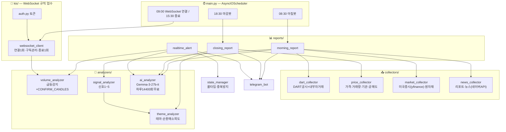

# 🇰🇷 한국주식 봇 — 아키텍처 설계 문서 v2.0

> **이 문서의 목적**: AI에게 유지보수 요청 시 반드시 이 문서를 첨부할 것.
> AI가 전체 구조를 파악하고 엉뚱한 파일을 건드리는 할루시네이션을 방지한다.

---

## 🚨 KIS WebSocket 운영 규칙 (위반 시 IP·앱키 차단)

> **출처**: 한국투자증권 Open API 공식 공지  
> **위반 결과**: IP 및 앱키 일시 차단 → 봇 전체 중단

### ✅ 정상 사용 흐름 (반드시 이 순서 준수)

```
연결 → 종목 구독 → 데이터 수신 → 불필요 종목 구독해제 → 연결 종료
```

### ❌ 절대 금지 패턴 (차단 대상)

```
비정상 케이스 1: 웹소켓 연결 후 종료를 바로 반복
   → websocket_client.py는 장 시작(09:00)에 한 번만 연결
     장 마감(15:30)에 한 번만 종료

비정상 케이스 2: 구독 후 수신 검증 없이 무한 등록/해제 반복
   → 종목 구독 후 반드시 ack 수신 확인 절차 포함
   → 구독/해제를 루프로 반복하는 코드 절대 금지
```

### kis/websocket_client.py 필수 구현 규칙

```python
class KISWebSocketClient:
    def __init__(self):
        self.connected = False
        self.subscribed_tickers = set()   # 구독 중인 종목 추적

    async def connect(self):
        if self.connected:   # 이미 연결 시 즉시 return
            return

    async def subscribe(self, ticker):
        if ticker in self.subscribed_tickers:   # 중복 구독 금지
            return
        await self._wait_for_ack(ticker)        # ack 대기 필수
        self.subscribed_tickers.add(ticker)

    async def disconnect(self):
        for ticker in list(self.subscribed_tickers):   # 전체 해제 후 종료
            await self.unsubscribe(ticker)

# ❌ 절대 금지
while True: await ws.connect(); await ws.disconnect()   # 연결/종료 루프
while True: await ws.subscribe("005930"); await ws.unsubscribe("005930")  # 구독/해제 루프
```

### 재연결 로직 (네트워크 에러 시만 허용)

```python
MAX_RECONNECT_ATTEMPTS = 3
RECONNECT_DELAY = 30   # 초 — 너무 빠른 재연결 금지

async def reconnect_with_backoff():
    for attempt in range(MAX_RECONNECT_ATTEMPTS):
        await asyncio.sleep(RECONNECT_DELAY * (attempt + 1))
        await ws.connect()
        for ticker in subscribed_tickers:
            await ws.subscribe(ticker)
```

---

## 📁 전체 파일 구조

```
korea_stock_bot/
│
├── ARCHITECTURE.md          ← 이 문서 (AI 유지보수 시 필수 첨부)
├── .env                     ← API 키 모음 (절대 공유 금지)
├── main.py                  ← AsyncIOScheduler 진입점만 (로직 없음)
├── config.py                ← 모든 설정값 상수 (임계값, 시간 등)
├── requirements.txt
│
├── collectors/              ← 데이터 수집 전담 (분석 로직 절대 금지)
│   ├── dart_collector.py    ← DART 공시 수집 (내부자거래 포함)
│   ├── price_collector.py   ← pykrx 가격·거래량·기관/외인·공매도 수집
│   ├── market_collector.py  ← 미국증시(yfinance), 원자재 수집
│   └── news_collector.py    ← 증권사 리포트·뉴스 (네이버 검색 API)
│
├── analyzers/               ← 분석 전담 (수집·발송 로직 절대 금지)
│   ├── volume_analyzer.py   ← 장중 급등 감지 (KIS WebSocket 연동)
│   ├── theme_analyzer.py    ← 테마 그룹핑, 순환매 소외도 계산
│   ├── signal_analyzer.py   ← v6.0 프롬프트 신호 1~5 통합 판단
│   └── ai_analyzer.py       ← Google Gemma-3-27b-it 2차 분석
│
├── notifiers/               ← 발송 전담 (분석 로직 절대 금지)
│   └── telegram_bot.py      ← 텔레그램 메시지 포맷 + 발송
│
├── reports/                 ← 보고서 조립 전담
│   ├── morning_report.py    ← 아침봇 08:30
│   ├── closing_report.py    ← 마감봇 18:30 (순환매 지도)
│   └── realtime_alert.py    ← 장중봇 (KIS WebSocket 급등 알림)
│
├── kis/                     ← KIS API 전담 폴더
│   ├── auth.py              ← 토큰 발급·갱신
│   ├── websocket_client.py  ← 실시간 체결 수신 (연결 규칙 엄수)
│   └── rest_client.py       ← REST API 호출
│
└── utils/
    ├── logger.py            ← 로그 기록
    ├── date_utils.py        ← 날짜 계산 + is_market_open()
    └── state_manager.py     ← 중복 알림 방지 (쿨타임 관리)
```

---

## 🔗 파일 의존성 지도

> **유지보수 핵심 규칙**: 한 파일 수정 시 아래 지도에서 영향받는 파일을 먼저 확인한다.

```
파일명                     → 영향받는 파일
─────────────────────────────────────────────────────────────
config.py                 → 모든 파일 (설정값 변경 시 전체 영향)
date_utils.py             → dart_collector, morning_report, closing_report, main
state_manager.py          → realtime_alert
dart_collector.py         → morning_report, signal_analyzer
price_collector.py        → closing_report, signal_analyzer, volume_analyzer(init)
market_collector.py       → morning_report, signal_analyzer
news_collector.py         → morning_report, signal_analyzer
volume_analyzer.py        → realtime_alert
theme_analyzer.py         → closing_report, morning_report
signal_analyzer.py        → morning_report
ai_analyzer.py            → morning_report(공시판단), closing_report(테마그룹핑),
                            realtime_alert(급등판단)
telegram_bot.py           → morning_report, closing_report, realtime_alert
kis/auth.py               → kis/websocket_client, kis/rest_client
kis/websocket_client.py   → volume_analyzer, realtime_alert
```

---

## 🗺️ 시스템 흐름도



---

## ⏱️ 봇별 실행 타임라인

```
07:00  KIS 토큰 자동 갱신 (auth.py) — REST 방식, WebSocket 아님

08:30  ─── 아침봇 ────────────────────────────────────────────
       ① is_market_open()    → 휴장일이면 전체 중단
       ② dart_collector      → 전날 공시 + 내부자거래 수집
       ③ market_collector    → 미국증시(yfinance), 원자재
       ④ news_collector      → 오늘 리포트 (네이버 검색 API)
       ⑤ signal_analyzer     → 신호 1~5 (v6.0 로직)
       ⑥ ai_analyzer.analyze_dart()  → 공시 호재/악재 점수화 (Gemma)
       ⑦ theme_analyzer      → 순환매 지도
       ⑧ morning_report      → 보고서 조립 + AI점수 신호강도 반영
       ⑨ telegram_bot        → 발송

09:00  ─── 장중봇 시작 ──────────────────────────────────────
       volume_analyzer.init_prev_volumes() → 전일 거래량 로딩
       KIS WebSocket 연결 1회 (이후 연결/종료 반복 금지)
       ↓ 실시간 체결 데이터 수신 유지
       volume_analyzer.analyze() → CONFIRM_CANDLES(2틱) 연속 충족 시:
           ① state_manager.can_alert() 확인 (쿨타임 30분)
           ② realtime_alert → 1차 알림 즉시 발송
           ③ ai_analyzer.analyze_spike() 비동기 호출
           ④ 2차 알림 (AI 판단 포함: 진짜급등/작전주의심/판단불가)

15:30  ─── 장중봇 종료 ──────────────────────────────────────
       구독 전체 해제 → WebSocket 종료 1회
       volume_analyzer.reset()
       state_manager.reset()

18:30  ─── 마감봇 ────────────────────────────────────────────
       ① price_collector     → 전종목 등락률 + 기관/공매도 수집
       ② ai_analyzer.analyze_closing() → 테마 그룹핑 + 소외주 식별 (Gemma)
       ③ theme_analyzer      → 소외도 수치 계산
       ④ closing_report      → 내일 순환매 지도 조립
       ⑤ telegram_bot        → 발송
```

---

## 📦 파일별 핵심 규격

### config.py 상수 목록

```python
# ── AI 분석 ──
GOOGLE_AI_API_KEY    = env  # Google AI Studio 무료 발급

# ── 뉴스/리포트 ──
NAVER_CLIENT_ID      = env  # 네이버 개발자센터 무료 발급
NAVER_CLIENT_SECRET  = env

# ── 장중봇 급등 감지 ──
VOLUME_SPIKE_RATIO   = 10     # 전일 총거래량 대비 누적거래량 (%)
PRICE_CHANGE_MIN     = 3.0    # 급등 감지 최소 등락률 (%)
CONFIRM_CANDLES      = 2      # 연속 충족 틱 수 (허위신호 방지)
MARKET_CAP_MIN       = 30_000_000_000

# ── 중복 알림 방지 ──
ALERT_COOLTIME_MIN   = 30

# ── KIS WebSocket ──
WS_MAX_RECONNECT     = 3
WS_RECONNECT_DELAY   = 30

# ── 스케줄 ──
TOKEN_REFRESH_TIME   = "07:00"
MORNING_TIME         = "08:30"
MARKET_OPEN_TIME     = "09:00"
MARKET_CLOSE_TIME    = "15:30"
CLOSING_TIME         = "18:30"

# ── DART 키워드 ──
DART_KEYWORDS = [
    "수주", "배당결정", "자사주취득결정",
    "MOU", "단일판매공급계약체결", "특허", "판결", "주요주주"
]
INSTITUTION_DAYS = 5
```

### 반환값 규격 (인터페이스 계약)

```python
# dart_collector.collect() → list[dict]
{"종목명": str, "종목코드": str, "공시종류": str,
 "핵심내용": str, "공시시각": str, "신뢰도": str, "내부자여부": bool}

# market_collector.collect() → dict
{"us_market": {"nasdaq": str, "sp500": str, "dow": str,
               "summary": str, "신뢰도": str},
 "commodities": {"copper": {"price": str, "change": str, "unit": str, "신뢰도": str},
                 "silver": {...}, "gas": {...}}}

# price_collector.collect_daily() → dict
{"date": str, "kospi": dict, "kosdaq": dict,
 "upper_limit": list, "top_gainers": list, "top_losers": list,
 "institutional": list, "short_selling": list,
 "by_name": dict, "by_code": dict}

# price_collector.collect_supply() → dict
{"종목코드": str, "기관_5일순매수": int, "외국인_5일순매수": int,
 "공매도잔고율": float, "대차잔고": int}

# volume_analyzer.analyze() → dict
{"종목코드": str, "종목명": str, "등락률": float,
 "거래량배율": float, "조건충족": bool, "감지시각": str}

# ai_analyzer.analyze_dart() → list[dict]
[{"종목명": str, "점수": int(1~10), "이유": str, "상한가확률": str}]

# ai_analyzer.analyze_spike() → dict
{"판단": str,  "이유": str}   # 판단: 진짜급등 | 작전주의심 | 판단불가

# ai_analyzer.analyze_closing() → list[dict]  ← signal_result["signals"] 형식
[{"테마명": str, "발화신호": str, "강도": int, "신뢰도": str,
  "발화단계": str, "상태": str, "관련종목": list[str], "ai_memo": str}]
```

### AI 모델 선택 근거

```
모델                    하루 무료 한도   선택
─────────────────────────────────────────
gemini-3-flash-preview  20회            ❌ 부족
gemini-2.5-flash        20회            ❌ 부족
gemini-2.5-flash-lite   20회            ❌ 부족
gemma-3-27b-it          14,400회        ✅ 채택
```

봇의 하루 AI 호출 횟수 (최악의 경우):
- 아침봇 analyze_dart: 5회 × 1 = 1회
- 마감봇 analyze_closing: 1회
- 장중봇 analyze_spike: 최대 40종목 × 2알림 = 80회  
- **합계 최대 ~82회/일 → 14,400 한도 내 충분**

---

## 🔧 AI 유지보수 요청 템플릿

### 단순 수정 (파일 1개)

```
[첨부]: ARCHITECTURE.md 전체 내용
[수정 대상]: config.py
[수정 내용]: ALERT_COOLTIME_MIN 30 → 60
[절대 건드리면 안 되는 파일]: 나머지 전부
[현재 파일 내용]: (config.py 전체 붙여넣기)
```

### 기능 추가 (파일 여러 개)

```
[첨부]: ARCHITECTURE.md 전체 내용
[목표]: RSI 조건 추가

[수정 파일 목록만]
1. config.py          → RSI_MIN = 60 상수 추가
2. volume_analyzer.py → RSI 계산 + 조건 추가
3. telegram_bot.py    → 알림에 RSI 값 추가

[절대 건드리면 안 되는 파일]
kis/websocket_client.py, state_manager.py 등 나머지 전부

[각 파일 현재 내용]
--- config.py ---
(내용)
```

---

## ⚠️ 절대 금지 규칙

```
[KIS WebSocket — 차단 위험]
1. websocket_client.py에 연결/종료 루프 금지
2. 구독/해제 반복 루프 금지
3. ack 수신 검증 없는 구독 금지
4. 장중 ws.connect() 여러 번 호출 금지

[아키텍처 준수]
5. collectors/ 파일에 분석 로직 금지
6. telegram_bot.py에 분석 로직 금지
7. 반환값 dict 키 구조 변경 시 → 의존성 지도 확인 후 연결 파일 동시 수정
8. config.py 변수명 변경 시 전체 파일 영향 주의
9. ai_analyzer.py에 수집/발송 로직 금지 (분석 결과 반환만)
```

---

## 🔄 버전 관리

| 버전 | 날짜 | 변경 내용 |
|------|------|---------|
| v1.0 | 2026-02-24 | 최초 설계 |
| v1.1 | 2026-02-24 | AsyncIOScheduler, state_manager, is_market_open, ai_analyzer, 기관/공매도 추가 |
| v1.2 | 2026-02-24 | KIS WebSocket 공식 공지 반영 — 연결 규칙, 차단 방지 패턴 추가 |
| v2.0 | 2026-02-25 | **AI 엔진 교체**: Claude API → Google Gemma-3-27b-it (무료 14,400회/일) |
|      |            | **버그 수정**: CONFIRM_CANDLES 실제 미사용 → volume_analyzer 연속충족 카운터 구현 |
|      |            | **기능 추가**: morning_report에 ai_analyzer.analyze_dart() 호출 추가 |
|      |            | **포맷 개선**: telegram_bot AI 공시분석 섹션 추가, 마감봇 포맷 개선 |
|      |            | **JSON 파싱 강화**: ai_analyzer _extract_json + _recover_json 이중 파싱 |
|      |            | **config 정리**: ANTHROPIC_API_KEY 제거, GOOGLE_AI_API_KEY 추가 |
|      |            | **requirements**: anthropic 제거, google-generativeai 추가 |

---

## 📋 환경변수 목록 (.env)

```bash
# ✅ 필수
TELEGRAM_TOKEN=
TELEGRAM_CHAT_ID=
DART_API_KEY=               # https://opendart.fss.or.kr

# ✅ 강력 권장 (없으면 해당 기능 비활성)
GOOGLE_AI_API_KEY=          # https://aistudio.google.com — 무료
NAVER_CLIENT_ID=            # https://developers.naver.com — 무료
NAVER_CLIENT_SECRET=

# ⚙️ 4단계 (장중봇) 필요
KIS_APP_KEY=
KIS_APP_SECRET=
KIS_ACCOUNT_NO=
KIS_ACCOUNT_CODE=01         # 기본값
```

*v2.0 | 2026-02-25 | Gemma-3-27b-it 교체 + 전면 검증 완료*
