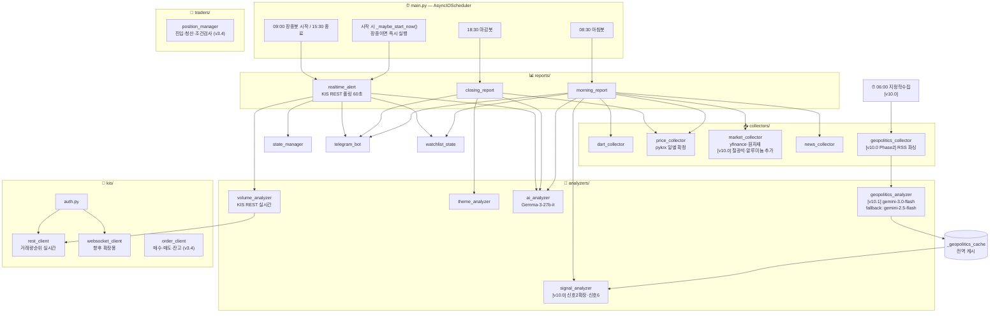

# 🇰🇷 한국주식 봇 — 아키텍처 설계 문서 v10.0

> **📋 감사 이력**: 2026-02-27, Claude Sonnet 4.6 전수 감사 완료 (v9.1-AUDIT-CLEAN 기준)
> 원본(v9.0)에서 발견된 오류 7종(할루시네이션 1, 자기모순 3, 퇴행규칙 3)을 교정 완료.
> **이 문서는 v9.1-CLEAN을 기준으로 v10.0 Phase 1·2 개편 내용을 반영한 최신 아키텍처입니다.**
>
> **📋 v10.1 버그픽스·모델교체**: 2026-02-27, Claude Sonnet 4.6
> ① main.py run_geopolitics_collect 함수 누락 추가 (NameError 수정)
> ② geopolitics_analyzer 전용 모델 교체: gemini-1.5-flash(서비스종료) → gemini-2.0-flash(Primary) + gemini-2.5-flash(Fallback)
>
> **📋 v10.0 개편 이력**: 2026-02-27, Claude Sonnet 4.6 대규모 개편 구현 + 아키텍처 반영
> Phase 1 (구현 완료): 철강/비철 ETF 수집 확장(XME·SLX·TIO=F·ALI=F), 지정학 맵 사전, 신호2 확장, oracle 철강/방산 부스팅
> Phase 2 (구현 완료): 지정학 수집·분석 엔진 신규, main.py 06:00 스케줄·장중 폴링, 신호6 통합, telegram 글로벌 트리거 섹션
>
> | 구분 | 원본 v9.0 | 교정 v9.1 |
> |------|-----------|-----------|
> | 중복 번호 | #71 × 5개 | #67~#71로 분리 |
> | 자기모순 | #58 vs #71(PnL 반환값) | #58 삭제, #68로 통일 |
> | 값 불일치 | POLL_INTERVAL_SEC 3가지 혼용 | 실제값 10초로 통일 |
> | 값 불일치 | WS_WATCHLIST_MAX 50/40 혼용 | 실제값 40으로 통일 |
> | 오삽입 | rule #34 내 rule #31 내용 혼입 | 제거 |
> | 퇴행 규칙 | #43 장중 시장환경 동결 | 극단장세(±2%) 예외 추가 |
> | 퇴행 규칙 | #66 AI 다운 시 전면 차단 | 8%+ 명확 급등 시 rule-based 허용 |
> | 구조 맹점 | #19 oracle 픽 성과 미기록 | 아침/마감봇 oracle 기록 경로 추가 |

---

> **이 문서의 목적**: AI에게 유지보수 요청 시 반드시 이 문서를 첨부할 것.
> AI가 전체 구조를 파악하고 엉뚱한 파일을 건드리는 할루시네이션을 방지한다.

---

## 🚨 KIS WebSocket 운영 규칙 (위반 시 IP·앱키 차단)

> **출처**: 한국투자증권 Open API 공식 공지  
> **위반 결과**: IP 및 앱키 일시 차단 → 봇 전체 중단

### ✅ 정상 사용 흐름 (반드시 이 순서 준수)

```
연결 → 종목 구독 → 데이터 수신 → 불필요 종목 구독해제 → 연결 종료
```

### ❌ 절대 금지 패턴 (차단 대상)

```
비정상 케이스 1: 웹소켓 연결 후 종료를 바로 반복
   → websocket_client.py는 장 시작(09:00)에 한 번만 연결
     장 마감(15:30)에 한 번만 종료

비정상 케이스 2: 구독 후 수신 검증 없이 무한 등록/해제 반복
   → 종목 구독 후 반드시 ack 수신 확인 절차 포함
   → 구독/해제를 루프로 반복하는 코드 절대 금지
```

### kis/websocket_client.py 필수 구현 규칙

```python
class KISWebSocketClient:
    def __init__(self):
        self.connected = False
        self.subscribed_tickers = set()

    async def connect(self):
        if self.connected: return   # 이미 연결 시 즉시 return

    async def subscribe(self, ticker):
        if ticker in self.subscribed_tickers: return   # 중복 구독 금지
        await self._wait_for_ack(ticker)               # ack 대기 필수
        self.subscribed_tickers.add(ticker)

    async def disconnect(self):
        for ticker in list(self.subscribed_tickers):   # 전체 해제 후 종료
            await self.unsubscribe(ticker)
```

> **v3.1+ 참고**: 장중봇은 WebSocket(방법B) + REST 폴링(방법A) 하이브리드 운영.
> websocket_client.py: 체결(H0STCNT0) 구독 + v4.0에서 호가(H0STASP0) 구독 추가.
> WS_ORDERBOOK_ENABLED=false(기본): REST get_orderbook()으로 호가 분석.
> WS_ORDERBOOK_ENABLED=true: WS 호가 구독 병행 (체결20+호가20=40, 한도 준수).

---

## 📁 전체 파일 구조

```
korea_stock_bot/
│
├── ARCHITECTURE.md          ← 이 문서 (AI 유지보수 시 필수 첨부)
├── .env                     ← API 키 모음 (절대 공유 금지)
├── main.py                  ← AsyncIOScheduler 진입점 + 장중 재시작 감지
├── config.py                ← 모든 설정값 상수
├── requirements.txt         [v10.0] feedparser>=6.0.0 추가
│
├── tests/                   ← [v7.0 Priority1 신규] 단위 테스트 패키지
│   ├── __init__.py
│   ├── test_signal_analyzer.py  ← analyzers/signal_analyzer.py 단위 테스트
│   │                               _dart_strength / _dart_to_theme / analyze() 검증
│   ├── test_position_manager.py ← traders/position_manager.py 단위 테스트
│   │                               get_effective_position_max / _calc_trailing_stop / R/R 필터
│   ├── test_ai_context.py       ← tracking/ai_context.py 단위 테스트
│   │                               build_spike_context / 빈 DB 안전 반환 검증
│   ├── test_watchlist_state.py  ← utils/watchlist_state.py 단위 테스트
│   │                               워치리스트 CRUD / 시장 환경 / 섹터 맵 / 경계값 검증
│   └── test_db_schema.py        ← tracking/db_schema.py 단위 테스트
│                                   테이블 생성 / kospi_index_stats 검증 / idempotent 마이그레이션
│
│   [실행 방법] cd korea_stock_bot && python -m unittest discover tests -v
│
├── collectors/
│   ├── dart_collector.py    ← DART 공시 수집
│   ├── price_collector.py   ← pykrx 일별 확정 데이터 (마감 후 전용)
│   ├── market_collector.py  ← 미국증시(yfinance), 원자재 [v10.0] 철광석(TIO=F)·알루미늄(ALI=F) 추가
│   ├── news_collector.py    ← 리포트·뉴스 (네이버 검색 API)
│   └── geopolitics_collector.py  ← [v10.0 Phase 2 신규] RSS 파싱 + 지정학 뉴스 URL 수집
│                                     Reuters·Bloomberg·기재부·방사청·Google News RSS (API 키 없이 무료)
│                                     비치명적: 소스 실패 시 빈 리스트 반환 (아침봇 blocking 금지)
│                                     AI 분석·텔레그램 발송·DB 기록 절대 금지 (rule #90)
│
├── analyzers/
│   ├── volume_analyzer.py        ← 장중 급등 감지 (KIS REST 실시간) + T2 갭상승
│   ├── theme_analyzer.py         ← 테마 그룹핑, 순환매 소외도
│   ├── signal_analyzer.py        ← 신호 1~5
│   ├── ai_analyzer.py            ← Gemma-3-27b-it 2차 분석 [v4.2 Phase 1: 프롬프트 전면 강화]
│   │                                 analyze_spike(): 윌리엄 오닐 인격 + SYSTEM CONSTRAINTS
│   │                                 (rule #38: 오닐 인격 블록 삭제 금지)
│   ├── closing_strength.py       ← [v3.2] T5 마감 강도 트리거 (마감봇용, pykrx)
│   ├── volume_flat.py            ← [v3.2] T6 횡보 거래량 급증 (마감봇용, pykrx)
│   ├── fund_inflow_analyzer.py   ← [v3.2] T3 시총 대비 자금유입 (마감봇용, pykrx)
│   ├── oracle_analyzer.py        ← [v8.1] 쪽집게봇 — 컨플루언스 스코어링 → 픽 + 진입조건
│   │                                 테마/수급/공시/T5·T6·T3 종합 (외부 API·DB·발송 호출 없음)
│   │                                 closing_report(T5/T6/T3 포함) + morning_report(수급·공시만) 양쪽 호출
│   │                                 [v10.0 Phase 1] _score_theme(): 철강/방산 테마 +20 부스팅
│   └── geopolitics_analyzer.py   ← [v10.1] 지정학 이벤트 → 섹터 매핑 + gemini-3.0-flash 분석 (fallback: gemini-2.5-flash)
│                                     geopolitics_map 사전 패턴 매칭 우선 (사전 6 : AI 4 가중 평균)
│                                     gemini-3.0-flash 배치 분석 (최대 10건/호출) → fallback: gemini-2.5-flash
│                                     신뢰도 필터링 (GEOPOLITICS_CONFIDENCE_MIN 기본 0.6)
│                                     KIS API·pykrx 호출 절대 금지 (rule #91)
│
├── notifiers/
│   ├── telegram_bot.py      ← 텔레그램 포맷 + 발송 [v5.0: send_photo_async, format_morning_summary 추가]
│   ├── chart_generator.py   ← [v5.0 Phase 5 신규] 차트 이미지 생성 (종목별 + 주간 성과)
│   └── telegram_interactive.py ← [v5.0 Phase 5 신규] /status /holdings /principles 명령어 처리
│                               [v6.0 P2] /evaluate 추가: 종목코드+평균매수가 입력 → Gemma AI 맞춤 분석
│                               ConversationHandler 2단계 대화 플로우 (_EVAL_TICKER → _EVAL_PRICE)
│                               [v7.0 Priority2] /report 추가: 종목코드/이름 입력 → KIS+pykrx+AI 종합 리포트
│                               _cmd_report(), _resolve_ticker(), _run_report_analysis() 추가
│                               Prism /report 경량화 — 기존 KIS REST + pykrx 인프라 완전 재활용
│
├── reports/
│   ├── morning_report.py    ← 아침봇 08:30
│   ├── closing_report.py    ← 마감봇 18:30
│   ├── realtime_alert.py    ← 장중봇 (KIS REST 폴링 60초)
│   └── weekly_report.py     ← [v3.3] 주간 성과 리포트 (월요일 08:45)
│
├── kis/
│   ├── auth.py              ← 토큰 발급·갱신 (실전 + v3.4 VTS 분리)
│   ├── websocket_client.py  ← 체결(H0STCNT0)+호가(H0STASP0) WebSocket (v4.0 업그레이드)
│   ├── rest_client.py       ← 현재가, 거래량 순위 조회
│   └── order_client.py      ← [v3.4] 모의/실전 매수·매도·잔고 (Phase 4 신규)
│
└── utils/
    ├── logger.py
    ├── date_utils.py        ← is_market_open() 포함
    ├── state_manager.py     ← 쿨타임·중복 알림 방지
    ├── watchlist_state.py   ← 아침봇↔장중봇↔마감봇 WebSocket 워치리스트 공유 (v3.1/v3.2)
    ├── rate_limiter.py      ← [v3.2] KIS API Rate Limiter (초당 19회 제한)
    └── geopolitics_map.py   ← [v10.0 Phase 1 신규] 이벤트 키워드 → 국내 섹터 매핑 사전
                                 40+ 패턴: 철강관세·NATO국방비·중국부양책·반도체규제·유가급등 등
                                 분석 로직·API 호출 절대 금지 — 사전 조회(lookup)만 허용 (rule #93)
│
├── tracking/                ← [v3.3] Phase 3 DB + 성과 추적 패키지 (신규)
│   ├── db_schema.py         ← SQLite DDL + init_db() + get_conn()
│   │                           [v6.0] _migrate_v60(): compression_layer/summary_text 컬럼
│   │                           [v7.0] kospi_index_stats 테이블 추가 (Priority3 지수 레벨 학습)
│   │                           [v7.0] _migrate_v70(): 기존 DB idempotent 마이그레이션
│   ├── alert_recorder.py    ← 장중봇 알림 발송 시 DB 기록 (realtime_alert에서만 호출)
│   ├── performance_tracker.py ← 1/3/7일 수익률 추적 배치 + 주간 통계 조회
│   ├── ai_context.py        ← [v3.5] AI 프롬프트 컨텍스트 조회 전담 (Phase 5 신규)
│   │                           [v4.3] trading_journal 컨텍스트 추가 (종목 과거 일지)
│   ├── principles_extractor.py ← [v3.5] 매매 원칙 추출 배치 (Phase 5 신규)
│   │                             [v4.3] trading_journal 패턴 통합 (_integrate_journal_patterns)
│   ├── trading_journal.py   ← [v4.3 Phase3 신규] 거래 완료 시 AI 회고 분석 일지
│   │                           Prism trading_journal_agent 경량화 구현
│   │                           record_journal() / get_weekly_patterns() / get_journal_context()
│   │                           [v6.0 이슈②] get_journal_context() 토큰 제한 (JOURNAL_MAX_ITEMS/CHARS)
│   │                           compression_layer별 포맷 분기 (Layer1 상세 / Layer2 요약 / Layer3 핵심)
│   └── memory_compressor.py ← [v6.0 5번/P1 신규] 3계층 기억 압축 배치
│                               Prism CompressionManager 경량화 구현 (동기 Gemma)
│                               Layer1(0~7일) → Layer2(AI요약) → Layer3(핵심한줄)
│                               run_compression() — main.py 매주 일요일 03:30 호출
│                               [v7.0 Priority3] update_index_stats(): KOSPI 레벨별 승률 집계
│                               [v7.0 Priority3] get_index_context(): AI 프롬프트 주입용 레벨 컨텍스트
│                               [v7.0 Priority3] _extract_kospi_level(), _get_kospi_bucket() 헬퍼 추가
│
└── traders/                 ← [v3.4] Phase 4 자동매매 패키지 (신규)
    └── position_manager.py  ← 포지션 진입·청산·조건 검사 + DB 기록 [v4.2 Phase 2: Trailing Stop]
                                [v4.4 Phase 4: 섹터 분산, 동적 POSITION_MAX, 강화된 손실 한도,
                                               AI 선택적 강제청산, final_close_all 신규]
```

---

## 🔗 파일 의존성 지도

```
파일명                     → 영향받는 파일
─────────────────────────────────────────────────────────────
config.py                 → 모든 파일
date_utils.py             → dart_collector, morning_report, closing_report, main
watchlist_state.py        → morning_report (write), realtime_alert (read)
state_manager.py          → realtime_alert
dart_collector.py         → morning_report, signal_analyzer
price_collector.py        → closing_report, morning_report, signal_analyzer
market_collector.py       → morning_report, signal_analyzer
news_collector.py         → morning_report, signal_analyzer
volume_analyzer.py        → realtime_alert
theme_analyzer.py         → closing_report, morning_report
signal_analyzer.py        → morning_report
ai_analyzer.py            → morning_report (analyze_dart + analyze_closing v2.4), closing_report, realtime_alert
                            [v4.2] market_env 파라미터: realtime_alert에서 선택적 주입
                            [v4.2] 반환값 확장: target_price, stop_loss, risk_reward_ratio 추가
telegram_bot.py           → morning_report, closing_report, realtime_alert
                            [v8.1] format_oracle_section(): oracle_analyzer 결과 포맷 (분석 로직 없음)
kis/auth.py               → kis/rest_client, kis/websocket_client
kis/rest_client.py        → volume_analyzer (거래량 순위 + 등락률 순위 + 시가 제공)
kis/websocket_client.py   → volume_analyzer, realtime_alert
                              H0STCNT0(체결) + H0STASP0(호가, v4.0 신규)
utils/rate_limiter.py     → kis/rest_client (API 호출 보호)
analyzers/closing_strength.py → reports/closing_report (T5 마감 강도)
analyzers/volume_flat.py  → reports/closing_report (T6 횡보 거래량)
analyzers/fund_inflow_analyzer.py → reports/closing_report (T3 시총 자금유입)
analyzers/oracle_analyzer.py    ← reports/closing_report (theme_map, price, institutional, T5/T6/T3 전달)
analyzers/oracle_analyzer.py    ← reports/closing_report (theme_map, price, institutional, T5/T6/T3 전달)
                                 ← reports/morning_report (theme_map, price, institutional, ai_dart 전달)
                                 → notifiers/telegram_bot (format_oracle_section 이 포맷)
                                 ※ T5/T6/T3는 closing_report에서만 전달 (morning_report는 None) — rule #16
kis/order_client.py       → kis/auth (get_vts_access_token / get_access_token)
kis/order_client.py       → utils/rate_limiter (API 호출 보호)
traders/position_manager.py → tracking/db_schema (get_conn)
traders/position_manager.py → kis/order_client (buy, sell, get_current_price)
traders/position_manager.py → notifiers/telegram_bot (format_trade_executed, format_trade_closed)
traders/position_manager.py ← reports/realtime_alert (can_buy, open_position, check_exit)
traders/position_manager.py ← main.py (force_close_all 14:50 / final_close_all 15:20)  ← v4.4 추가
traders/position_manager.py ← tracking/performance_tracker (update_trailing_stops)  ← v4.2 추가
                              [v4.2] can_buy(ai_result, market_env): R/R 필터 적용
                              [v4.2] open_position(stop_loss_price, market_env): Trailing Stop 초기화
                              [v4.2] check_exit(): Trailing Stop 포함 (peak_price × 0.92/0.95)
                              [v4.2] update_trailing_stops(): 18:45 배치에서 종가 기준 일괄 갱신
                              [v4.4] can_buy(): 섹터 집중 체크(SECTOR_CONCENTRATION_MAX) 추가
                              [v4.4] can_buy(): 동적 POSITION_MAX (강세장 5/횡보 3/약세장 2)
                              [v4.4] can_buy(): 미실현 손익 포함 당일 손실 한도 강화
                              [v4.4] open_position(sector): 섹터 파라미터 추가
                              [v4.4] force_close_all(): AI 선택적 청산 (유망 종목 유지)
                              [v4.4] final_close_all(): 15:20 최종 청산 (유지 종목)
                              [v4.4] get_effective_position_max(market_env): 동적 POSITION_MAX
utils/watchlist_state.py      ← morning_report (set_sector_map)  ← v4.4 추가
                               ← realtime_alert (get_sector)    ← v4.4 추가
                               ← position_manager (get_kospi_level) ← v7.0 추가
                               ← tracking/ai_context (_get_index_level_context) ← v7.0 추가
tracking/ai_context.py         → _get_portfolio_context(): 오픈 포지션 현황 → AI 프롬프트 주입  ← v4.4
analyzers/ai_analyzer.py       → analyze_selective_close(positions, market_env): 선택적 청산 판단  ← v4.4
tracking/db_schema.py             → tracking/alert_recorder, tracking/performance_tracker
tracking/alert_recorder.py        ← reports/realtime_alert (유일 호출처)
tracking/performance_tracker.py   ← main.py (18:45 cron), reports/weekly_report
tracking/trading_journal.py       ← traders/position_manager (record_journal — close_position 후 자동)  ← v4.3
tracking/trading_journal.py       ← tracking/ai_context (get_journal_context — 읽기 전용)              ← v4.3
tracking/trading_journal.py       ← reports/weekly_report (get_weekly_patterns — 읽기 전용)            ← v4.3
tracking/trading_journal.py       → tracking/principles_extractor (_integrate_journal_patterns)         ← v4.3
tracking/ai_context.py            ← reports/realtime_alert (build_spike_context)
tracking/ai_context.py            → tracking/trading_journal (get_journal_context)                     ← v4.3
tracking/principles_extractor.py  ← main.py (일요일 03:00), tracking/trading_journal (_integrate)     ← v4.3
reports/weekly_report.py          ← main.py (월요일 08:45 cron)
reports/weekly_report.py          → tracking/performance_tracker, notifiers/telegram_bot
reports/weekly_report.py          → notifiers/chart_generator (주간 성과 차트)  ← v5.0 추가
notifiers/chart_generator.py      ← reports/weekly_report (generate_weekly_performance_chart)  ← v5.0 추가
notifiers/chart_generator.py      → pykrx (종목별 OHLCV, 마감 확정치 전용)  ← v5.0 추가
notifiers/telegram_interactive.py ← main.py (asyncio.create_task — 백그라운드)  ← v5.0 추가
notifiers/telegram_interactive.py → tracking/db_schema (get_conn — /status /holdings /principles)  ← v5.0 추가
notifiers/telegram_interactive.py → utils/watchlist_state (get_market_env — /status)  ← v5.0 추가
notifiers/telegram_interactive.py → kis/order_client (get_balance — AUTO_TRADE=true 시만)  ← v5.0 추가
notifiers/telegram_interactive.py → tracking/trading_journal (get_journal_context — /evaluate)  ← v6.0 추가
tracking/memory_compressor.py     ← main.py (run_compression — 일요일 03:30)  ← v6.0 추가
tracking/memory_compressor.py     → tracking/db_schema (get_conn)  ← v6.0 추가
tracking/memory_compressor.py     → kospi_index_stats (update_index_stats — UPSERT)  ← v7.0 추가
tracking/memory_compressor.py     → ai_context.py (get_index_context — 읽기용 함수 제공)  ← v7.0 추가
tracking/ai_context.py            → tracking/memory_compressor (_get_index_level_context)  ← v7.0 추가

[v10.0 Phase 1: 철강/비철 ETF 확장]
collectors/market_collector.py    ← 철광석(TIO=F)·알루미늄(ALI=F) COMMODITY_TICKERS 추가 (단위: $/MT)  ← v10.0
analyzers/signal_analyzer.py      → _analyze_steel_etf(): XME/SLX ≥ STEEL_ETF_ALERT_THRESHOLD(3.0%)
                                     급등 시 신호2 독립 발화 (5%+ → 강도5, 3~5% → 강도4)               ← v10.0
analyzers/oracle_analyzer.py      → _score_theme(): BOOST_THEMES(철강/비철금속·방산·자동차부품 등)
                                     신호6 또는 신호2 발화 시 +20 부스팅 (signal_map 확인 후 적용)      ← v10.0
utils/geopolitics_map.py          → analyzers/geopolitics_analyzer (lookup 사전 조회)                  ← v10.0

[v10.0 Phase 2: 지정학 수집·분석 엔진]
collectors/geopolitics_collector.py  ← main.py (run_geopolitics_collect: 06:00 + 장중 30분 폴링)       ← v10.0
collectors/geopolitics_collector.py  → raw_news 목록 → analyzers/geopolitics_analyzer                  ← v10.0
analyzers/geopolitics_analyzer.py   → utils/geopolitics_map (lookup 사전 매칭)                         ← v10.0
analyzers/geopolitics_analyzer.py   → gemini-3.0-flash API (배치 분석, 최대 10건/호출, fallback: gemini-2.5-flash)                     ← v10.0
main.py                             → _geopolitics_cache (전역 캐시, 아침봇·마감봇 공유)               ← v10.0
analyzers/signal_analyzer.py        ← reports/morning_report (geopolitics_data=캐시 주입)
                                      _analyze_geopolitics(): 신뢰도 → 강도 분기 (0.85+:5, 0.70+:4, 기타:3)
                                      신호6 발화 → signals 리스트 추가, 강도 내림차순 정렬             ← v10.0
notifiers/telegram_bot.py           ← format_morning_report(geopolitics_data 추가)
                                       🌍 글로벌 트리거 섹션: 신뢰도 상위 3건, 미국증시 섹션 앞에 삽입
                                       원자재 섹션: 철광석(TIO=F)·알루미늄(ALI=F) 추가                ← v10.0
```

---

## 🗺️ 시스템 흐름도



---

## ⏱️ 봇별 실행 타임라인

```
[컨테이너 시작 시]
    _maybe_start_now() 즉시 호출
    → 현재 시각 09:00~15:30 AND 개장일 → start_realtime_bot() 즉시 실행
    → 그 외 시간 → 대기 (cron 스케줄에 위임)

06:00  ─── 지정학 뉴스 수집 [v10.0 Phase 2 신규] ─────────────────
       GEOPOLITICS_ENABLED=true 시에만 실행 (기본 false)
       run_geopolitics_collect() 호출:
       ① geopolitics_collector.collect() → raw_news (feedparser, 스레드풀)
          Reuters RSS / Bloomberg RSS / 기재부 RSS / 방사청 RSS / Google News RSS
          소스 실패해도 비치명적 (빈 리스트 반환, 아침봇 08:30 blocking 절대 금지)
       ② geopolitics_analyzer.analyze(raw_news) → 이벤트 분석 결과
          geopolitics_map 사전 매칭 우선 → gemini-3.0-flash 배치 분석 → fallback: gemini-2.5-flash → 사전 결과 fallback
          신뢰도 GEOPOLITICS_CONFIDENCE_MIN(0.6) 미달 이벤트 필터링
       ③ _geopolitics_cache 전역 변수에 캐시 저장 (아침봇·마감봇 공유)
       장중 GEOPOLITICS_POLL_MIN(30분) 간격 폴링: 긴급 이벤트 실시간 갱신

07:00  KIS 토큰 갱신

08:30  ─── 아침봇 ────────────────────────────────────────────
       ① is_market_open() 확인
       ② dart_collector → 전날 공시
       ③ market_collector → 미국증시·원자재
       ④ news_collector → 리포트
       ⑤ price_collector → 전날 가격·수급 (pykrx 확정치)
       ⑥ signal_analyzer → 신호 1~6  [v10.0 확장]
          get_geopolitics_cache() → geopolitics_data 주입 (GEOPOLITICS_ENABLED=true 시)
          _analyze_steel_etf(): XME/SLX ≥ STEEL_ETF_ALERT_THRESHOLD(3.0%) 급등 시 신호2 독립 발화
            5%+: 강도5 / 3~5%: 강도4
          _analyze_geopolitics(): 지정학 캐시 → 신호6 변환
            신뢰도 0.85+: 강도5 / 0.70+: 강도4 / 기타: 강도3
            impact_direction: "+" 상승 / "-" 하락 / "mixed" 혼재
          신호6 발화 후 signals 강도 내림차순 정렬
       ⑦ ai_analyzer.analyze_dart() — 공시 호재/악재 점수화
       ⑦-b ai_analyzer.analyze_closing(price_data) — 신호4 AI 교체 (v2.4 신규)
           "상한가 순환매"/"KOSPI 급등 순환매" → 실제 테마명(바이오신약 등)
           실패 시 기존 신호4 유지 (graceful fallback)
       ⑧ theme_analyzer — AI 테마 기반 소외도 계산
       ⑧-b oracle_analyzer — 수급·공시·소외도 기반 픽 + 진입조건 (v8.1 신규)
           T5/T6/T3 없음 — rule #16 준수 (마감봇 전용 트리거)
       ⑨ morning_report 조립
       ⑩ telegram_bot 발송 (쪽집게 최우선 선발송 → 핵심 요약 → 상세 리포트)  ← v8.1 변경

09:00  ─── 장중봇 시작 ──────────────────────────────────────
       (컨테이너가 이미 장중에 있으면 시작 시 즉시 실행됨)
       asyncio.create_task(_poll_loop()) 백그라운드 시작
       ↓ POLL_INTERVAL_SEC(10초)마다:  [교정: 원본 60초 오기, 실제 10초]
           volume_analyzer.poll_all_markets()
               [v4.1 소스 단일화]
               → KIS REST get_rate_ranking("J"/"Q") 등락률 순위만 사용
                   코스피: 중형+소형 합산 / 코스닥: 전체(스팩·ETF 제외)
                   등락률 0~10% 구간 → 초기 급등 조기 포착
                   ※ get_volume_ranking() 제거: 삼성전자·현대차 등 대형주가
                     거래량 순위 상위에 항상 포함되어 노이즈 알림 발생했었음
               [v2.8 델타 기준 감지 / v8.2 가속도 기준으로 변경 / v9.0 신규진입 감지 추가]
               → 첫 사이클: 워밍업 (스냅샷 저장만, 알림 없음)
               → 이후 사이클: 두 경로로 분기
                 [경로1] 기존 종목 (prev 있음): 등락률 가속도 기준
                   [v8.2] Δ등락률(가속도) = curr["등락률"] - prev["등락률"]
                   예: 4.2%→4.7% → Δ=+0.5% → PRICE_DELTA_MIN(0.5%) 충족
                   Δ등락률 ≥ PRICE_DELTA_MIN(0.5%) AND Δ거래량 ≥ VOLUME_DELTA_MIN(5%)
                   × CONFIRM_CANDLES(1)회 충족 → 알림
                 [경로2] 신규진입 종목 (prev 없음): FIRST_ENTRY_MIN_RATE 단독 기준 [v9.0 신규]
                   이전: if not prev: continue → delta_rate=0 → 100% 스킵 (알림 0건의 핵심 원인)
                   수정: change_rate ≥ FIRST_ENTRY_MIN_RATE(4%) AND acml_rvol ≥ MIN_VOL_RATIO_ACML
                   직전대비 = change_rate (미진입→현재 전체 등락률이 가속도)
               → 알림 포맷: 감지소스 배지 표시 (📊거래량포착 / 📈등락률포착)
               [v3.4 Phase 4 추가] AUTO_TRADE_ENABLED=true 시:
               position_manager.check_exit() — 익절/손절/Trailing Stop 조건 검사
               → TAKE_PROFIT_1(+5%) / TAKE_PROFIT_2(+10%) — 익절
               → Trailing Stop: peak_price × 0.92(강세) / × 0.95(약세) 이탈 시 "trailing_stop" 청산
               → 절대 손절: AI 제공 stop_loss or config.STOP_LOSS(-3%) — "stop_loss" 청산
                 order_client.sell() → position_manager.close_position() → 텔레그램 청산 알림

           → can_alert() 쿨타임 확인
           → 1차 알림 즉시 발송
           → ai_analyzer.analyze_spike() 비동기
           → 2차 AI 알림
           [v3.5 Phase 5 추가] AI 판단 전 컨텍스트 주입:
           ai_context.build_spike_context(ticker, source) — 동기, run_in_executor
           → trigger_stats 뷰: 트리거별 7일 승률 (tracked >= 5건)
           → trading_history: 해당 종목 과거 거래 최대 3건 이력
           → trading_principles: confidence='high' 원칙 최대 3개
           → ai_analyzer.analyze_spike(analysis, ai_context=ctx) 에 주입
           → Gemma가 과거 데이터를 참고해 판단 정확도 향상
           [v4.2 Phase 1 추가] AI 프롬프트 전면 강화:
           → 윌리엄 오닐 인격 + SYSTEM CONSTRAINTS (조건부 대기 금지)
           → 손절 철칙 -7% 절대 + 예외 조건 5개 ALL 충족 시에만
           → 강세장(R/R 1.2+) / 약세장(R/R 2.0+) 분기 전략
           → 장중(09:00~15:20) vs 마감 후(15:30+) 데이터 신뢰도 자동 분기
           → analyze_spike() 반환값: target_price, stop_loss, risk_reward_ratio 추가
           → market_env 파라미터 추가 (선택적, 빈 문자열이면 AI가 맥락으로 판단)

           [v3.4 Phase 4 추가] AUTO_TRADE_ENABLED=true + AI판단=='진짜급등' 시:
           등락률 3~10% 구간 필터 → position_manager.can_buy() 검사
           → order_client.buy() 매수 → position_manager.open_position() DB 기록
           → 텔레그램 매수 체결 알림
           ※ 10% 초과 종목: 추격 금지, 패스

03:00  ─── 매매 원칙 추출 (Phase 5, v3.5, 매주 일요일) ───────────
       principles_extractor.run_weekly_extraction()
       → trading_history 집계 → trigger_source별 승률 계산
       → trading_principles 신규 INSERT / 기존 UPDATE
       → win_rate >= 65% → confidence='high' (AI 프롬프트 주입 대상)
       → 텔레그램 원칙 DB 업데이트 요약 알림

14:50  ─── 선택적 강제청산 (Phase 4, v3.4 / v4.4 AI 선택적 청산으로 업그레이드) ──
       AUTO_TRADE_ENABLED=true 일 때만 실행
       position_manager.force_close_all()
       → 각 포지션 현재가 조회 + 수익률 계산
       → ai_analyzer.analyze_selective_close() AI 판단:
         · profit >= SELECTIVE_CLOSE_PROFIT_THRESHOLD(3%) → 사전 필터: 유지
         · profit <= STOP_LOSS(-3%) → 사전 필터: 청산
         · 중간 수익률 → Gemma AI가 모멘텀 지속 여부 판단 (청산/유지)
       → "청산" 종목: 즉시 시장가 매도 + 텔레그램 알림 (close_reason="force_close")
       → "유지" 종목: _deferred_close_list 등록 → 15:20 final_close 대기
       → AI 실패 시 rule-based fallback (수익>0 → 유지, 손실 → 청산)

15:20  ─── 최종 청산 (Phase 4, v4.4 신규) ──────────────────────────────
       AUTO_TRADE_ENABLED=true 일 때만 실행
       position_manager.final_close_all()
       → _deferred_close_list 꺼내기 (14:50 유지 판정 종목)
       → 폴링에서 이미 청산된 종목 자동 스킵 (positions 존재 여부 확인)
       → 잔여 종목 시장가 매도 + 텔레그램 알림 (close_reason="final_close")

15:30  ─── 장중봇 종료 ──────────────────────────────────────
       _poll_task.cancel()
       volume_analyzer.reset()
       state_manager.reset()

18:30  ─── 마감봇 ────────────────────────────────────────────
       price_collector → 마감 확정치
       ai_analyzer.analyze_closing()
       theme_analyzer → 순환매 지도
       [v3.2] closing_strength → T5 마감 강도 상위 종목   ← v3.6에서 dead code 복원
       [v3.2] volume_flat     → T6 횡보 거래량 급증 종목  ← v3.6에서 dead code 복원
       [v3.2] fund_inflow_analyzer → T3 시총 자금유입     ← v3.6에서 dead code 복원
       [v3.2] watchlist_state 보강: T5+T6 종목 → 내일 WebSocket 워치리스트 추가  ← v3.6 복원
       [v8.1] oracle_analyzer → T5/T6/T3 + 테마/수급/공시 종합 → 내일 픽 + 진입조건
              쪽집게 섹션 선발송 → 마감 리포트 후발송 (결론 먼저 제공)
       telegram_bot 발송 (T3/T5/T6 섹션 포함)

18:45  ─── 수익률 추적 배치 (Phase 3, v3.3 / v4.2 확장) ────────────────────
       performance_tracker.run_batch()
       → done_Xd=0 미추적 행 조회 (1/3/7일 전 발송 알림)
       → pykrx 마감 확정치 전종목 종가 일괄 조회
       → 수익률 계산 → performance_tracker UPDATE
       → 트리거별 승률 로그 출력
       [v4.2] 수익률 추적 완료 후 Trailing Stop 일괄 갱신:
       → position_manager.update_trailing_stops() 호출
       → 오픈 포지션 peak_price / stop_loss 종가 기준 상향 조정
       → AUTO_TRADE_ENABLED=false 시 즉시 return (안전, 비치명적)

매주 월요일 08:45  ─── 주간 성과 리포트 (Phase 3, v3.3 / v4.3 업데이트 / v5.0 차트 추가) ──
       performance_tracker.get_weekly_stats() → 지난 7일 DB 조회
       [v4.3] trading_journal.get_weekly_patterns() → 이번 주 학습한 패턴 (30일 거래일지 집계)
       [v5.0] chart_generator.generate_weekly_performance_chart(stats) → PNG 차트 생성
       telegram_bot.format_weekly_report(stats, weekly_patterns) → 메시지 포맷
       → [v5.0] send_photo_async(chart) — 성과 차트 이미지 먼저 발송
       → send_async(message) — 텍스트 리포트 후발송
       → (트리거별 승률 + 상위/하위 종목 + 🧠 이번 주 학습한 패턴 Top5)

───────────────────── v3.1 방법B+A 하이브리드 ──────────────────────
08:30  아침봇 완료 후 ⑧ 추가:
       _build_ws_watchlist(price_data, signal_result)
         ① 전날 상한가 전체 (우선순위1)
         ② 전날 급등 상위 20 (우선순위2)
         ③ 기관 순매수 상위 10 (우선순위3)
         ④ 신호 관련종목 각 3개 (우선순위4)
       → 종목코드 기준 중복 제거 → 최대 50개 → watchlist_state 저장

09:00  장중봇 start() 에서 2개 Task 병렬 시작:

  [방법 B] WebSocket 고정 구독 (_ws_loop)
       ws_client.connect() → watchlist 50종목 subscribe (1회, 변경 없음)
       H0STCNT0 틱 수신 → volume_analyzer.analyze_ws_tick(tick, prdy_vol)
       조건: 누적 등락률 >= PRICE_CHANGE_MIN(3.0%)
       → 즉시(0초 지연) 알림

  [방법 A] REST 폴링 (_poll_loop) — 간격 30s→10s 단축
       기존 로직 동일 (Δ등락률+Δ거래량 기준)
       역할: 워치리스트 外 당일 신규 테마 종목 커버

  [쿨타임 공유] state_manager.can_alert() — WS/REST 공통 30분 쿨타임
       WS가 먼저 감지하면 REST는 30분간 같은 종목 알림 억제

15:30  ws_client.disconnect() → REST 폴링 cancel → watchlist_state.clear()
```

---

## 📦 파일별 핵심 규격

### config.py 상수 목록

```python
# v2.8: 델타 기준 (감지 조건)
PRICE_DELTA_MIN      = 0.5      # 폴링 간격 내 누적 등락률 가속도 최소값 (%)
                                 # [v8.2] 가격 변화율 → 등락률 가속도로 변경
                                 # [v9.0] 1.0→0.5 완화: 10초 1%p 가속은 과도한 조건이었음
                                 # 예: 4.2%→4.7% = +0.5%가속 → PRICE_DELTA_MIN(0.5%) 충족
VOLUME_DELTA_MIN     = 5        # 폴링 간격 내 순간 거래량 증가 (전일 거래량 대비 %) — v8.2: 10→5
CONFIRM_CANDLES      = 1        # 연속 충족 횟수 — v8.2: 2→1 (가속도 기준은 1회로 충분)
FIRST_ENTRY_MIN_RATE = 4.0      # [v9.0 신규] 신규진입 종목(prev 없음) 단독 감지 임계값 (%)
                                 # 직전 스냅샷에 없다 → delta_rate=0 버그 → 이 상수로 우회
                                 # MIN_CHANGE_RATE(3%)보다 약간 높게: 노이즈 방지
POLL_INTERVAL_SEC    = 10       # KIS REST 폴링 간격 (초) [교정: 원본 60초 오기, 실제 config.py = 10초]
ALERT_COOLTIME_MIN   = 30       # 중복 알림 방지 쿨타임
WS_MAX_RECONNECT     = 3
WS_RECONNECT_DELAY   = 30

# deprecated v2.8 (하위 호환 보존만)
VOLUME_SPIKE_RATIO   = 10       # deprecated: 누적 거래량 배율
PRICE_CHANGE_MIN     = 3.0      # deprecated: 누적 등락률

# v3.2: KIS API Rate Limit (python-kis 스펙 참조)
KIS_RATE_LIMIT_REAL    = 19     # 초당 최대 호출 횟수 (실전)
KIS_RATE_LIMIT_VIRTUAL = 2      # 초당 최대 호출 횟수 (모의)
WS_RECONNECT_DELAY     = 5      # v3.2: 30초 → 5초 (무한 재연결 간격)

# v3.4: Phase 4 자동매매 설정
TRADING_MODE         = "VTS"          # "VTS"=모의 / "REAL"=실전 (환경변수 TRADING_MODE)
AUTO_TRADE_ENABLED   = False          # 기본 False (환경변수 AUTO_TRADE_ENABLED="true")
KIS_VTS_APP_KEY      = ...            # 환경변수 (없으면 KIS_APP_KEY 폴백)
KIS_VTS_APP_SECRET   = ...            # 환경변수 (없으면 KIS_APP_SECRET 폴백)
KIS_VTS_ACCOUNT_NO   = ...            # 환경변수 (없으면 KIS_ACCOUNT_NO 폴백)
KIS_VTS_ACCOUNT_CODE = "01"
POSITION_MAX         = 3              # 동시 보유 한도 기본값 (환경변수 POSITION_MAX)
POSITION_BUY_AMOUNT  = 1_000_000      # 1회 매수 금액 원 (환경변수 POSITION_BUY_AMOUNT)
TAKE_PROFIT_1        = 5.0            # 1차 익절 기준 (%)
TAKE_PROFIT_2        = 10.0           # 2차 익절 기준 (%)
STOP_LOSS            = -3.0           # 손절 기준 (%)
DAILY_LOSS_LIMIT     = -3.0           # 당일 누적 손실 한도 (%)
MIN_ENTRY_CHANGE     = 3.0            # 매수 진입 최소 등락률 (%)
MAX_ENTRY_CHANGE     = 10.0           # 추격 금지 상한 등락률 (%)
FORCE_CLOSE_TIME     = "14:50"        # 선택적 강제 청산 시각

# v4.4: Phase 4 포트폴리오 인텔리전스 설정
POSITION_MAX_BULL    = 5              # 강세장 최대 보유 종목 (환경변수 POSITION_MAX_BULL)
POSITION_MAX_NEUTRAL = 3              # 횡보장 최대 보유 종목 (환경변수 POSITION_MAX_NEUTRAL)
POSITION_MAX_BEAR    = 2              # 약세장 최대 보유 종목 (환경변수 POSITION_MAX_BEAR)
SECTOR_CONCENTRATION_MAX = 2          # 동일 섹터 최대 보유 종목 (환경변수 SECTOR_CONCENTRATION_MAX)
SELECTIVE_CLOSE_PROFIT_THRESHOLD = 3.0  # 선택적 청산 시 유지 기준 수익률 (%)

# v4.0: 소~중형주 필터 + 호가 분석
VOLUME_RANK_KOSPI_SIZE_CLS = ["2", "3"]  # 거래량순위 코스피 규모구분 (중형+소형)
ORDERBOOK_ENABLED      = True          # REST 호가 분석 활성화
ORDERBOOK_BID_ASK_MIN  = 1.3          # 매수/매도잔량 비율 하한 (강세 기준)
ORDERBOOK_BID_ASK_GOOD = 2.0          # 매수/매도잔량 비율 강세 기준
ORDERBOOK_TOP3_RATIO_MIN = 0.4        # 상위3호가 잔량/전체 최솟값
WS_ORDERBOOK_ENABLED   = False        # WebSocket 호가(H0STASP0) 구독 여부
WS_ORDERBOOK_SLOTS     = 20           # WS 호가 구독 종목 수 (한도 분할 시)

# v10.0: Phase 1 철강/비철 ETF 확장
STEEL_ETF_ALERT_THRESHOLD = 3.0   # XME/SLX 급등 임계값 (%) — 초과 시 신호2 독립 발화
                                   # 5%+: 강도5 / 3~5%: 강도4
# US_SECTOR_TICKERS 확장: XME (미국철강), SLX (철강) 추가
# US_SECTOR_KR_INDUSTRY: "철강/비철금속", "철강" 업종 키워드 추가
# COMMODITY_TICKERS 확장: TIO=F (철광석 $/MT), ALI=F (알루미늄 LME $/MT)
# COMMODITY_UNITS: $/MT 단위 추가
# COMMODITY_KR_INDUSTRY: steel → "철강/비철금속", aluminum → "철강" 매핑 추가
# BOOST_THEMES: ["철강/비철금속", "철강", "방산", "산업재/방산", "에너지솔루션", "자동차부품"]
#               oracle_analyzer._score_theme()에서 신호6·신호2 발화 시 +20 부스팅

# v10.0: Phase 2 지정학 수집·분석
GEOPOLITICS_ENABLED        = False  # 지정학 수집 활성화 (Railway Variables에서 true 설정)
GEOPOLITICS_POLL_MIN       = 30     # 장중 폴링 간격 (분)
GEOPOLITICS_CONFIDENCE_MIN = 0.6    # 이벤트 최소 신뢰도 (미달 시 신호6 미생성)

# v3.2: Phase 2 트리거 임계값
GAP_UP_MIN             = 1.5    # T2 갭업 최소 비율 (%) — v9.0: 2.5→1.5 (임계값 3.0% = MIN_CHANGE_RATE)
                                 # 기존 2.5: 임계값 5.0% → 3~5% 신규 급등 사각지대 발생
                                 # 노이즈 방지: _detect_gap_up에 MIN_VOL_RATIO_ACML 필터 추가
CLOSING_STRENGTH_MIN   = 0.75   # T5 마감 강도 최소값 (0~1)
CLOSING_STRENGTH_TOP_N = 7
VOLUME_FLAT_CHANGE_MAX = 5.0    # T6 횡보 인정 등락률 절대값 상한 (%)
VOLUME_FLAT_SURGE_MIN  = 50.0   # T6 거래량 급증 최소 비율 (%)
VOLUME_FLAT_TOP_N      = 7
FUND_INFLOW_CAP_MIN    = 100_000_000_000  # T3 최소 시가총액 (1000억)
FUND_INFLOW_TOP_N      = 7
```

### 반환값 규격 (인터페이스 계약)

```python
# rest_client.get_volume_ranking(market_code) → list[dict]
{"종목코드": str, "종목명": str, "현재가": int,
 "등락률": float, "누적거래량": int, "전일거래량": int}

# volume_analyzer.poll_all_markets() → list[dict]
{"종목코드": str, "종목명": str, "등락률": float,
 "직전대비": float,               # v2.8 신규 / v8.2 변경: 등락률 가속도 (curr등락률 - prev등락률)
                                  # 구: (curr_price - prev_price) / prev_price * 100 (가격 변화율)
                                  # 신: curr["등락률"] - prev["등락률"] (모멘텀 가속도 — 더 현실적 기준)
                                  # [v9.0] 신규진입 종목(prev 없음): change_rate 그대로 (0%→현재 전체 가속도)
 "거래량배율": float,             # v3.8 변경: 누적RVOL (acml_vol / prdy_vol 배수)
 "순간강도": float,               # v3.8 신규: 순간 Δvol / 전일거래량 (%)
 "조건충족": bool, "감지시각": str,
 "감지소스": str,                 # "volume"|"rate"|"gap_up"|"websocket"
 "호가분석": dict | None}          # v4.0 신규: {매수매도비율, 상위3집중도, 호가강도, 매수잔량, 매도잔량}

# dart_collector.collect() → list[dict]
{"종목명": str, "종목코드": str, "공시종류": str,
 "핵심내용": str, "공시시각": str, "신뢰도": str, "내부자여부": bool}

# price_collector.collect_daily() → dict
{"date": str, "kospi": dict, "kosdaq": dict,
 "upper_limit": list, "top_gainers": list, "top_losers": list,
 "institutional": list, "short_selling": list,
 "by_name": dict, "by_code": dict, "by_sector": dict}

# ai_analyzer.analyze_spike() → dict  [v4.2 확장]
{
    "판단": str,               # "진짜급등" | "작전주의심" | "판단불가"
    "이유": str,               # 20자 이내 이유
    "target_price": int|None,  # [v4.2] 추정 목표가 (원). 판단불가 시 None
    "stop_loss": int|None,     # [v4.2] 권장 손절가 (원). 판단불가 시 None
    "risk_reward_ratio": float|None  # [v4.2] 손익비 소수점 1자리. 판단불가 시 None
}
{"success": bool, "order_no": str|None, "ticker": str, "name": str,
 "qty": int, "buy_price": int, "total_amt": int, "mode": str, "message": str}

# order_client.sell() → dict
{"success": bool, "order_no": str|None, "ticker": str, "name": str,
 "qty": int, "sell_price": int, "mode": str, "message": str}

# order_client.get_balance() → dict
{"holdings": list[{ticker,name,qty,avg_price,current_price,profit_rate}],
 "available_cash": int, "total_eval": int, "total_profit": float}

# geopolitics_collector.collect() → list[dict]  [v10.0 신규]
[
    {
        "title":     str,   # 뉴스 제목
        "summary":   str,   # 요약 (RSS description)
        "url":       str,   # 원문 URL
        "source":    str,   # 소스명 ("reuters" | "bloomberg" | "moef" | "dapa" | "google_news")
        "published": str,   # 발행 시각 (ISO 8601)
    }
]
# 소스 실패 시 해당 소스 빈 리스트 반환 (비치명적 — rule #90)

# geopolitics_analyzer.analyze(raw_news) → list[dict]  [v10.0 신규]
[
    {
        "event_summary":    str,         # 이벤트 요약 (50자 이내)
        "sectors":          list[str],   # 영향 국내 섹터 (예: ["철강/비철금속", "방산"])
        "impact_direction": str,         # "+" 상승 / "-" 하락 / "mixed" 혼재
        "confidence":       float,       # 신뢰도 0.0~1.0
        "source_url":       str,         # 원문 URL
    }
]
# GEOPOLITICS_CONFIDENCE_MIN 미달 이벤트 자동 필터링
# AI 실패 시 사전 결과만 반환 (graceful fallback — rule #91)

# signal_analyzer.analyze() → dict  [v10.0 신호6 추가]
# geopolitics_data 파라미터 추가 (기본 None — 하위 호환)
# 신호6 구조 (signals 리스트 내):
{
    "type":             int,         # 6 (지정학)
    "strength":         int,         # 3~5 (신뢰도 기반)
    "event_summary":    str,
    "sectors":          list[str],
    "impact_direction": str,         # "+" | "-" | "mixed"
    "confidence":       float,
}
# signals 리스트: 강도 내림차순 정렬 (신호6 포함)

# oracle_analyzer.analyze() → dict  [v8.1 신규]
{
    "picks": [          # 최대 5종목
        {
            "rank":          int,      # 1~5 순위
            "ticker":        str,      # 종목코드
            "name":          str,      # 종목명
            "theme":         str,      # 소속 테마
            "entry_price":   int,      # 진입가 (전일 종가)
            "target_price":  int,      # 목표가
            "stop_price":    int,      # 손절가 (O'Neil -7%)
            "target_pct":    float,    # 목표 수익률 (%)
            "stop_pct":      float,    # 손절 기준 (%) — 항상 -7.0
            "rr_ratio":      float,    # 손익비
            "score":         int,      # 컨플루언스 점수 (0~100)
            "badges":        list[str],# 근거 배지 (기관/외인↑, 마감강도↑ 등)
            "position_type": str,      # 포지션 타입 (오늘★/내일/모니터/대장)
        }
    ],
    "top_themes": [     # 상위 3 테마
        {
            "theme":         str,
            "score":         int,
            "factors":       list[str],  # 점수 기여 요인
            "leader":        str,
            "leader_change": float,
        }
    ],
    "market_env":     str,    # 시장 환경
    "rr_threshold":   float,  # 적용 R/R 기준
    "one_line":       str,    # 한 줄 요약
    "has_data":       bool,   # 실제 픽 있는지
}
# R/R 기준: 강세장 1.2+ / 약세장·횡보 2.0+ / 기본 1.5+
# T5/T6/T3 파라미터: closing_report에서만 전달, morning_report는 None (rule #82)

# position_manager.can_buy(ticker, ai_result, market_env) → (bool, str)  [v4.2 확장]
(True, "OK") | (False, "사유 메시지")
# ai_result: analyze_spike() 반환값. risk_reward_ratio 기반 R/R 필터 적용.
# market_env: "강세장" → R/R 1.2+, "약세장/횡보" → R/R 2.0+, 미지정 → R/R 1.5+

# position_manager.close_position() → dict | None
{"ticker": str, "name": str, "buy_price": int, "sell_price": int,
 "qty": int, "profit_rate": float, "profit_amount": int, "reason": str, "mode": str}
```

### KIS REST API 구현 현황

```
tr_id            함수명                   용도
─────────────────────────────────────────────────
FHKST01010100    get_stock_price()        단일 종목 현재가
                                          반환: {종목명, 현재가, 시가, 등락률, 거래량}
                                          [v8.0] 종목명(hts_kor_isnm) 추가
                                          → telegram_interactive /report·/evaluate 사용
FHKST01010200    get_orderbook()          호가잔량 조회 (v4.0 신규)
FHPST01710000    get_volume_ranking()     거래량 순위 (v4.1: poll_all_markets에서 제거됨 — 대형주 노이즈)
FHPST01700000    get_rate_ranking()       등락률 순위 (v2.9 신규 / v3.0 개편)
                                          코스닥: 모든 노이즈 제외, 등락률 0~10%
                                          코스피: 중형+소형 합산, 등락률 0~10%

[order_client.py — v3.4 신규]
VTTC0012U/TTTC0012U  buy()              시장가 매수 (VTS/REAL)
VTTC0011U/TTTC0011U  sell()             시장가 매도 (VTS/REAL)
VTTC8434R/TTTC8434R  get_balance()      잔고 조회  (VTS/REAL)

[Base URL 분기]
REAL: https://openapi.koreainvestment.com:9443
VTS:  https://openapivts.koreainvestment.com:29443
```

### 데이터 소스 선택 기준

```
데이터 종류          소스        이유
─────────────────────────────────────────────────────────
장중 실시간 시세     KIS REST    지연 없음, 공식 API
일별 확정 OHLCV     pykrx       마감 후 확정치 전용
기관/외인 수급       pykrx       일별 집계, 장중 의미 없음
미국증시/원자재      yfinance    KIS 미제공 영역
공시                DART API    공식 전용
```

### AI 모델

```
gemma-3-27b-it      14,400회/일  ✅ 채택 — 장중봇 급등 판단, 아침봇 공시·순환매 분석
gemini-3-flash-preview    높은 쿼터    ✅ 채택 — [v10.1] geopolitics_analyzer 전용 Primary
                                          (지정학 배치 분석, 최대 20건/호출)
                                          AI 실패 시 사전 결과 fallback
gemini-2.5-flash    확인 완료    ✅ 채택 — [v10.1] geopolitics_analyzer 전용 Fallback
                                          (gemini-3-flash-preview 실패 시 자동 전환)
gemini-2.0-flash    ❌ 서비스 종료 — 사용 금지 (Google 지원 중단)
gemini-2.0-flash-lite ❌ 서비스 종료 — 사용 금지 (Google 지원 중단)
gemini-1.5-flash ❌ 서비스 종료 — 사용 금지 (Google 지원 중단)
```

---

## ⚠️ 절대 금지 규칙

```
[KIS WebSocket — 차단 위험]
1. websocket_client.py 연결/종료 루프 금지
2. 구독/해제 반복 루프 금지
3. ack 없는 구독 금지
4. 장중 connect() 여러 번 호출 금지

[아키텍처]
5. collectors/ 에 분석 로직 금지
6. telegram_bot.py 에 분석 로직 금지
7. 반환값 key 변경 시 의존성 지도 확인 후 연결 파일 동시 수정
8. config.py 변수명 변경 시 전체 영향 주의
9. ai_analyzer.py 에 수집/발송 로직 금지

[데이터 소스]
10. 장중 실시간 → KIS REST (pykrx 장중 사용 금지 — 15~20분 지연)
11. 일별 확정 데이터 → pykrx 사용 가능

[종목명 하드코딩 금지]
12. config.py 에 종목명 직접 쓰지 않음 (업종명 키워드만)
13. 대장주는 signal_analyzer가 by_sector에서 동적 결정

[Phase 2 트리거 규칙 — v3.2 추가]
14. T5(마감강도)/T6(횡보거래량)/T3(시총자금유입): 마감봇 전용 — pykrx 허용 (확정치)
15. T2(갭상승모멘텀): 장중봇 전용 — KIS REST 실시간만 (pykrx 장중 사용 금지)
16. T5/T6/T3 분석기는 closing_report.py 에서만 호출 (morning_report에서 호출 금지)
17. rate_limiter.acquire()는 kis/rest_client.py 내부에서만 호출 (외부에서 중복 호출 금지)

[Phase 3 DB 규칙 — v3.3 추가]
18. tracking/ 모듈은 DB 기록·조회만 담당 — 분석·발송·수집 로직 절대 금지
19. alert_recorder.record_alert()는 realtime_alert._dispatch_alerts()에서만 호출 — 기본 원칙
    [교정 v9.1] 예외: oracle_analyzer 픽 성과 추적 경로 추가.
    morning_report / closing_report에서 oracle_result 발송 후
    oracle_recorder.record_oracle_pick()을 호출하여 oracle 픽을 별도 테이블(oracle_picks)에 기록.
    → oracle_picks 테이블: ticker, theme, entry_price, target_price, stop_price, pick_date, source(morning/closing)
    → performance_tracker.run_batch()에서 oracle_picks도 1/3/7일 수익률 추적.
    이를 통해 아침봇/마감봇 쪽집게 예측 정확도 독립 측정 가능.
    oracle_recorder.py 신규 파일로 분리 (alert_recorder와 혼용 금지).
20. performance_tracker.run_batch()는 main.py 18:45 cron에서만 호출
    (장중 직접 호출 금지 — pykrx 당일 미확정 데이터 방지)
21. DB 파일 경로는 config.DB_PATH 단일 상수로 관리 (경로 하드코딩 금지)

[Phase 4 자동매매 규칙 — v3.4 추가]
22. kis/order_client.py는 주문·잔고 조회만 담당 — 포지션 관리·알림·DB 기록 금지
    모든 order 함수는 동기(sync) 함수 — asyncio.run() 내부 호출 금지
23. traders/position_manager.py는 포지션 관리만 담당 — 급등 감지·AI 분석·텔레그램 직접 포맷 생성 금지
    모든 함수는 동기(sync) — realtime_alert / main.py 에서 run_in_executor 경유 호출
24. position_manager.can_buy() / open_position() → realtime_alert._send_ai_followup() 에서만 호출
25. position_manager.check_exit() → realtime_alert._poll_loop() 매 사이클에서만 호출
26. position_manager.force_close_all() → main.py 14:50 cron에서만 호출
27. TRADING_MODE="REAL" 전환 시 반드시 KIS_APP_KEY/SECRET와 별개의 실전 계좌 키 사용
    VTS 테스트 없이 REAL 모드 운영 금지
28. AUTO_TRADE_ENABLED 는 Railway Variables에서 명시적 "true" 설정 시에만 활성
    기본값 false — 의도치 않은 자동매매 방지

[Phase 5 AI 학습 피드백 규칙 — v3.5 추가]
29. tracking/ai_context.py는 DB 조회 + 문자열 반환만 담당
    AI API 호출·텔레그램 발송·매수 로직 절대 금지
    모든 함수는 동기(sync) — realtime_alert에서 run_in_executor 경유 호출
30. tracking/principles_extractor.py는 trading_principles 갱신 배치만 담당
    AI API 호출·텔레그램 직접 발송·매수 로직 절대 금지
    main.py 매주 일요일 03:00 cron에서만 호출
    데이터 부족(total < 5건) 시 원칙 등록 건너뜀 — 신뢰도 없는 원칙 방지

[Phase 3 거래 일지 & 패턴 학습 규칙 — v4.3 추가]
45. tracking/trading_journal.py는 DB 기록 + AI 회고 분석만 담당
    텔레그램 발송·KIS API 호출·매수 로직 절대 금지
    모든 함수는 동기(sync)
46. record_journal()은 traders/position_manager.close_position() 에서만 호출
    (다른 모듈에서 직접 호출 금지 — 청산 직후 자동 기록이 원칙)
47. AI 회고 분석 실패 시 rule-based fallback으로 패턴 태그만 기록
    실패해도 DB INSERT는 반드시 완료 (비치명적 처리 필수)
48. get_journal_context()는 ai_context.py에서만 호출
    (realtime_alert가 직접 호출 금지 — ai_context 경유 필수)
49. get_weekly_patterns()는 weekly_report.py에서만 호출
    (30일 기준 집계, 데이터 없으면 빈 리스트 반환 — 섹션 생략)
50. _integrate_journal_patterns()는 principles_extractor.run_weekly_extraction() 내부에서만 호출
    journal 패턴은 기존 원칙 보강에만 사용 (신규 INSERT 금지 — 트리거 집계 역할 유지)
51. trading_journal 테이블: position_manager만 INSERT, 다른 모듈은 SELECT 전용
    외부에서 직접 UPDATE / DELETE 절대 금지

[Phase 5 리포트 품질 & UX 규칙 — v5.0 추가]
61. chart_generator.py는 차트 이미지 생성만 담당 — 텔레그램 발송·DB 기록·AI 호출 금지
    생성 실패 시 반드시 None 반환 (비치명적) — 예외 발생 대신 logger.warning + return None
62. generate_stock_chart()는 pykrx 사용 → 마감 후 확정치 전용 (장중 호출 금지 — 규칙 #10)
    장중 실시간 차트가 필요하면 KIS REST로 별도 구현 (chart_generator 아닌 다른 모듈)
63. send_photo_async()는 telegram_bot.py에만 위치
    chart_generator나 weekly_report에서 직접 Bot() 객체 생성 금지 — telegram_bot 경유 필수
64. telegram_interactive.py는 DB 조회 + KIS 잔고 조회 + 텔레그램 응답만 담당
    KIS 매수/매도/포지션 기록 금지 — position_manager 직접 호출 금지
    AI 분석 호출 금지 — 응답 지연 방지
65. start_interactive_handler()는 main.py에서만 asyncio.create_task()로 실행
    다른 모듈에서 직접 실행 금지 — 중복 롱폴링 방지
    핸들러 실패 시 봇 전체 영향 없음 — try/except로 감싸 비치명적 처리

[v6.0 잠재 이슈 해결 & Prism 흡수 규칙]
66. [이슈①] [교정 v9.1] analyze_spike() 실패 / "판단불가" 반환 시 자동매매 기본 = 차단
    원칙: verdict != "진짜급등" 이면 즉시 return.
    [교정] 예외 — AI_FALLBACK_ENABLED=true 이고 아래 3조건 ALL 충족 시 rule-based 허용:
      ① 현재 등락률 ≥ FALLBACK_MIN_RATE(기본 8.0%) — 명확한 급등
      ② 누적 RVOL ≥ FALLBACK_MIN_RVOL(기본 200%) — 거래량 동반
      ③ Gemma API 응답 없음(timeout/500) — 단순 "판단불가" 반환은 해당 없음
    fallback 매수 시 텔레그램 경고 배지 🆘 표시 필수.
    AI_FALLBACK_ENABLED 기본값 false — Railway Variables에서 명시적 true 설정 시만 활성.
    fallback은 AI 다운 시 봇이 완전히 멈추는 문제 방지용. 판단 품질 저하 감수.
67. [v9.1 재번호: 구 #71-①] TRADING_MODE=REAL 전환 시 반드시 _check_real_mode_safety() 대기 완료 후 자동매매 활성
    REAL_MODE_CONFIRM_ENABLED=false 설정 시에만 안전장치 우회 가능 (기본 true — 우회 금지)
    대기 중 컨테이너 재시작 = 안전한 취소 방법 (딜레이 중 재배포 → VTS 상태로 복귀)
68. [v9.1 재번호: 구 #71-②] _calc_unrealized_pnl() KIS 조회 실패 포지션 → KIS_FAILURE_SAFE_LOSS_PCT(기본 -1.5%) 추정 적용
    0 반환 금지 — 보수적 기본값으로 daily_loss_limit 보호
    KIS_FAILURE_SAFE_LOSS_PCT는 config에서만 변경 (코드 내 하드코딩 금지)
    [교정 v9.1: rule #58(0 반환)과 직접 모순. 이 규칙(#68)이 우선. #58은 삭제됨.]
69. [v9.1 재번호: 구 #71-③] get_journal_context()는 JOURNAL_MAX_ITEMS / JOURNAL_MAX_CONTEXT_CHARS 제한 필수 준수
    제한 없는 전체 조회 절대 금지 — 장기 운영 토큰 증가 방지
    압축 레이어(compression_layer)별 다른 포맷 사용 (Layer1 상세 / Layer2 요약 / Layer3 핵심)
70. [v9.1 재번호: 구 #71-④] tracking/memory_compressor.py는 trading_journal UPDATE만 담당
    텔레그램 발송·KIS API 호출·AI 분석(요약 제외) 금지
    run_compression()은 main.py 일요일 03:30에서만 호출 (중복 실행 방지)
    압축 실패 시 비치명적 처리 — 예외 발생 대신 logger.warning + 건너뜀
71. [v9.1 재번호: 구 #71-⑤] /evaluate 명령어는 telegram_interactive.py ConversationHandler에서만 구현
    AI 호출(Gemma)은 run_in_executor 경유 필수 (동기 SDK — 이벤트 루프 차단 방지)
    대화 타임아웃 EVALUATE_CONV_TIMEOUT_SEC(기본 120초) 반드시 적용
    KIS get_current_price 실패 시 현재가 없이 수익률 0% 표시 (비치명적)

[v8.1 쪽집게봇 규칙]
80. analyzers/oracle_analyzer.py는 분석·점수 계산만 담당
    DB 기록·텔레그램 발송·KIS API 호출·AI API 호출·수집 로직 절대 금지
    외부 의존성 없는 순수 계산 모듈 (입력 파라미터만으로 동작)
81. oracle_analyzer.analyze()는 closing_report / morning_report 에서만 호출
    장중봇(realtime_alert) 직접 호출 금지 — 마감/아침 배치 전용
82. oracle_analyzer에 T5/T6/T3 파라미터는 closing_report에서만 전달
    morning_report에서는 반드시 None으로 전달 — rule #16 (마감봇 전용 트리거) 준수
    실수로 None이 들어와도 oracle_analyzer 내부에서 안전하게 처리 (빈 set으로 폴백)
83. format_oracle_section()은 telegram_bot.py에만 위치 — rule #6 준수
    oracle_analyzer나 report 모듈에서 직접 포맷 생성 금지 (telegram_bot 경유 필수)
84. oracle_analyzer.analyze() 실패 시 반드시 None 반환 (비치명적)
    호출처(closing_report / morning_report)에서 oracle_result is None 체크 후 발송 건너뜀
    oracle 실패가 전체 리포트 발송을 막으면 안 됨
85. 윌리엄 오닐 인격 적용 범위 명시:
    - ai_analyzer.analyze_spike(): 장중 급등 AI 판단 (rule #38 — 삭제 금지)
    - oracle_analyzer: 아침/마감 픽 생성 시 오닐 -7% 손절 철칙 + R/R 기준 강제 적용
    두 모듈이 상호 보완 — 장중봇은 오닐 AI 판단, 아침/마감봇은 오닐 수치 기준 픽 필터
72. tests/ 디렉토리는 단위 테스트 전용 — 실제 API 호출 금지 (Mock 불필요한 순수 로직만)
    테스트는 외부 의존성 없이 독립 실행 가능해야 함 (임시 SQLite DB 허용)
    새 모듈 추가 시 tests/ 에 대응 테스트 파일 생성 권장
    실행: cd korea_stock_bot && python -m unittest discover tests -v
73. /report 명령어는 _cmd_report() → _run_report_analysis() 패턴으로만 구현
    AI 호출은 run_in_executor 경유 필수 (동기 Gemma SDK)
    KIS REST 실패 시 pykrx로 폴백 (비치명적) — 두 소스 모두 실패해도 리포트 생성 (데이터 없음 표시)
    /report는 telegram_interactive.py 에서만 구현 — telegram_bot.py에 추가 금지
    _resolve_ticker()는 pykrx 종목명 조회만 사용 (장중 실시간 API 불필요)
74. kospi_index_stats 테이블은 memory_compressor.update_index_stats()만 UPSERT
    외부에서 직접 INSERT/UPDATE 금지 — update_index_stats() 경유 필수
    거래 데이터 5건 미만 레벨은 get_index_context()에서 자동 필터 (total_count >= 3)
    buy_market_context 컬럼 없는 구버전 DB → graceful fallback (빈 결과 반환)
    [v7.0 수정] _migrate_v70()이 trading_history.buy_market_context 컬럼도 자동 추가
    position_manager.open_position()이 매수 시 "KOSPI:6306" 형태로 자동 기록
75. tracking/ai_context._get_index_level_context()는 DB 조회 + 문자열 반환만
    AI API 호출 금지 (규칙 #29 준수) — memory_compressor.get_index_context()에 위임
    [v7.0 수정] watchlist_state.get_kospi_level()로 현재 레벨 읽어 current_kospi에 전달
    아침봇 미실행(레벨=0.0) 시 current_kospi=None으로 전체 Top3 폴백
    데이터 없으면 "" 반환 — AI 프롬프트에서 컨텍스트 없으면 기존 방식으로 판단

[v8.0 버그수정 규칙 — 2026-02-27]
76. kis/websocket_client.py WebSocket URL은 반드시 _get_ws_url() 경유
    _WS_URL_REAL/_WS_URL_VTS 상수 직접 사용 금지 — TRADING_MODE 기반 자동 분기 필수
    TRADING_MODE=VTS → 31000 포트 / REAL → 21000 포트
77. rest_client.get_stock_price() 반환값에 "종목명" 포함 (v8.0 추가)
    의존 모듈: telegram_interactive._cmd_evaluate_ticker / _run_report_analysis
    반환값 키 변경 시 이 두 함수도 반드시 동시 수정 (규칙 #7 준수)
78. telegram_interactive에서 종목명 조회는 rest_client.get_stock_price() 경유
    order_client.get_current_price()는 주문·잔고용 — "종목명" 반환 안 함, 혼용 금지
79. run_memory_compression은 main.py scheduler에서만 호출 (일요일 03:30 cron)
    함수 정의 추가 시 반드시 scheduler.add_job()도 함께 등록 (누락 방지)

[v9.0 신규진입 감지 규칙 — 2026-02-28]
86. volume_analyzer.poll_all_markets(): prev 없는 신규진입 종목 처리는 first-entry 블록에서만
    `if not prev: continue` 패턴으로 복귀 금지 — 신규진입 알림 0건 버그 재발 방지
    first-entry 조건: FIRST_ENTRY_MIN_RATE + MIN_VOL_RATIO_ACML (두 조건 동시 준수)
87. FIRST_ENTRY_MIN_RATE는 MIN_CHANGE_RATE 이상으로만 설정
    MIN_CHANGE_RATE 미만으로 낮추면 기준 미달 종목의 신규진입 노이즈 발생
88. _detect_gap_up()은 MIN_VOL_RATIO_ACML 필터 반드시 포함 (GAP_UP_MIN 완화 노이즈 방지)
    GAP_UP_MIN 수치 변경 시 _detect_gap_up의 RVOL 필터 동시 확인 필수
89. PRICE_DELTA_MIN은 0.3 미만으로 낮추지 말 것
    너무 낮으면 이미 오른 종목의 소폭 가속도도 감지 → MAX_ALERTS_PER_CYCLE 포화 위험

[Phase 4 포트폴리오 인텔리전스 규칙 — v4.4 추가]
52. positions 테이블 sector 컬럼은 open_position() 진입 시 1회 기록, 이후 변경 금지
    watchlist_state.get_sector()로 조회 — 아침봇 미실행 시 "" (빈 문자열) 허용
53. 섹터 분산 체크(SECTOR_CONCENTRATION_MAX)는 can_buy()에서만 수행
    realtime_alert 에서 직접 섹터 체크 금지 — position_manager 경유 필수
54. get_effective_position_max()는 can_buy() 내부에서만 POSITION_MAX 대신 사용
    config.POSITION_MAX 직접 참조 금지 (can_buy 내부) — 동적 조정 무효화 방지
55. force_close_all()의 AI 판단 실패 시 반드시 rule-based fallback 실행
    AI 오류로 청산 누락 시 미결 포지션 발생 — 비치명적 처리 필수
56. _deferred_close_list는 force_close_all() → _register_deferred_close() 경로로만 등록
    외부에서 직접 _deferred_close_list 조작 금지
57. final_close_all()은 main.py 15:20 cron에서만 호출
    장중 직접 호출 금지 — 유동성 있는 15:20 이전 청산 원칙 준수
58. ⚠️ [v9.1 삭제] _calc_unrealized_pnl() KIS 실패 시 0 반환 규칙 — 폐기됨
    사유: v7.0에서 rule #68(구 #71)로 KIS_FAILURE_SAFE_LOSS_PCT 적용으로 대체됨.
         실제 코드(position_manager.py)도 이미 보수적 기본값 적용 중.
         이 규칙을 참조하면 안전장치가 무력화되는 위험한 할루시네이션 발생.
    → 대신 rule #68 참조할 것.
59. _get_portfolio_context()는 ai_context.build_spike_context() 내부에서만 호출
    외부에서 직접 호출 금지 — ai_context 경유 필수 (규칙 #29 준수)
60. analyze_selective_close()는 position_manager.force_close_all() 에서만 호출
    AI API 호출이 포함되므로 장중 폴링 루프에서 직접 호출 금지

[Phase 2 Trailing Stop & 매매전략 규칙 — v4.2 추가]
39. positions 테이블 peak_price / stop_loss / market_env 컬럼은 position_manager만 관리
    외부에서 직접 UPDATE 금지 — _update_peak() / update_trailing_stops() 경유 필수
40. Trailing Stop 손절가 상향만 허용, 하향 금지
    _update_peak() / update_trailing_stops() 내부에서 MAX(stop_loss, new_stop) 강제 적용
41. update_trailing_stops() 는 performance_tracker.run_batch() 종료 직후에만 호출
    장중 직접 호출 금지 (pykrx 당일 미확정가 방지)
    단, check_exit() 폴링 내에서 peak_price 실시간 갱신은 허용 (KIS REST 현재가 기준)
42. can_buy() 는 ai_result + market_env 선택적 파라미터 — 기존 호출부(ai_result 없이) 하위 호환
    ai_result 없거나 risk_reward_ratio 없으면 R/R 필터 미적용 (Phase 1 이전 동작 유지)
43. watchlist_state.determine_and_set_market_env() 는 morning_report.py 에서만 호출
    [교정 v9.1] 원칙: 당일 전략 일관성 유지.
    예외: KOSPI 장중 등락률이 ±2.0% 초과 시 realtime_alert에서 _emergency_env_update() 호출 허용.
    → 아침 강세장 판단 후 장중 -3% 급락 시 약세장으로 재설정, 신규 매수 전면 중단.
    → emergency update는 텔레그램 경고 알림 필수 발송 후 실행.
    → 장중 재설정은 1회만 허용 (재설정 후 재재설정 금지 — _env_emergency_used 플래그 관리).
44. Trailing Stop 비율: 강세장 0.92 / 약세장·횡보 0.95 (position_manager._TS_RATIO_* 상수)
    비율 변경 시 반드시 양쪽 상수 동시 수정 — 한쪽만 수정 금지

[Phase 1 벤치마킹 AI 강화 규칙 — v4.2 추가]
35. analyze_spike() 의 market_env 파라미터는 realtime_alert에서 선택적으로 주입
    "강세장" / "약세장" / "횡보" 포함 여부로 R/R 기준 자동 분기
    빈 문자열 허용 — AI가 주어진 컨텍스트로 자체 판단 (하위 호환)
36. analyze_spike() 반환값에 target_price / stop_loss / risk_reward_ratio 추가
    판단불가 시 세 필드 모두 None 반환 — 호출처에서 None 체크 필수
    telegram_bot.py에서 None 처리: 해당 필드는 표시 생략
37. _get_market_time_context() 는 ai_analyzer.py 내부에서만 사용
    외부에서 직접 호출 금지 — 프롬프트 주입 전용 내부 유틸
38. AI 프롬프트에 윌리엄 오닐 인격 / SYSTEM CONSTRAINTS 블록은 유지 필수
    향후 프롬프트 수정 시 해당 블록 삭제 금지 (판단 일관성의 핵심)
31. ai_analyzer.analyze_closing()은 morning_report에서도 호출 가능 (v2.4~)
    → 전날 price_data를 전달해 신호4 제네릭 라벨을 실제 테마명으로 교체
    → T5/T6/T3 분석기(rule #16)와 달리 ai_analyzer는 양쪽 호출 허용
    → AI 실패 시 기존 신호4(상한가 순환매 등) 유지 — 의존성 없는 graceful fallback

[소~중형주 필터 + 호가 분석 규칙 — v4.0 추가]
32. [v4.1 deprecated] get_volume_ranking() 은 poll_all_markets()에서 사용하지 않음
    → 대형주 노이즈 알림 원인이었으므로 제거. get_rate_ranking() 단독 사용.
    get_volume_ranking() 함수 자체는 rest_client.py에 보존 (다른 용도 호환)
    코스닥은 시장 특성상 전체("0") 유지 (단, 스팩/ETF/ETN 제외)
33. get_orderbook()은 volume_analyzer 내부 급등 감지 직후에만 호출 (외부 직접 호출 금지)
    호가 분석 로직은 volume_analyzer.analyze_orderbook()에만 위치
    telegram_bot에 호가 분석 계산 로직 추가 금지 (반환된 dict 표시만)
34. WS_ORDERBOOK_ENABLED=true 설정 시 체결(H0STCNT0) 구독 종목 수 = WS_ORDERBOOK_SLOTS(20)
    체결 + 호가 합계가 WS_WATCHLIST_MAX(40) 초과 금지 — KIS 차단 위험
    WS_ORDERBOOK_ENABLED는 Railway Variables에서 명시적 "true" 설정 시에만 활성 (기본 false)
    [교정 v9.1: 하단 3줄(→ 전날 price_data ... graceful fallback)은 rule #31의 내용이 잘못 삽입된 것으로 제거됨]
```

---

## 🔄 버전 관리

| 버전 | 날짜 | 변경 내용 |
|------|------|---------|
| v10.0 | 2026-02-27 | **철강/방산 예측 실패 사후분석 → 신호 수집 소스 확장 (Phase 1·2)** |
|       |            | [Phase 1] config.py: XME·SLX US_SECTOR_TICKERS 추가, TIO=F·ALI=F COMMODITY_TICKERS 추가 |
|       |            | [Phase 1] market_collector.py: 철광석·알루미늄 원자재 수집 (단위 $/MT) |
|       |            | [Phase 1] signal_analyzer.py: _analyze_steel_etf() — XME/SLX 3%+ 급등 시 신호2 독립 발화 |
|       |            | [Phase 1] utils/geopolitics_map.py 신규: 이벤트 키워드→섹터 매핑 사전 (40+ 패턴) |
|       |            | [Phase 1] oracle_analyzer.py: _score_theme() 철강/방산 BOOST_THEMES +20 부스팅 |
|       |            | [Phase 2] collectors/geopolitics_collector.py 신규: RSS 파싱 전담 (rule #90) |
|       |            | [Phase 2] analyzers/geopolitics_analyzer.py 신규: gemini-2.0-flash/2.5-flash 배치 분석 (rule #91) |
|       |            | [Phase 2] signal_analyzer.py: geopolitics_data 파라미터 추가, _analyze_geopolitics(), 신호6 |
|       |            | [Phase 2] main.py: 06:00 run_geopolitics_collect(), 장중 30분 폴링, _geopolitics_cache 전역변수 |
|       |            | [Phase 2] telegram_bot.py: format_morning_report(geopolitics_data) — 🌍 글로벌 트리거 섹션 |
|       |            |            원자재 섹션: 철광석(TIO=F)·알루미늄(ALI=F) 추가 |
|       |            | [Phase 2] requirements.txt: feedparser>=6.0.0 추가 |
|       |            | [아키텍처] 파일구조·의존성지도·흐름도·타임라인·반환값 규격·환경변수 전면 업데이트 |
|       |            | 절대 금지 규칙 #90~#95 추가 (v9.1-CLEAN에 이미 반영, 본 버전에서 공식화) |
| v9.1-AUDIT | 2026-02-27 | 아키텍처 전수 감사 교정 (Claude Sonnet 4.6 감사) |
|      |            | [교정①] POLL_INTERVAL_SEC 60→10 통일 (실제 config.py 값 반영) |
|      |            | [교정②] WS_WATCHLIST_MAX 50→40 통일 (v3.2 수정값 반영) |
|      |            | [교정③] rule #34 내 rule #31 오삽입 내용 제거 |
|      |            | [교정④] rule #58 삭제 (rule #68과 직접 모순, 실제 코드는 #68 방식) |
|      |            | [교정⑤] rule #71 × 5 → #67, #68, #69, #70, #71로 분리 (번호 중복 제거) |
|      |            | [교정⑥] rule #43 장중 환경 동결 → KOSPI ±2% 극단 예외 조항 추가 |
|      |            | [교정⑦] rule #66 AI 전면 차단 → 8%+ 명확 급등 시 rule-based fallback 허용 |
|      |            | [교정⑧] rule #19 alert_recorder → oracle 픽 성과 기록 경로 추가 |
| v1.0 | 2026-02-24 | 최초 설계 |
| v1.1 | 2026-02-24 | AsyncIOScheduler, state_manager, ai_analyzer 추가 |
| v1.2 | 2026-02-24 | KIS WebSocket 차단 방지 규칙 추가 |
| v2.0 | 2026-02-25 | AI 엔진 교체: Claude → Gemma-3-27b-it |
| v2.1 | 2026-02-25 | 아침봇 독립화, 신호4, 섹터 ETF 연동 |
| v2.2 | 2026-02-25 | price_collector 등락률 0% 버그 수정 |
| v2.3 | 2026-02-25 | 종목 하드코딩 전면 제거, by_sector 동적 조회 |
| v2.4 | 2026-02-25 | 장중봇: KIS WebSocket → pykrx REST 폴링 구조 전환 |
| v2.5 | 2026-02-25 | 장중봇 데이터: pykrx(지연) → KIS REST(실시간) |
|      |            | rest_client: get_volume_ranking() 추가 (tr_id FHPST01710000) |
|      |            | volume_analyzer: pykrx 의존성 완전 제거 |
| v2.6 | 2026-02-25 | **장중 재배포/재시작 대응** |
|      |            | main.py: _maybe_start_now() 추가 |
|      |            | 시작 시 09:00~15:30 + 개장일이면 즉시 start_realtime_bot() 호출 |
|      |            | _realtime_started 플래그로 cron과 즉시 실행 중복 방지 |
| v2.7 | 2026-02-25 | **KIS volume-rank API 파라미터 버그 수정** |
|      |            | rest_client: FID_COND_MRKT_DIV_CODE 항상 "J" 고정 |
|      |            | 코스피/코스닥 구분: FID_INPUT_ISCD "0001"/"1001" 으로 전환 |
| v2.8 | 2026-02-25 | **장중봇 감지 방식 전면 전환 — 누적→델타** |
|      |            | volume_analyzer: _prev_snapshot 캐시 도입 |
|      |            | 감지 조건: 누적 등락률/거래량 → 1분간 변화량(Δ)으로 전환 |
|      |            | 첫 사이클=워밍업(알림없음), 이후 "지금 막 터지는" 종목만 포착 |
|      |            | 반환값: "직전대비" key 추가 (1분간 추가 상승률) |
|      |            | config: PRICE_DELTA_MIN(1%), VOLUME_DELTA_MIN(5%) 신규 추가 |
|      |            | telegram_bot: 알림 포맷에 "1분 +X.X%" 표시 추가 |
| v2.9 | 2026-02-25 | **장중봇 감지 커버리지 2배 확장 — 등락률 순위 API 병행** |
|      |            | rest_client: get_rate_ranking() 신규 (tr_id: FHPST01700000) |
|      |            | volume_analyzer: 거래량TOP30 + 등락률TOP30 병합, 중복제거 후 감지 |
|      |            | 소형주·디모아형(거래량 적음, 등락률 높음) 포착 가능 |
|      |            | 반환값: "감지소스" key 추가 ("volume" or "rate") |
|      |            | telegram_bot: 감지소스 배지 표시 (📊거래량포착 / 📈등락률포착) |
|      |            | API 호출: 사이클당 2회 → 4회 (분당 8회, KIS 제한 여유 있음) |
| v3.0 | 2026-02-25 | **등락률 순위 필터 전면 개편 — 초기 급등 조기 포착** |
| v3.1 | 2026-02-25 | **방법B+A 하이브리드 — WebSocket 고정구독 + REST 폴링 단축** |
| v3.2 | 2026-02-26 | **Phase 1+2 병렬 업그레이드 (python-kis + prism-insight 흡수)** |
| v3.4 | 2026-02-26 | **Phase 4 — 자동매매(모의투자) 연동** |
| v3.5 | 2026-02-26 | **날짜버그 수정 + Phase 5 — AI 학습 피드백 루프** |
|      |            | utils/date_utils.py: get_today() KST 타임존 명시 (Railway UTC 서버 버그 수정) |
|      |            | tracking/ai_context.py 신규: AI 프롬프트 컨텍스트 조회 (트리거 승률+종목 이력+원칙) |
|      |            | tracking/principles_extractor.py 신규: 매매 원칙 추출 배치 (매주 일요일 03:00) |
|      |            | tracking/db_schema.py: trading_principles 테이블 추가 |
|      |            | analyzers/ai_analyzer.py: analyze_spike() ai_context 파라미터 추가 |
|      |            | reports/realtime_alert.py: _send_ai_followup()에서 ai_context 빌드 후 주입 |
|      |            | main.py: run_principles_extraction() 추가, 일요일 03:00 스케줄 등록 |
|      |            | kis/order_client.py 신규: VTS/REAL 시장가 매수·매도·잔고조회 |
|      |            | kis/auth.py: get_vts_access_token() 추가 (실전 토큰과 완전 분리) |
|      |            | traders/position_manager.py 신규: 포지션 진입·청산·조건 검사 |
|      |            | tracking/db_schema.py: positions 테이블 추가 (오픈 포지션 전용) |
|      |            | trading_history: profit_amount/close_reason 컬럼 추가 |
|      |            | config.py: TRADING_MODE/AUTO_TRADE_ENABLED/POSITION_MAX/BUY_AMOUNT/TAKE_PROFIT/STOP_LOSS 등 추가 |
|      |            | reports/realtime_alert.py: _send_ai_followup()에 자동매매 필터 체인 추가 |
|      |            | _poll_loop()에 position_manager.check_exit() 추가 |
|      |            | _handle_trade_signal() / _check_positions() / _handle_exit_results() 신규 |
|      |            | notifiers/telegram_bot.py: format_trade_executed() / format_trade_closed() 추가 |
|      |            | main.py: 14:50 run_force_close() 스케줄 추가 |
|      |            | 절대 금지 규칙 22~28 추가 (Phase 4 자동매매 규칙) |
|      |            | 환경변수: TRADING_MODE/AUTO_TRADE_ENABLED/POSITION_MAX/POSITION_BUY_AMOUNT/KIS_VTS_* |
|      |            | tracking/db_schema.py 신규: SQLite DDL (alert_history, performance_tracker, trading_history, trigger_stats 뷰) |
|      |            | tracking/alert_recorder.py 신규: 장중봇 알림 발송 시 DB 기록 (동기 함수) |
|      |            | tracking/performance_tracker.py 신규: 1/3/7일 수익률 배치 + 주간 통계 조회 |
|      |            | reports/weekly_report.py 신규: 주간 성과 리포트 (월요일 08:45, 트리거별 승률+상위/하위 종목) |
|      |            | config.py: DB_PATH 상수 추가 (환경변수 DB_PATH 오버라이드 가능) |
|      |            | main.py: init_db() 기동 시 1회 호출, 18:45 perf_batch, 월요일 08:45 weekly_report 스케줄 추가 |
|      |            | reports/realtime_alert.py: _dispatch_alerts()에 alert_recorder.record_alert() 추가 |
|      |            | notifiers/telegram_bot.py: format_weekly_report() 추가 |
|      |            | 절대 금지 규칙 18~21 추가 (tracking 모듈 규칙) |
|      |            | config: WS_WATCHLIST_MAX 50→40 (KIS 실제 한도, python-kis 확인) |
|      |            | utils/rate_limiter.py 신규: KIS API 초당 19회 제한 (python-kis 구조 이식) |
|      |            | kis/rest_client.py: rate_limiter.acquire() 전 API 호출 전 삽입 |
|      |            | kis/rest_client.py: get_stock_price()에 시가(stck_oprc) 필드 추가 (T2용) |
|      |            | kis/websocket_client.py: 무한 재연결 (MAX 3회 제한 제거, 5초 간격) |
|      |            | analyzers/closing_strength.py 신규: T5 마감 강도 (pykrx, 마감봇용) |
|      |            | analyzers/volume_flat.py 신규: T6 횡보 거래량 급증 (pykrx, 마감봇용) |
|      |            | analyzers/fund_inflow_analyzer.py 신규: T3 시총 대비 자금유입 (pykrx, 마감봇용) |
|      |            | analyzers/volume_analyzer.py: T2 갭 상승 모멘텀 감지 추가 (장중봇, KIS REST) |
|      |            | reports/closing_report.py: T3/T5/T6 분석 통합 + watchlist 마감봇 보강 |
|      |            | notifiers/telegram_bot.py: gap_up 배지 + T5/T6/T3 마감 리포트 섹션 추가 |
|      |            | 감지소스 확장: volume/rate/websocket/gap_up 4종 체계 완성 |
|      |            | utils/watchlist_state.py 신규 — 아침봇→장중봇 공유 상태 |
|      |            | morning_report: _build_ws_watchlist() 추가 (상한가+급등+기관+신호) |
|      |            | realtime_alert: _ws_loop() 추가 (방법B), POLL_INTERVAL_SEC 10s |
|      |            | volume_analyzer: analyze_ws_tick() 추가 (누적 등락률 기준) |
|      |            | websocket_client: _parse_tick() 필드 수정 ([12]→[5] 등락률, [13] 누적거래량) |
|      |            | config: POLL_INTERVAL_SEC 30→10, WS_WATCHLIST_MAX=50 추가 [⚠️교정: WS_WATCHLIST_MAX는 v3.2에서 50→40으로 수정됨] |
|      |            | config: PRICE_CHANGE_MIN deprecated→WebSocket 감지 임계값으로 재활성 |
|      |            | telegram_bot: "websocket" 소스 배지 추가 (🎯 워치리스트) |
|      |            | rest_client: get_rate_ranking() 개편 |
|      |            | 종목코드 필드 버그 수정: mksc_shrn_iscd → stck_shrn_iscd |
|      |            | 코스닥(Q): 모든 노이즈 제외 (FID_TRGT_EXLS_CLS_CODE="1111111") |
|      |            | 코스피(J): 중형+소형 2회 호출 합산 → 대형주 실질 제외 |
|      |            | 등락률 범위 0~10% (FID_RSFL_RATE2="10") — 상한가 전 초기 급등 포착 |
|      |            | FID_COND_MRKT_DIV_CODE 항상 "J" 고정 (rate API도 통일) |
|      |            | 내부 헬퍼 _fetch_rate_once() 분리 |
| v3.6 | 2026-02-26 | **버그 수정 6종 — 아침봇 AI 순환매 강화 + Phase 2/4 안정화** |
|      |            | [BUG-1] collectors/price_collector.py: _fetch_index() 등락률 0% 버그 수정 |
|      |            | pykrx 등락률 컬럼 의존 제거 → 마지막 두 행 종가로 직접 계산 |
|      |            | 조회 범위 10일 → 20일 확장 (공휴일 연속 구간 안전 마진) |
|      |            | [BUG-2] reports/morning_report.py: 순환매 지도 제네릭 라벨 수정 |
|      |            | 신호4 "상한가 순환매"/"KOSPI 급등 순환매" → ai_analyzer.analyze_closing()으로 교체 |
|      |            | Gemma가 전날 상한가+급등 종목을 실제 테마명(바이오신약, 방산 등)으로 그룹핑 |
|      |            | AI 실패 시 기존 신호4 유지 (graceful fallback) |
|      |            | [BUG-3] reports/closing_report.py: T5/T6/T3 데드코드 복원 |
|      |            | closing_strength / volume_flat / fund_inflow_analyzer .analyze() 호출 추가 |
|      |            | _update_watchlist_from_closing() 호출 추가 (이전엔 정의만 되고 호출 없음) |
|      |            | report 딕셔너리에 "closing_strength" / "volume_flat" / "fund_inflow" 키 추가 |
|      |            | [BUG-4] traders/position_manager.py: DATE() 포맷 불일치 수정 |
|      |            | strftime("%Y%m%d") → "%Y-%m-%d" (SQLite DATE() 반환 형식과 통일) |
|      |            | 기존: 당일 손실 한도 체크 항상 0 → 안전장치 무력화됨 |
|      |            | [BUG-5] utils/rate_limiter.py: VTS 모의투자 rate limit 수정 |
|      |            | 기존: TRADING_MODE 무관하게 REAL(19req/s) 고정 |
|      |            | 수정: TRADING_MODE=VTS → 2req/s / REAL → 19req/s 동적 선택 |
|      |            | [BUG-6] analyzers/closing_strength.py, volume_flat.py: 주말 전일 버그 수정 |
|      |            | _get_prev_date() timedelta(days=1) → get_prev_trading_day() |
|      |            | 월요일 입력 시 일요일(데이터 없음) 반환 → 금요일 반환으로 수정 |
| v3.8 | 2026-02-26 | **초기 급등 포착 & 뒷북 방지 — 장중봇 핵심 로직 개선** |
| v4.0 | 2026-02-26 | **소~중형주 필터 + WebSocket 호가 분석 통합** |
| v4.1 | 2026-02-26 | **장중봇 소스 단일화 — 거래량 순위 제거, 등락률 순위만 사용** |
| v4.2 | 2026-02-26 | **Phase 1 벤치마킹 — AI 프롬프트 전면 강화 (Prism 흡수)** |
| v4.3 | 2026-02-26 | **Phase 3 — 거래 일지 & 패턴 학습 (Prism trading_journal_agent 경량화 구현)** |
|      |            | tracking/trading_journal.py 신규: 거래 완료 시 AI 회고 분석 + 패턴 태그 추출 |
|      |            | - record_journal(): Gemma AI 회고 분석 (situation_analysis / judgment_evaluation / lessons) |
|      |            | - rule-based 패턴 태그 (강세장진입/원칙준수익절/트레일링스탑작동/손절지연 등 11종) |
|      |            | - AI + rule-based 태그 병합 후 trading_journal 테이블 INSERT |
|      |            | - get_weekly_patterns(): 최근 N일 패턴 빈도·승률 집계 |
|      |            | - get_journal_context(): 같은 종목 과거 일지 → AI 프롬프트 주입 |
|      |            | - _push_lessons_to_principles(): AI 교훈 → trading_principles 반영 |
|      |            | tracking/db_schema.py: trading_journal 테이블 추가 |
|      |            | - situation_analysis / judgment_evaluation / lessons / pattern_tags / one_line_summary 컬럼 |
|      |            | - _migrate_v43(): 기존 DB 자동 마이그레이션 (idempotent) |
|      |            | - trading_principles.is_active 컬럼 추가 (마이그레이션 포함) |
|      |            | traders/position_manager.py: close_position() 수정 |
|      |            | - DELETE 전에 trigger_source / market_env / buy_time 조회 저장 |
|      |            | - 청산 완료 후 trading_journal.record_journal() 자동 호출 (비치명적) |
|      |            | tracking/ai_context.py: build_spike_context()에 journal 컨텍스트 추가 |
|      |            | - _get_journal_context(): 같은 종목 과거 일지 → 프롬프트 주입 (Prism 벤치마킹) |
|      |            | - _get_high_conf_principles(): is_active 필터 추가, 구버전 DB 호환 |
|      |            | tracking/principles_extractor.py: _integrate_journal_patterns() 추가 |
|      |            | - run_weekly_extraction() 완료 후 자동 호출 |
|      |            | - journal 패턴 태그 집계 → 기존 원칙 total_count / confidence 보강 |
|      |            | - 신규 INSERT 금지 — 트리거 기반 집계 역할 유지 |
|      |            | reports/weekly_report.py: 패턴 섹션 추가 |
|      |            | - trading_journal.get_weekly_patterns() 조회 |
|      |            | - format_weekly_report(stats, weekly_patterns) 호출 |
|      |            | notifiers/telegram_bot.py: format_weekly_report() 업데이트 |
|      |            | - weekly_patterns 파라미터 추가 (선택, 하위 호환) |
|      |            | - 🧠 이번 주 학습한 패턴 Top5 섹션 추가 (태그·빈도·승률·교훈샘플) |
|      |            | 절대 금지 규칙 45~51 추가 (Phase 3 거래 일지 규칙) |
| v5.0 | 2026-02-26 | **Phase 5 — 리포트 품질 & UX 강화** |
| v6.0 | 2026-02-27 | **잠재 이슈 해결 & Prism 개선 흡수** |
| v7.0 | 2026-02-27 | **Priority 1~3 — 테스트/리포트/지수학습 (2차 비교평가 개선)** |
|      |            | [Priority1] tests/ 디렉토리 신규 — 단위 테스트 5개 파일 작성 |
|      |            | - test_signal_analyzer.py: _dart_strength/theme/analyze() 18개 케이스 |
|      |            | - test_position_manager.py: get_effective_position_max/_calc_trailing_stop/R/R필터 15개 |
|      |            | - test_ai_context.py: build_spike_context 빈DB 안전반환 + 포트폴리오 컨텍스트 9개 |
|      |            | - test_watchlist_state.py: 워치리스트/시장환경/섹터맵 CRUD 18개 |
|      |            | - test_db_schema.py: 테이블생성/kospi_index_stats/마이그레이션 idempotent 9개 |
|      |            | 모든 테스트 외부 API 없이 독립 실행 가능 — 임시 SQLite DB 활용 |
|      |            | [Priority2] /report 명령어 신규 (Prism /report 경량화) |
|      |            | - telegram_interactive.py: _cmd_report() / _resolve_ticker() / _run_report_analysis() |
|      |            | - KIS REST 현재가 + pykrx 20일 OHLCV/수급 + Gemma AI 종합 판단 |
|      |            | - pykrx 종목명→코드 변환 (_resolve_ticker: KOSPI/KOSDAQ 전체 탐색) |
|      |            | - KIS 실패 시 pykrx 폴백, 양쪽 실패시도 "조회 불가" 표시 (비치명적) |
|      |            | - run_in_executor 경유 AI 호출 (동기 Gemma SDK 이벤트 루프 차단 방지) |
|      |            | [Priority3] KOSPI 지수 레벨 학습 신규 (Prism memory_compressor_agent 경량화) |
|      |            | - tracking/db_schema.py: kospi_index_stats 테이블 추가 |
|      |            |   (kospi_range, win_count, total_count, win_rate, avg_profit_rate) |
|      |            |   _migrate_v70(): 기존 DB 자동 마이그레이션 (idempotent) |
|      |            | - tracking/memory_compressor.py: update_index_stats() 신규 |
|      |            |   trading_history.buy_market_context → KOSPI 레벨 파싱 → 200포인트 구간 집계 |
|      |            |   run_compression() 내 Step4로 자동 실행 (매주 일요일 03:30) |
|      |            | - tracking/memory_compressor.py: get_index_context() 신규 |
|      |            |   인접 구간 승률 조회 → AI 프롬프트 주입용 문자열 반환 |
|      |            | - trading/db_schema.py: trading_history에 buy_market_context 컬럼 추가 (DDL + _migrate_v70 마이그레이션) |
|      |            | - traders/position_manager.py: open_position()에서 KOSPI 레벨 자동 기록 |
|      |            |   watchlist_state.get_kospi_level() → "KOSPI:6306" 형태로 buy_market_context 저장 |
|      |            | - utils/watchlist_state.py: KOSPI 지수값 저장/조회 기능 추가 |
|      |            |   set_kospi_level() / get_kospi_level() 신규 |
|      |            |   determine_and_set_market_env(): price_data["kospi"]["close"] 자동 저장 |
|      |            |   clear(): _kospi_level도 함께 초기화 |
|      |            | - tracking/ai_context.py: _get_index_level_context() 수정 |
|      |            |   watchlist_state.get_kospi_level()로 현재 레벨 읽어 current_kospi 전달 |
|      |            |   기존 None 고정 → 실제 KOSPI 레벨로 개선 (현재 구간 중심 인접 승률 조회) |
|      |            | 절대 금지 규칙 72~75 추가 (v7.0 Priority 1~3 규칙) |
|      |            | [이슈④] TRADING_MODE=REAL 전환 안전장치: _check_real_mode_safety() 신규 |
|      |            | → REAL 감지 시 텔레그램 경고 + REAL_MODE_CONFIRM_DELAY_SEC(기본 5분) 대기 |
|      |            | → 대기 완료 후 "REAL 모드 활성화" 알림 → 이후 자동매매 실행 |
|      |            | → REAL_MODE_CONFIRM_ENABLED=false 시 건너뜀 (기본 true) |
|      |            | [이슈⑤] _calc_unrealized_pnl() KIS 장애 시 보수적 기본값 적용 |
|      |            | → 기존: KIS 실패 → 0 반환 → daily_loss_limit 통과 위험 |
|      |            | → 수정: KIS 실패 → POSITION_BUY_AMOUNT × KIS_FAILURE_SAFE_LOSS_PCT(-1.5%) 추정 |
|      |            | [이슈②] get_journal_context() 토큰 무제한 증가 방지 |
|      |            | → JOURNAL_MAX_ITEMS(기본 3) / JOURNAL_MAX_CONTEXT_CHARS(기본 2000자) 제한 |
|      |            | → compression_layer별 포맷 분기 (Layer1 상세 / Layer2 요약 / Layer3 핵심) |
|      |            | [5번/P1] tracking/memory_compressor.py 신규: 3계층 기억 압축 |
|      |            | → Prism CompressionManager 경량화 (비동기 MCP 대신 동기 Gemma) |
|      |            | → Layer1→2: 7일 이상 항목 AI 요약 압축 |
|      |            | → Layer2→3: 30일 이상 항목 핵심 한 줄만 |
|      |            | → Layer3 정리: 90일 이상 상세 필드 초기화 |
|      |            | → db_schema: _migrate_v60() — compression_layer/summary_text/compressed_at 컬럼 추가 |
|      |            | → main.py: 매주 일요일 03:30 run_memory_compression() 스케줄 추가 |
|      |            | [P2] /evaluate 명령어 신규: 보유 종목 AI 맞춤 분석 |
|      |            | → telegram_interactive.py: ConversationHandler 2단계 대화 플로우 |
|      |            | → 종목코드 입력 → 평균매수가 입력 → Gemma AI 분석 반환 |
|      |            | → 과거 거래 일지 + 매매 원칙 주입으로 맞춤 분석 품질 향상 |
|      |            | → EVALUATE_CONV_TIMEOUT_SEC(기본 120초) 타임아웃 |
|      |            | config.py: v6.0 상수 추가 (REAL_MODE_CONFIRM_*, KIS_FAILURE_SAFE_LOSS_PCT, |
|      |            |            JOURNAL_MAX_CONTEXT_CHARS, JOURNAL_MAX_ITEMS, |
|      |            |            MEMORY_COMPRESS_*, EVALUATE_CONV_TIMEOUT_SEC) |
|      |            | 절대 금지 규칙 66~70 추가 (v6.0 이슈 해결 규칙) |
|      |            | notifiers/chart_generator.py 신규 |
|      |            | - generate_stock_chart(ticker, name, days): pykrx OHLCV + matplotlib 캔들차트 PNG |
|      |            | - generate_weekly_performance_chart(stats): 트리거별 승률 + 수익률 비교 차트 PNG |
|      |            | - 생성 실패 시 None 반환 (비치명적) — 호출처 None 체크 필수 |
|      |            | notifiers/telegram_interactive.py 신규 |
|      |            | - /status: 오늘 알림 수 + 포지션 수 + 시장 환경 + 당일 실현 손익 |
|      |            | - /holdings: 보유 종목 (AUTO_TRADE=true 시 KIS 실시간, 아니면 DB) |
|      |            | - /principles: 매매 원칙 Top5 (confidence='high') |
|      |            | - python-telegram-bot Application 기반 롱폴링 |
|      |            | - main.py 에서 asyncio.create_task()로 백그라운드 실행 |
|      |            | notifiers/telegram_bot.py 수정 |
|      |            | - send_photo_async(): BytesIO PNG 텔레그램 전송 |
|      |            | - format_morning_report(): 섹션 순서 재배치 (시장환경 → 공시AI → 추천테마 → 기타) |
|      |            | - format_morning_summary(): 300자 이내 핵심 요약 (선발송용) |
|      |            | reports/morning_report.py 수정 |
|      |            | - 300자 핵심 요약 선발송 → 상세 리포트 후발송 (2단계 발송) |
|      |            | reports/weekly_report.py 수정 |
|      |            | - chart_generator.generate_weekly_performance_chart() 호출 |
|      |            | - send_photo_async(chart) → send_async(message) 순 발송 |
|      |            | main.py 수정 |
|      |            | - asyncio.create_task(start_interactive_handler()) 등록 |
|      |            | config.py 수정 |
|      |            | - REPORT_CHART_ENABLED(bool), CHART_DAYS(int=30) 신규 추가 |
|      |            | requirements.txt 수정 |
|      |            | - matplotlib 추가 |
|      |            | 절대 금지 규칙 61~65 추가 (Phase 5 차트 & UX 규칙) |
| v8.1 | 2026-02-27 | **쪽집게봇 — oracle_analyzer 통합 (아침봇·마감봇 픽 + 진입조건)** |
| v8.2 | 2026-02-27 | **장중봇 알림 불발 근본 수정 — 델타 계산 기준 가격→등락률 가속도 전환** |
|      |            | analyzers/volume_analyzer.py: poll_all_markets() 델타 계산 변경 |
|      |            | 구: `delta_rate = (curr_price - prev_price) / prev_price * 100` |
|      |            | 신: `delta_rate = row["등락률"] - prev["등락률"]` (누적 등락률 가속도) |
|      |            | 원인: 이미 3~12% 구간 종목의 절대 가격 변화는 10초에 1.5% 도달 불가 |
|      |            |      CONFIRM_CANDLES=2 조합 시 20초간 3% 추가 상승이 사실상 불가능 |
|      |            | 효과: "지금 모멘텀이 붙고 있는" 종목(4.2%→5.3%)을 직접 포착 |
|      |            | config.py: PRICE_DELTA_MIN 1.5→1.0 (가속도 1% = 의미있는 기준) |
|      |            | config.py: VOLUME_DELTA_MIN 10→5 (10%는 10초에 전일거래량 10% 요구, 비현실) |
|      |            | config.py: CONFIRM_CANDLES 2→1 (가속도 기준은 1회 충족으로 충분) |
|      |            | analyzers/oracle_analyzer.py 신규: 컨플루언스 스코어링 엔진 |
|      |            | - analyze(): 테마/수급/공시/T5·T6·T3 종합 → 최대 5종목 픽 |
|      |            | - 컨플루언스 점수(0~100): 기관/외인30 + 소외도25 + T5마감강도20 + 공시AI15 + T3/T6 10 + 신호강도5 |
|      |            | - 윌리엄 오닐 손절 철칙 -7% 절대 적용 + R/R 기준 시장환경 분기 |
|      |            |   (강세장 1.2+ / 약세장·횡보 2.0+ / 기본 1.5+) |
|      |            | - 외부 API 호출 없음 — 입력 파라미터만으로 동작 (순수 계산 모듈) |
|      |            | - 실패 시 None 반환 (비치명적) — 전체 리포트 발송에 영향 없음 |
|      |            | reports/closing_report.py 수정: oracle_analyzer 통합 |
|      |            | - T5/T6/T3 결과 oracle_analyzer에 전달 (마감봇만 — rule #16 준수) |
|      |            | - 쪽집게 픽 섹션 선발송 → 마감 리포트 후발송 (결론 먼저) |
|      |            | reports/morning_report.py 수정: oracle_analyzer 통합 |
|      |            | - T5/T6/T3 None 전달 (아침봇은 수급+공시+소외도 기반만) |
|      |            | - 쪽집게 픽 섹션 최우선 발송 → 핵심 요약 → 상세 리포트 (3단계) |
|      |            | notifiers/telegram_bot.py 수정: format_oracle_section() 추가 |
|      |            | - oracle_result → 텔레그램 포맷 (포맷·발송만, 분석 로직 없음 — rule #6) |
|      |            | - 픽마다 진입가·목표가·손절가·R/R + 판단 근거 배지 표시 |
|      |            | - 한 줄 요약(one_line) 맨 하단 표시 |
|      |            | ARCHITECTURE.md: 의존성 지도 + 규칙 80~85 추가 |
|      |            | 절대 금지 규칙 80~85 추가 (v8.1 쪽집게봇 규칙) |
| v4.4 | 2026-02-26 | **Phase 4 — 포트폴리오 인텔리전스 강화 (Prism portfolio_intelligence 경량화)** |
|      |            | config.py: Phase 4 상수 추가 |
|      |            | - POSITION_MAX_BULL(5) / POSITION_MAX_NEUTRAL(3) / POSITION_MAX_BEAR(2) |
|      |            | - SECTOR_CONCENTRATION_MAX(2): 동일 섹터 최대 보유 종목 한도 |
|      |            | - SELECTIVE_CLOSE_PROFIT_THRESHOLD(3.0): 선택적 청산 유지 기준 수익률 |
|      |            | tracking/db_schema.py: positions.sector 컬럼 추가 |
|      |            | - _migrate_v44(): 기존 DB 자동 마이그레이션 (idempotent) |
|      |            | utils/watchlist_state.py: 섹터 맵 기능 추가 |
|      |            | - set_sector_map() / get_sector() / get_sector_map() 신규 |
|      |            | - clear(): _sector_map도 함께 초기화 |
|      |            | reports/morning_report.py: 섹터 맵 빌드 + 저장 단계(⑩) 추가 |
|      |            | - _build_sector_map(price_data): by_sector → {코드:섹터} 역방향 맵 |
|      |            | - watchlist_state.set_sector_map() 호출 |
|      |            | traders/position_manager.py: 포트폴리오 인텔리전스 전면 강화 |
|      |            | - get_effective_position_max(market_env): 동적 POSITION_MAX (강세 5/횡보 3/약세 2) |
|      |            | - can_buy(): 섹터 집중 체크 추가 (동일 섹터 2종목 초과 시 차단) |
|      |            | - can_buy(): 동적 POSITION_MAX 적용 (get_effective_position_max) |
|      |            | - can_buy(): 미실현 손익(_calc_unrealized_pnl) 포함 당일 손실 한도 강화 |
|      |            | - open_position(sector): sector 파라미터 추가 → positions.sector 기록 |
|      |            | - force_close_all(): AI 선택적 청산으로 전면 업그레이드 |
|      |            |   analyze_selective_close() → 청산/유지 판단 → 유지 종목 deferred 등록 |
|      |            | - final_close_all(): 15:20 최종 청산 (14:50 유지 종목) 신규 |
|      |            | - _register_deferred_close() / _pop_deferred_close(): 유지 종목 레지스트리 |
|      |            | - _calc_unrealized_pnl(): 미실현 손익 계산 헬퍼 (비치명적) |
|      |            | tracking/ai_context.py: 포트폴리오 현황 컨텍스트 추가 |
|      |            | - _get_portfolio_context(): 오픈 포지션 현황 → AI 프롬프트 주입 |
|      |            |   보유 종목·섹터·총 노출도·미실현 P&L → AI가 집중 위험 인식 가능 |
|      |            | analyzers/ai_analyzer.py: 선택적 청산 판단 추가 |
|      |            | - analyze_selective_close(positions, market_env): 청산/유지 AI 판단 |
|      |            |   rule-based 사전 필터 → Gemma AI → fallback 3단계 구조 |
|      |            | - _build_selective_close_prompt(): 청산 판단 프롬프트 생성 |
|      |            | reports/realtime_alert.py: sector 파라미터 흐름 연동 |
|      |            | - _send_ai_followup(): watchlist_state.get_sector() 조회 후 sector 추출 |
|      |            | - _handle_trade_signal(sector): sector 파라미터 추가 → open_position 전달 |
|      |            | main.py: 15:20 final_close 스케줄 추가 |
|      |            | - run_final_close(): 14:50 유지 종목 최종 청산 |
|      |            | - scheduler.add_job(run_final_close, cron, 15:20) |
|      |            | 절대 금지 규칙 52~60 추가 (Phase 4 포트폴리오 인텔리전스 규칙) |
|      |            | tracking/db_schema.py: positions 테이블 3개 컬럼 추가 (peak_price, stop_loss, market_env) |
|      |            | _migrate_v42(): 기존 DB 자동 마이그레이션 (idempotent, ALTER TABLE) |
|      |            | traders/position_manager.py: Trailing Stop 전면 구현 |
|      |            | - can_buy(ai_result, market_env): R/R 필터 추가 (강세 1.2+, 약세 2.0+) |
|      |            | - open_position(stop_loss_price, market_env): AI 손절가 + 환경 저장 |
|      |            | - check_exit(): Trailing Stop (peak × 0.92/0.95) + 절대 손절 분리 |
|      |            | - update_trailing_stops() 신규: 18:45 종가 기준 peak/stop 일괄 갱신 |
|      |            | - _calc_trailing_stop() / _update_peak() 내부 헬퍼 신규 |
|      |            | - close_position() reason에 "trailing_stop" 추가 |
|      |            | utils/watchlist_state.py: 시장 환경 저장/조회 기능 추가 |
|      |            | - set_market_env() / get_market_env() 신규 |
|      |            | - determine_and_set_market_env(price_data): KOSPI 등락률 기준 자동 판단 |
|      |            | - clear(): _market_env도 함께 초기화 |
|      |            | reports/morning_report.py: ⑨ 시장 환경 판단 + 저장 단계 추가 |
|      |            | - watchlist_state.determine_and_set_market_env(price_data) 호출 |
|      |            | reports/realtime_alert.py: market_env 전체 흐름 연동 |
|      |            | - _send_ai_followup(): watchlist_state.get_market_env() 조회 |
|      |            | - analyze_spike()에 market_env 주입 |
|      |            | - can_buy()에 ai_result + market_env 전달 |
|      |            | - _handle_trade_signal(): stop_loss_price + market_env 파라미터 추가 |
|      |            | - open_position()에 stop_loss_price + market_env 전달 |
|      |            | notifiers/telegram_bot.py: 3개 함수 수정 |
|      |            | - format_realtime_alert_ai(): R/R + 목표가/손절가 라인 추가 |
|      |            | - format_trade_executed(): AI 손절가 표시 + 시장 환경 배지 + Trailing Stop 안내 |
|      |            | - format_trade_closed(): trailing_stop 이모지/라벨 추가 (📈 Trailing Stop) |
|      |            | tracking/performance_tracker.py: run_batch() 완료 후 update_trailing_stops() 호출 |
|      |            | 반환값 확장: trailing_updated 필드 추가 |
|      |            | 절대 금지 규칙 39~44 추가 (Phase 2 Trailing Stop 규칙) |
|      |            | analyzers/ai_analyzer.py: analyze_spike() 프롬프트 전면 개편 |
|      |            | - 윌리엄 오닐 인격 + SYSTEM CONSTRAINTS 블록 추가 |
|      |            | - 손절 철칙 -7% 절대 + 예외 조건 5개 ALL 충족 명시 |
|      |            | - 강세장(R/R 1.2+) / 약세장/횡보(R/R 2.0+) 분기 전략 |
|      |            | - market_env 파라미터 추가 (선택적, realtime_alert에서 주입 가능) |
|      |            | - 장중(09:00~15:20) vs 마감 후(15:30+) 데이터 신뢰도 자동 분기 |
|      |            | - 반환값 확장: target_price, stop_loss, risk_reward_ratio 필드 추가 |
|      |            | analyzers/ai_analyzer.py: analyze_dart() 강화 |
|      |            | - 시간 컨텍스트 주입 (_get_market_time_context 공통 함수) |
|      |            | - 공시 유형별 판단 가이드 (수주/배당/자사주/유상증자/내부자) |
|      |            | analyzers/ai_analyzer.py: _build_closing_prompt() 강화 |
|      |            | - 시간 컨텍스트 주입 추가 |
|      |            | 내부 유틸: _get_market_time_context() 신규 (KST 기준 장중/마감 후 판단) |
|      |            | 절대 금지 규칙 35~38 추가 (Phase 1 AI 강화 규칙) |
|      |            | analyzers/volume_analyzer.py: poll_all_markets()에서 get_volume_ranking() 호출 제거 |
|      |            | 이유: 삼성전자·현대차 등 시총 대형주가 거래량 순위 상위에 항상 포함되어 |
|      |            |   실질적 급등 신호가 아닌 노이즈 알림 다수 발생 |
|      |            | get_rate_ranking()만 사용 — 코스피(중형+소형)/코스닥(전체,스팩·ETF제외) |
|      |            | 감지소스 "volume" 배지 deprecated (장중 REST 감지는 전부 "rate") |
|      |            | 절대 금지 규칙 32 업데이트 |
|      |            | kis/rest_client.py: get_volume_ranking() 코스피 중형+소형 2회 호출 (대형 제외) |
|      |            |   _fetch_volume_once() 헬퍼 신규 — blng_cls/exls_cls 파라미터화 |
|      |            | kis/rest_client.py: get_orderbook() 신규 (FHKST01010200) — 호가잔량 REST 조회 |
|      |            | kis/websocket_client.py: subscribe_orderbook() 신규 (H0STASP0 구독) |
|      |            |   unsubscribe_orderbook(), receive_loop()에 on_orderbook 콜백 추가 |
|      |            |   _parse_orderbook() 신규 — H0STASP0 파이프 포맷 파싱 |
|      |            |   _peek_tr_id() 신규 — 수신 데이터 분기용 tr_id 빠른 추출 |
|      |            |   subscribed_ob 세트 신규 — 호가 구독 종목 관리 |
|      |            |   disconnect()/reconnect: 호가 구독 종목도 복원 |
|      |            | analyzers/volume_analyzer.py: analyze_orderbook() 신규 |
|      |            |   매수매도잔량비율/상위3집중도/호가강도(강세/중립/약세) 계산 |
|      |            |   poll_all_markets()/_detect_gap_up(): 급등 감지 직후 get_orderbook() 호출 |
|      |            |   analyze_ws_tick(): 호가분석=None 반환 (realtime_alert에서 채움) |
|      |            |   analyze_ws_orderbook_tick() 신규 — WS 호가 틱 → 호가분석 보강 |
|      |            | reports/realtime_alert.py: _ws_loop() 호가 분석 통합 |
|      |            |   WS_ORDERBOOK_ENABLED=false: 체결 감지 후 REST 호가 조회 |
|      |            |   WS_ORDERBOOK_ENABLED=true: 체결20+호가20=40 구독, _ob_cache 활용 |
|      |            |   _send_ai_followup(): 호가강도="약세" 시 자동매매 진입 보류 |
|      |            | notifiers/telegram_bot.py: 호가분석 라인 추가 (강도이모지+매수매도비율+집중도) |
|      |            | config.py: VOLUME_RANK_KOSPI_SIZE_CLS, ORDERBOOK_* 상수 추가 |
|      |            |   WS_ORDERBOOK_ENABLED, WS_ORDERBOOK_SLOTS 신규 |
|      |            | 반환값 계약: 호가분석 dict 키 추가 (매수매도비율/상위3집중도/호가강도/매수잔량/매도잔량) |
|      |            | 절대 금지 규칙 32~34 추가 |
|      |            | [문제1] 21.8% 뒷북 알림: volume_ranking은 등락률 무제한이므로 급등 끝 종목도 통과됨 |
|      |            | [문제2] RVOL 오계산: 거래량배율=순간Δvol이었으나 진짜 RVOL은 누적거래량/전일거래량 |
|      |            | [문제3] 정렬 오류: MAX_ALERTS_PER_CYCLE 등락률정렬 → 이미 많이 오른 것이 우선 발송 |
|      |            | config: MAX_CATCH_RATE=12.0 신규 — 등락률 상한 (초과 시 이미 급등 끝) |
|      |            | config: MIN_CHANGE_RATE 2.0→3.0 상향 — 등락률 하한 강화 |
|      |            | config: MIN_VOL_RATIO_ACML=30.0 신규 — 누적RVOL 최솟값 (%) |
|      |            | volume_analyzer: 필터 체인 재구성 (하한→상한→거래대금→전일거래량→누적RVOL→델타) |
|      |            | volume_analyzer: MAX_CATCH_RATE 상한 필터 (poll_all_markets + _detect_gap_up + analyze_ws_tick) |
|      |            | volume_analyzer: MIN_VOL_RATIO_ACML 누적RVOL 필터 — 허상 급등(거래량 없는 상승) 차단 |
|      |            | volume_analyzer: 거래량배율 의미 변경 — 순간Δvol% → 누적RVOL 배수(acml/prdy) |
|      |            | volume_analyzer: 순간강도 필드 신규 추가 — 순간 Δvol/전일거래량 (%) |
|      |            | volume_analyzer: MAX_ALERTS_PER_CYCLE 정렬 등락률→직전대비(순간가속도) |
|      |            | volume_analyzer: 알림 발송 후 _confirm_count[ticker]=0 초기화 (재트리거 방지) |
|      |            | ARCHITECTURE 계약 업데이트: 반환값에 순간강도 필드 추가 |

---

## 📋 환경변수 목록 (.env)

```bash
# 필수
TELEGRAM_TOKEN=
TELEGRAM_CHAT_ID=
DART_API_KEY=

# 권장
GOOGLE_AI_API_KEY=
NAVER_CLIENT_ID=
NAVER_CLIENT_SECRET=

# 장중봇 필수
KIS_APP_KEY=
KIS_APP_SECRET=
KIS_ACCOUNT_NO=
KIS_ACCOUNT_CODE=01

# Phase 3: DB 경로 (선택 — 미설정 시 /data/bot_db.sqlite)
# Railway Volume 마운트 시 /data 경로 권장 (재시작 후에도 데이터 유지)
DB_PATH=/data/bot_db.sqlite

# Phase 4: 호가 분석 / 소~중형주 필터 (선택 — 미설정 시 기본값 적용)
ORDERBOOK_ENABLED=true        # REST 호가 분석 활성화 (false로 끄면 호가 조회 생략)
WS_ORDERBOOK_ENABLED=false    # WebSocket H0STASP0 호가 구독 (true시 체결20+호가20=40)

# Phase 4: 자동매매 (선택 — 미설정 시 자동매매 비활성)
TRADING_MODE=VTS                    # VTS=모의투자(기본) / REAL=실전 (극도 주의)
AUTO_TRADE_ENABLED=false            # true로 변경 시 자동매매 활성화
POSITION_MAX=3                      # 동시 보유 한도 (기본 3)
POSITION_BUY_AMOUNT=1000000         # 1회 매수 금액 (원, 기본 100만원)
# VTS 모의투자 전용 앱키 (미설정 시 KIS_APP_KEY/SECRET 폴백)
# KIS 모의투자 앱키가 실전과 다른 경우 반드시 별도 설정
KIS_VTS_APP_KEY=
KIS_VTS_APP_SECRET=
KIS_VTS_ACCOUNT_NO=

# Phase 5: 리포트 품질 & UX (선택 — 미설정 시 기본값 적용)
REPORT_CHART_ENABLED=true   # 차트 이미지 생성 활성화 (false로 끄면 텍스트만 발송)
CHART_DAYS=30               # 차트 조회 기간 (영업일 기준 일수)

# v6.0: 잠재 이슈 해결 & Prism 흡수
REAL_MODE_CONFIRM_ENABLED=true    # REAL 전환 시 확인 절차 (false로 끄면 즉시 활성, 위험)
REAL_MODE_CONFIRM_DELAY_SEC=300   # REAL 전환 확인 딜레이 (초, 기본 5분)
KIS_FAILURE_SAFE_LOSS_PCT=-1.5    # KIS 장애 시 미실현 손익 추정값 (%)
JOURNAL_MAX_CONTEXT_CHARS=2000    # 거래 일지 컨텍스트 최대 문자 수
JOURNAL_MAX_ITEMS=3               # 거래 일지 컨텍스트 최대 항목 수
MEMORY_COMPRESS_ENABLED=true      # 기억 압축 활성화
MEMORY_COMPRESS_LAYER1_DAYS=7     # Layer1 보존 기간 (일)
MEMORY_COMPRESS_LAYER2_DAYS=30    # Layer2 요약 보존 기간 (일)
EVALUATE_CONV_TIMEOUT_SEC=120     # /evaluate 대화 타임아웃 (초)

# v10.0 Phase 1: 철강/비철 ETF (선택 — 미설정 시 기본값 적용)
STEEL_ETF_ALERT_THRESHOLD=3.0   # XME/SLX 급등 임계값 (%) — 기본 3.0%

# v10.0 Phase 2: 지정학 수집·분석 (선택 — 미설정 시 기능 비활성)
GEOPOLITICS_ENABLED=false           # true로 변경 시 지정학 수집 활성화
GEOPOLITICS_POLL_MIN=30             # 장중 폴링 간격 (분, 기본 30)
GEOPOLITICS_CONFIDENCE_MIN=0.6      # 이벤트 신뢰도 최소값 (기본 0.6)
# GOOGLE_NEWS_API_KEY=              # Google News API 키 (선택 — 없어도 RSS 동작)
#                                   # newsapi.org 에서 무료 발급 (100건/일)
```

*v3.0 | 2026-02-25 | 등락률 순위 필터 전면 개편: 코스닥 노이즈제외 / 코스피 중형+소형 / 0~10% 구간*

---

## 🛠️ v9.0 버그수정 내역 (2026-02-28)

### 장중봇 알림 무발송 원인 3종 수정

| 파일 | 버그 (P0/P1) | 수정 내용 |
|---|---|---|
| `analyzers/volume_analyzer.py` | **P0-핵심** `if not prev: continue` — 신규진입 종목 delta_rate=0 강제 스킵 | first-entry 감지 블록 추가: `change_rate ≥ FIRST_ENTRY_MIN_RATE AND acml_rvol ≥ MIN_VOL_RATIO_ACML` |
| `config.py` | **P0** `PRICE_DELTA_MIN=1.0` — 10초 안에 1%p 가속은 사실상 불가능한 조건 | `0.5`로 완화 |
| `config.py` | **P1** `GAP_UP_MIN=2.5` → 임계값 5.0% — 3~5% 신규 급등 사각지대 | `1.5`로 완화 (임계값 → 3.0% = MIN_CHANGE_RATE) |
| `analyzers/volume_analyzer.py` | **P1** `_detect_gap_up` GAP_UP_MIN 완화 시 거래량 無 종목 노이즈 우려 | `MIN_VOL_RATIO_ACML` 필터 추가 |
| `config.py` | — | `FIRST_ENTRY_MIN_RATE = 4.0` 신규 상수 추가 |

### 버그 원인 상세

```
[P0-핵심] 신규진입 종목 delta_rate=0 버그
─────────────────────────────────────────
증상: 장중 등락률 순위에 처음 등장한 종목 (= 지금 막 급등 시작한 종목)이 전혀 감지되지 않음
원인: _prev_snapshot에 없으면 `if not prev: continue` 로 즉시 건너뜀
      → 설령 갭업 경로(_detect_gap_up)로 가더라도 임계값이 GAP_UP_MIN×2=5%여서
        3~5% 급등 신규 진입 종목은 두 경로 모두에서 누락
수정: prev 없는 종목 전용 감지 블록 추가
      FIRST_ENTRY_MIN_RATE(4%) + MIN_VOL_RATIO_ACML(30%) 단독 기준
      → 4%+ 첫 등장 종목은 즉시 포착 / 3~4%는 gap_up 경로(GAP_UP_MIN 완화) 커버

[P0] PRICE_DELTA_MIN=1.0 과도
─────────────────────────────
증상: 이미 3~7% 구간에 있는 종목이 10초 안에 1%p 추가 상승해야 조건 충족
     → 실제 급등 중인 종목도 0.3~0.7%p/10초가 보통 → 조건 거의 불충족
수정: 0.5로 완화 (0.5%p 가속 = 10초 안에 3.5%→4.0% 같은 움직임)

[P1] GAP_UP_MIN=2.5 → 임계값 5.0%
──────────────────────────────────
증상: 3~5% 구간에서 신규 등장한 종목은 delta 경로(prev 없음)와 gap_up 경로(5% 미달) 모두 통과 불가
수정: GAP_UP_MIN=1.5 → 임계값=3.0% — MIN_CHANGE_RATE(3%)와 동일선, 사각지대 소멸
     단, _detect_gap_up에 MIN_VOL_RATIO_ACML 필터 추가해 거래량 없는 갭업 노이즈 차단
```

### first-entry 감지 흐름 (v9.0 신규)

```
poll_all_markets() 내부:

  prev = _prev_snapshot.get(ticker)

  if not prev:   ← 순위에 처음 등장 (이번 사이클)
      if change_rate >= FIRST_ENTRY_MIN_RATE(4.0%)  ← 명시적 임계값
         AND acml_rvol >= MIN_VOL_RATIO_ACML(30%):  ← 거래량 있는 급등만
          → alerted 추가 (직전대비 = change_rate, 감지소스 = "rate")
      continue                                       ← 나머지는 건너뜀

  else:  ← 기존 종목, 가속도 기준 유지
      delta_rate = row["등락률"] - prev["등락률"]
      ...

_detect_gap_up():
  if change_rate >= GAP_UP_MIN(1.5) × 2 = 3.0%    ← P1 완화 (구: 5.0%)
     AND acml_rvol >= MIN_VOL_RATIO_ACML(30%):     ← v9.0 신규 노이즈 필터
      → gap_up 알림 (already_codes 중복 방지 내장)
```

### 감지 커버리지 변화

```
등락률 구간   | 구 버전               | v9.0 수정 후
─────────────┼──────────────────────┼─────────────────────────────────
3.0~3.9%    | ❌ 신규진입 전부 누락   | ✅ gap_up 경로 (GAP_UP_MIN×2=3.0%)
4.0~4.9%    | ❌ 신규진입 전부 누락   | ✅ first-entry 경로 (FIRST_ENTRY_MIN_RATE=4.0%)
5.0~12.0%   | △ gap_up 포착 (5%+만)  | ✅ 두 경로 모두 커버 (already_codes 중복 방지)
기존 종목    | △ PRICE_DELTA≥1.0% 필요 | ✅ PRICE_DELTA≥0.5% (0.5%p 가속으로 충분)
```

---

## 🛠️ v8.0 버그수정 내역 (2026-02-27)

### 수정된 파일 및 변경 내용

| 파일 | 버그 | 수정 내용 |
|---|---|---|
| `main.py` | `run_memory_compression` 스케줄 누락 | `scheduler.add_job(run_memory_compression, cron, 일요일 03:30)` 추가 |
| `main.py` | 아침봇 로그 오타 `07:59` | `07:30`으로 수정 |
| `kis/websocket_client.py` | WebSocket URL 실전 하드코딩 | `_get_ws_url()` 추가, TRADING_MODE 기반 VTS/REAL 분기 |
| `kis/rest_client.py` | `get_stock_price()` 반환값에 `종목명` 누락 | `hts_kor_isnm` 파싱 추가 → `/report`, `/evaluate` 정상 표시 |
| `notifiers/telegram_interactive.py` | `/evaluate`: `order_client.get_current_price()` 에 `종목명` 없음 | `rest_client.get_stock_price()` 로 교체 |
| `notifiers/telegram_interactive.py` | `/report`: `kis_data.get('누적거래량')` → 키 불일치로 항상 0 | `'거래량'`으로 수정 |
| `notifiers/telegram_interactive.py` | `_EVAL_CANCEL = -1` 사용 전 정의 순서 혼란 | 상태값 그룹 최상단으로 이동 |

### WebSocket URL 분기 규칙 (v8.0 추가)

```python
# kis/websocket_client.py
_WS_URL_REAL = "ws://ops.koreainvestment.com:21000"   # 실전
_WS_URL_VTS  = "ws://ops.koreainvestment.com:31000"   # 모의투자

def _get_ws_url() -> str:
    return _WS_URL_VTS if config.TRADING_MODE == "VTS" else _WS_URL_REAL
```

### `get_stock_price()` 반환값 계약 갱신 (v8.0)

```python
# rest_client.get_stock_price(ticker) → dict  [v8.0: 종목명 추가]
{
    "종목명": str,    # [v8.0 신규] hts_kor_isnm — telegram_interactive /report·/evaluate 사용
    "현재가": int,
    "시가":   int,
    "등락률": float,
    "거래량": int,
}
```

---

## 🔧 Railway Variables 설정 가이드

### 자동매매 사용 안 함 (기본 — 모니터링만)
별도 설정 불필요. `AUTO_TRADE_ENABLED`는 기본값 `false`.

### 모의투자(VTS) 자동매매 활성화
Railway 대시보드 → 프로젝트 → Variables 탭에서 추가:

```
AUTO_TRADE_ENABLED=true
TRADING_MODE=VTS
POSITION_BUY_AMOUNT=1000000      # 1회 매수 금액 (원, 기본 100만)
POSITION_MAX=3                   # 최대 동시 보유 종목 수

# KIS 모의투자 전용 앱키 (실전 키와 다를 경우 반드시 별도 설정)
# 동일하면 생략 가능 — KIS_APP_KEY/SECRET으로 자동 폴백
KIS_VTS_APP_KEY=발급받은_모의투자_앱키
KIS_VTS_APP_SECRET=발급받은_모의투자_앱시크릿
KIS_VTS_ACCOUNT_NO=모의투자_계좌번호(예:50123456789)
```

### 실전 자동매매 (⚠️ 극주의)
```
AUTO_TRADE_ENABLED=true
TRADING_MODE=REAL
# → 봇 시작 시 텔레그램으로 5분 대기 경고 발송됨 (REAL_MODE_CONFIRM_ENABLED=true 기본)
# → 5분 안에 취소하려면 Railway 재배포 또는 TRADING_MODE=VTS 변경
```

---

## 🆕 v10.0 추가 절대 금지 규칙 (#90~#95)

> **추가 배경**: 2026-02-27 철강/방산 테마 예측 실패 사후 분석 → 지정학·섹터수급 신호 시스템 신설
> 새 모듈(geopolitics_collector, geopolitics_analyzer 등)의 역할 경계를 명확히 한다.

---

**rule #90** — `geopolitics_collector.py`는 RSS 파싱 + URL 수집만 담당.
AI 분석·텔레그램 발송·DB 기록 **절대 금지**.
비치명적 처리: 소스 실패 시 빈 리스트 반환 (아침봇 08:30 blocking 금지).

```python
# ✅ 허용
items = feedparser.parse(url).entries
# ❌ 금지
genai.GenerativeModel(...).generate_content(...)  # AI 호출 금지
await telegram_bot.send_message(...)              # 발송 금지
db.execute("INSERT ...")                          # DB 기록 금지
```

---

**rule #91** — `geopolitics_analyzer.py`는 지정학 이벤트 → 섹터 맵핑 + Gemini 분석만 담당.
KIS API·pykrx 호출 **절대 금지**. 외부 의존성 없는 입력 파라미터 + geopolitics_map 사전만 사용.

```python
# ✅ 허용
from utils.geopolitics_map import lookup
genai.GenerativeModel("gemini-2.0-flash").generate_content(prompt)  # fallback: gemini-2.5-flash
# ❌ 금지
from kis.rest_client import get_current_price     # KIS 호출 금지
from pykrx import stock                            # pykrx 호출 금지
```

---

**rule #92** — `sector_flow_analyzer.py` (Phase 3 예정)의 pykrx 호출은 **아침봇(08:30) 전용**.
장중 실시간 섹터 수급 필요 시 KIS REST 섹터 지표 사용 **(pykrx 장중 호출 금지 — rule #10 준수)**.

---

**rule #93** — `utils/geopolitics_map.py`는 키워드→섹터 매핑 사전 파일 전용.
분석 로직·API 호출 **절대 금지**. 신규 이벤트 패턴 추가 시 **이 파일만 수정**.

```python
# ✅ 허용 — 사전 조회만
GEOPOLITICS_SECTOR_MAP = {"철강 관세": {"sectors": [...], ...}}
def lookup(text: str) -> list[dict]: ...  # dict 조회만
# ❌ 금지
import requests                           # HTTP 호출 금지
genai.GenerativeModel(...).generate_content(...)  # AI 호출 금지
```

---

**rule #94** — 신호6(지정학) 결과는 **반드시 `signal_analyzer.analyze()`의 `geopolitics_data` 파라미터**로 전달.
`oracle_analyzer`에 직접 전달 **절대 금지** — signal_analyzer 경유 필수.

```python
# ✅ 허용 경로
geo_result = geopolitics_analyzer.analyze(raw_news)
signal_result = signal_analyzer.analyze(..., geopolitics_data=geo_result)
oracle_result = oracle_analyzer.analyze(..., signals=signal_result["signals"])

# ❌ 금지 경로
oracle_result = oracle_analyzer.analyze(..., geopolitics_data=geo_result)  # 직접 전달 금지
```

---

**rule #95** — `tracking/theme_history.py` (Phase 3 예정)는 이벤트→급등 섹터 이력 DB 저장·조회만 담당.
분석·발송·AI 호출 **절대 금지**. `main.py` 마감봇 완료 후 자동 기록.

---

### v10.0 신규 환경변수 요약

| 변수명 | 기본값 | 단계 | 설명 |
|--------|--------|------|------|
| `STEEL_ETF_ALERT_THRESHOLD` | `3.0` | Phase 1 | XME 급등 임계값 (%) |
| `GEOPOLITICS_ENABLED` | `false` | Phase 2 | 지정학 뉴스 수집 활성화 |
| `GEOPOLITICS_POLL_MIN` | `30` | Phase 2 | 장중 폴링 간격 (분) |
| `GEOPOLITICS_CONFIDENCE_MIN` | `0.6` | Phase 2 | 이벤트 최소 신뢰도 |
| `GOOGLE_NEWS_API_KEY` | (없음) | Phase 2 | Google News API 키 (선택) |
| `SECTOR_ETF_ENABLED` | `true` | Phase 3 | 섹터 ETF 자금흐름 수집 |
| `SHORT_INTEREST_ENABLED` | `false` | Phase 3 | 공매도 잔고 수집 |
| `THEME_HISTORY_ENABLED` | `true` | Phase 3 | 이벤트→섹터 이력 누적 |
| `FULL_REPORT_FORMAT` | `false` | Phase 4 | 완전 분석 리포트 포맷 |
