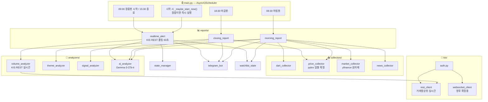

# 🇰🇷 한국주식 봇 — 아키텍처 설계 문서 v3.0

> **이 문서의 목적**: AI에게 유지보수 요청 시 반드시 이 문서를 첨부할 것.
> AI가 전체 구조를 파악하고 엉뚱한 파일을 건드리는 할루시네이션을 방지한다.

---

## 🚨 KIS WebSocket 운영 규칙 (위반 시 IP·앱키 차단)

> **출처**: 한국투자증권 Open API 공식 공지  
> **위반 결과**: IP 및 앱키 일시 차단 → 봇 전체 중단

### ✅ 정상 사용 흐름 (반드시 이 순서 준수)

```
연결 → 종목 구독 → 데이터 수신 → 불필요 종목 구독해제 → 연결 종료
```

### ❌ 절대 금지 패턴 (차단 대상)

```
비정상 케이스 1: 웹소켓 연결 후 종료를 바로 반복
   → websocket_client.py는 장 시작(09:00)에 한 번만 연결
     장 마감(15:30)에 한 번만 종료

비정상 케이스 2: 구독 후 수신 검증 없이 무한 등록/해제 반복
   → 종목 구독 후 반드시 ack 수신 확인 절차 포함
   → 구독/해제를 루프로 반복하는 코드 절대 금지
```

### kis/websocket_client.py 필수 구현 규칙

```python
class KISWebSocketClient:
    def __init__(self):
        self.connected = False
        self.subscribed_tickers = set()

    async def connect(self):
        if self.connected: return   # 이미 연결 시 즉시 return

    async def subscribe(self, ticker):
        if ticker in self.subscribed_tickers: return   # 중복 구독 금지
        await self._wait_for_ack(ticker)               # ack 대기 필수
        self.subscribed_tickers.add(ticker)

    async def disconnect(self):
        for ticker in list(self.subscribed_tickers):   # 전체 해제 후 종료
            await self.unsubscribe(ticker)
```

> **v2.5+ 참고**: 장중봇(realtime_alert.py)은 KIS WebSocket 미사용.
> KIS REST 거래량 순위 API 폴링 방식. websocket_client.py는 향후 확장용 보존.

---

## 📁 전체 파일 구조

```
korea_stock_bot/
│
├── ARCHITECTURE.md          ← 이 문서 (AI 유지보수 시 필수 첨부)
├── .env                     ← API 키 모음 (절대 공유 금지)
├── main.py                  ← AsyncIOScheduler 진입점 + 장중 재시작 감지
├── config.py                ← 모든 설정값 상수
├── requirements.txt
│
├── collectors/
│   ├── dart_collector.py    ← DART 공시 수집
│   ├── price_collector.py   ← pykrx 일별 확정 데이터 (마감 후 전용)
│   ├── market_collector.py  ← 미국증시(yfinance), 원자재
│   └── news_collector.py    ← 리포트·뉴스 (네이버 검색 API)
│
├── analyzers/
│   ├── volume_analyzer.py        ← 장중 급등 감지 (KIS REST 실시간) + T2 갭상승
│   ├── theme_analyzer.py         ← 테마 그룹핑, 순환매 소외도
│   ├── signal_analyzer.py        ← 신호 1~5
│   ├── ai_analyzer.py            ← Gemma-3-27b-it 2차 분석
│   ├── closing_strength.py       ← [v3.2] T5 마감 강도 트리거 (마감봇용, pykrx)
│   ├── volume_flat.py            ← [v3.2] T6 횡보 거래량 급증 (마감봇용, pykrx)
│   └── fund_inflow_analyzer.py   ← [v3.2] T3 시총 대비 자금유입 (마감봇용, pykrx)
│
├── notifiers/
│   └── telegram_bot.py      ← 텔레그램 포맷 + 발송
│
├── reports/
│   ├── morning_report.py    ← 아침봇 08:30
│   ├── closing_report.py    ← 마감봇 18:30
│   └── realtime_alert.py    ← 장중봇 (KIS REST 폴링 60초)
│
├── kis/
│   ├── auth.py              ← 토큰 발급·갱신
│   ├── websocket_client.py  ← 향후 확장용 보존 (현재 미사용)
│   └── rest_client.py       ← 현재가, 거래량 순위 조회
│
└── utils/
    ├── logger.py
    ├── date_utils.py        ← is_market_open() 포함
    ├── state_manager.py     ← 쿨타임·중복 알림 방지
    ├── watchlist_state.py   ← 아침봇↔장중봇↔마감봇 WebSocket 워치리스트 공유 (v3.1/v3.2)
    └── rate_limiter.py      ← [v3.2] KIS API Rate Limiter (초당 19회 제한)
```

---

## 🔗 파일 의존성 지도

```
파일명                     → 영향받는 파일
─────────────────────────────────────────────────────────────
config.py                 → 모든 파일
date_utils.py             → dart_collector, morning_report, closing_report, main
watchlist_state.py        → morning_report (write), realtime_alert (read)
state_manager.py          → realtime_alert
dart_collector.py         → morning_report, signal_analyzer
price_collector.py        → closing_report, morning_report, signal_analyzer
market_collector.py       → morning_report, signal_analyzer
news_collector.py         → morning_report, signal_analyzer
volume_analyzer.py        → realtime_alert
theme_analyzer.py         → closing_report, morning_report
signal_analyzer.py        → morning_report
ai_analyzer.py            → morning_report, closing_report, realtime_alert
telegram_bot.py           → morning_report, closing_report, realtime_alert
kis/auth.py               → kis/rest_client, kis/websocket_client
kis/rest_client.py        → volume_analyzer (거래량 순위 + 등락률 순위 + 시가 제공)
kis/websocket_client.py   → (향후 확장용 보존)
utils/rate_limiter.py     → kis/rest_client (API 호출 보호)
analyzers/closing_strength.py → reports/closing_report (T5 마감 강도)
analyzers/volume_flat.py  → reports/closing_report (T6 횡보 거래량)
analyzers/fund_inflow_analyzer.py → reports/closing_report (T3 시총 자금유입)
```

---

## 🗺️ 시스템 흐름도



---

## ⏱️ 봇별 실행 타임라인

```
[컨테이너 시작 시]
    _maybe_start_now() 즉시 호출
    → 현재 시각 09:00~15:30 AND 개장일 → start_realtime_bot() 즉시 실행
    → 그 외 시간 → 대기 (cron 스케줄에 위임)

07:00  KIS 토큰 갱신

08:30  ─── 아침봇 ────────────────────────────────────────────
       ① is_market_open() 확인
       ② dart_collector → 전날 공시
       ③ market_collector → 미국증시·원자재
       ④ news_collector → 리포트
       ⑤ price_collector → 전날 가격·수급 (pykrx 확정치)
       ⑥ signal_analyzer → 신호 1~5
       ⑦ ai_analyzer.analyze_dart()
       ⑧ theme_analyzer
       ⑨ morning_report 조립
       ⑩ telegram_bot 발송

09:00  ─── 장중봇 시작 ──────────────────────────────────────
       (컨테이너가 이미 장중에 있으면 시작 시 즉시 실행됨)
       asyncio.create_task(_poll_loop()) 백그라운드 시작
       ↓ POLL_INTERVAL_SEC(60초)마다:
           volume_analyzer.poll_all_markets()
               [v2.9 듀얼 소스 병합]
               → KIS REST get_volume_ranking("J"/"Q") 거래량 순위 각 30종목
                   대형주·테마 대장주 포착 (거래량 많은 종목)
               → KIS REST get_rate_ranking("J"/"Q")   등락률 순위 각 최대 30종목
                   [v3.0 개편] 코스닥: 노이즈전부제외 / 코스피: 중형+소형합산
                   등락률 0~10% 구간만 → 초기 급등 조기 포착
                   종목코드 필드 버그 수정 (stck_shrn_iscd)
               → 종목코드 기준 중복 제거 → 최대 60종목 델타 감지
               [v2.8 델타 기준 감지]
               → 첫 사이클: 워밍업 (스냅샷 저장만, 알림 없음)
               → 이후 사이클: 직전 poll 대비 1분간 변화량 판단
                 Δ등락률 ≥ PRICE_DELTA_MIN(1%) AND Δ거래량 ≥ VOLUME_DELTA_MIN(5%)
                 × CONFIRM_CANDLES(2)회 연속 충족 → 알림
               → 알림 포맷: 감지소스 배지 표시 (📊거래량포착 / 📈등락률포착)
           → can_alert() 쿨타임 확인
           → 1차 알림 즉시 발송
           → ai_analyzer.analyze_spike() 비동기
           → 2차 AI 알림

15:30  ─── 장중봇 종료 ──────────────────────────────────────
       _poll_task.cancel()
       volume_analyzer.reset()
       state_manager.reset()

18:30  ─── 마감봇 ────────────────────────────────────────────
       price_collector → 마감 확정치
       ai_analyzer.analyze_closing()
       theme_analyzer → 순환매 지도
       [v3.2 추가] closing_strength → T5 마감 강도 상위 종목
       [v3.2 추가] volume_flat     → T6 횡보 거래량 급증 종목
       [v3.2 추가] fund_inflow_analyzer → T3 시총 대비 자금유입 종목
       [v3.2 추가] watchlist_state 보강: T5+T6 종목 → 내일 WebSocket 워치리스트 추가
       telegram_bot 발송 (T3/T5/T6 섹션 포함)

───────────────────── v3.1 방법B+A 하이브리드 ──────────────────────
08:30  아침봇 완료 후 ⑧ 추가:
       _build_ws_watchlist(price_data, signal_result)
         ① 전날 상한가 전체 (우선순위1)
         ② 전날 급등 상위 20 (우선순위2)
         ③ 기관 순매수 상위 10 (우선순위3)
         ④ 신호 관련종목 각 3개 (우선순위4)
       → 종목코드 기준 중복 제거 → 최대 50개 → watchlist_state 저장

09:00  장중봇 start() 에서 2개 Task 병렬 시작:

  [방법 B] WebSocket 고정 구독 (_ws_loop)
       ws_client.connect() → watchlist 50종목 subscribe (1회, 변경 없음)
       H0STCNT0 틱 수신 → volume_analyzer.analyze_ws_tick(tick, prdy_vol)
       조건: 누적 등락률 >= PRICE_CHANGE_MIN(3.0%)
       → 즉시(0초 지연) 알림

  [방법 A] REST 폴링 (_poll_loop) — 간격 30s→10s 단축
       기존 로직 동일 (Δ등락률+Δ거래량 기준)
       역할: 워치리스트 外 당일 신규 테마 종목 커버

  [쿨타임 공유] state_manager.can_alert() — WS/REST 공통 30분 쿨타임
       WS가 먼저 감지하면 REST는 30분간 같은 종목 알림 억제

15:30  ws_client.disconnect() → REST 폴링 cancel → watchlist_state.clear()
```

---

## 📦 파일별 핵심 규격

### config.py 상수 목록

```python
# v2.8: 델타 기준 (감지 조건)
PRICE_DELTA_MIN      = 1.0      # 1분간 최소 추가 등락률 (%)
VOLUME_DELTA_MIN     = 5        # 1분간 최소 추가 거래량 (전일 거래량 대비 %)
CONFIRM_CANDLES      = 2        # 연속 충족 횟수
POLL_INTERVAL_SEC    = 60       # KIS REST 폴링 간격 (초)
ALERT_COOLTIME_MIN   = 30       # 중복 알림 방지 쿨타임
WS_MAX_RECONNECT     = 3
WS_RECONNECT_DELAY   = 30

# deprecated v2.8 (하위 호환 보존만)
VOLUME_SPIKE_RATIO   = 10       # deprecated: 누적 거래량 배율
PRICE_CHANGE_MIN     = 3.0      # deprecated: 누적 등락률

# v3.2: KIS API Rate Limit (python-kis 스펙 참조)
KIS_RATE_LIMIT_REAL    = 19     # 초당 최대 호출 횟수 (실전)
KIS_RATE_LIMIT_VIRTUAL = 2      # 초당 최대 호출 횟수 (모의)
WS_RECONNECT_DELAY     = 5      # v3.2: 30초 → 5초 (무한 재연결 간격)

# v3.2: Phase 2 트리거 임계값
GAP_UP_MIN             = 1.0    # T2 갭업 최소 비율 (%)
CLOSING_STRENGTH_MIN   = 0.75   # T5 마감 강도 최소값 (0~1)
CLOSING_STRENGTH_TOP_N = 7
VOLUME_FLAT_CHANGE_MAX = 5.0    # T6 횡보 인정 등락률 절대값 상한 (%)
VOLUME_FLAT_SURGE_MIN  = 50.0   # T6 거래량 급증 최소 비율 (%)
VOLUME_FLAT_TOP_N      = 7
FUND_INFLOW_CAP_MIN    = 100_000_000_000  # T3 최소 시가총액 (1000억)
FUND_INFLOW_TOP_N      = 7
```

### 반환값 규격 (인터페이스 계약)

```python
# rest_client.get_volume_ranking(market_code) → list[dict]
{"종목코드": str, "종목명": str, "현재가": int,
 "등락률": float, "누적거래량": int, "전일거래량": int}

# volume_analyzer.poll_all_markets() → list[dict]
{"종목코드": str, "종목명": str, "등락률": float,
 "직전대비": float,               # v2.8 신규: 1분간 추가 상승률 (핵심)
 "거래량배율": float,             # v2.8 변경: 1분간 Δvol / 전일거래량
 "조건충족": bool, "감지시각": str,
 "감지소스": str}                 # v2.9: "volume"(거래량)|"rate"(등락률) / v3.2: "gap_up"(T2 갭상승)

# dart_collector.collect() → list[dict]
{"종목명": str, "종목코드": str, "공시종류": str,
 "핵심내용": str, "공시시각": str, "신뢰도": str, "내부자여부": bool}

# price_collector.collect_daily() → dict
{"date": str, "kospi": dict, "kosdaq": dict,
 "upper_limit": list, "top_gainers": list, "top_losers": list,
 "institutional": list, "short_selling": list,
 "by_name": dict, "by_code": dict, "by_sector": dict}

# ai_analyzer.analyze_spike() → dict
{"판단": str, "이유": str}   # 진짜급등 | 작전주의심 | 판단불가
```

### KIS REST API 구현 현황

```
tr_id            함수명                   용도
─────────────────────────────────────────────────
FHKST01010100    get_stock_price()        단일 종목 현재가
FHPST01710000    get_volume_ranking()     거래량 순위 (대형주·테마 대장주)
FHPST01700000    get_rate_ranking()       등락률 순위 (v2.9 신규 / v3.0 개편)
                                          코스닥: 모든 노이즈 제외, 등락률 0~10%
                                          코스피: 중형+소형 합산, 등락률 0~10%
```

### 데이터 소스 선택 기준

```
데이터 종류          소스        이유
─────────────────────────────────────────────────────────
장중 실시간 시세     KIS REST    지연 없음, 공식 API
일별 확정 OHLCV     pykrx       마감 후 확정치 전용
기관/외인 수급       pykrx       일별 집계, 장중 의미 없음
미국증시/원자재      yfinance    KIS 미제공 영역
공시                DART API    공식 전용
```

### AI 모델

```
gemma-3-27b-it  14,400회/일  ✅ 채택
gemini-2.5-flash   20회/일   ❌ 부족
```

---

## ⚠️ 절대 금지 규칙

```
[KIS WebSocket — 차단 위험]
1. websocket_client.py 연결/종료 루프 금지
2. 구독/해제 반복 루프 금지
3. ack 없는 구독 금지
4. 장중 connect() 여러 번 호출 금지

[아키텍처]
5. collectors/ 에 분석 로직 금지
6. telegram_bot.py 에 분석 로직 금지
7. 반환값 key 변경 시 의존성 지도 확인 후 연결 파일 동시 수정
8. config.py 변수명 변경 시 전체 영향 주의
9. ai_analyzer.py 에 수집/발송 로직 금지

[데이터 소스]
10. 장중 실시간 → KIS REST (pykrx 장중 사용 금지 — 15~20분 지연)
11. 일별 확정 데이터 → pykrx 사용 가능

[종목명 하드코딩 금지]
12. config.py 에 종목명 직접 쓰지 않음 (업종명 키워드만)
13. 대장주는 signal_analyzer가 by_sector에서 동적 결정

[Phase 2 트리거 규칙 — v3.2 추가]
14. T5(마감강도)/T6(횡보거래량)/T3(시총자금유입): 마감봇 전용 — pykrx 허용 (확정치)
15. T2(갭상승모멘텀): 장중봇 전용 — KIS REST 실시간만 (pykrx 장중 사용 금지)
16. T5/T6/T3 분석기는 closing_report.py 에서만 호출 (morning_report에서 호출 금지)
17. rate_limiter.acquire()는 kis/rest_client.py 내부에서만 호출 (외부에서 중복 호출 금지)
```

---

## 🔄 버전 관리

| 버전 | 날짜 | 변경 내용 |
|------|------|---------|
| v1.0 | 2026-02-24 | 최초 설계 |
| v1.1 | 2026-02-24 | AsyncIOScheduler, state_manager, ai_analyzer 추가 |
| v1.2 | 2026-02-24 | KIS WebSocket 차단 방지 규칙 추가 |
| v2.0 | 2026-02-25 | AI 엔진 교체: Claude → Gemma-3-27b-it |
| v2.1 | 2026-02-25 | 아침봇 독립화, 신호4, 섹터 ETF 연동 |
| v2.2 | 2026-02-25 | price_collector 등락률 0% 버그 수정 |
| v2.3 | 2026-02-25 | 종목 하드코딩 전면 제거, by_sector 동적 조회 |
| v2.4 | 2026-02-25 | 장중봇: KIS WebSocket → pykrx REST 폴링 구조 전환 |
| v2.5 | 2026-02-25 | 장중봇 데이터: pykrx(지연) → KIS REST(실시간) |
|      |            | rest_client: get_volume_ranking() 추가 (tr_id FHPST01710000) |
|      |            | volume_analyzer: pykrx 의존성 완전 제거 |
| v2.6 | 2026-02-25 | **장중 재배포/재시작 대응** |
|      |            | main.py: _maybe_start_now() 추가 |
|      |            | 시작 시 09:00~15:30 + 개장일이면 즉시 start_realtime_bot() 호출 |
|      |            | _realtime_started 플래그로 cron과 즉시 실행 중복 방지 |
| v2.7 | 2026-02-25 | **KIS volume-rank API 파라미터 버그 수정** |
|      |            | rest_client: FID_COND_MRKT_DIV_CODE 항상 "J" 고정 |
|      |            | 코스피/코스닥 구분: FID_INPUT_ISCD "0001"/"1001" 으로 전환 |
| v2.8 | 2026-02-25 | **장중봇 감지 방식 전면 전환 — 누적→델타** |
|      |            | volume_analyzer: _prev_snapshot 캐시 도입 |
|      |            | 감지 조건: 누적 등락률/거래량 → 1분간 변화량(Δ)으로 전환 |
|      |            | 첫 사이클=워밍업(알림없음), 이후 "지금 막 터지는" 종목만 포착 |
|      |            | 반환값: "직전대비" key 추가 (1분간 추가 상승률) |
|      |            | config: PRICE_DELTA_MIN(1%), VOLUME_DELTA_MIN(5%) 신규 추가 |
|      |            | telegram_bot: 알림 포맷에 "1분 +X.X%" 표시 추가 |
| v2.9 | 2026-02-25 | **장중봇 감지 커버리지 2배 확장 — 등락률 순위 API 병행** |
|      |            | rest_client: get_rate_ranking() 신규 (tr_id: FHPST01700000) |
|      |            | volume_analyzer: 거래량TOP30 + 등락률TOP30 병합, 중복제거 후 감지 |
|      |            | 소형주·디모아형(거래량 적음, 등락률 높음) 포착 가능 |
|      |            | 반환값: "감지소스" key 추가 ("volume" or "rate") |
|      |            | telegram_bot: 감지소스 배지 표시 (📊거래량포착 / 📈등락률포착) |
|      |            | API 호출: 사이클당 2회 → 4회 (분당 8회, KIS 제한 여유 있음) |
| v3.0 | 2026-02-25 | **등락률 순위 필터 전면 개편 — 초기 급등 조기 포착** |
| v3.1 | 2026-02-25 | **방법B+A 하이브리드 — WebSocket 고정구독 + REST 폴링 단축** |
| v3.2 | 2026-02-26 | **Phase 1+2 병렬 업그레이드 (python-kis + prism-insight 흡수)** |
|      |            | config: WS_WATCHLIST_MAX 50→40 (KIS 실제 한도, python-kis 확인) |
|      |            | utils/rate_limiter.py 신규: KIS API 초당 19회 제한 (python-kis 구조 이식) |
|      |            | kis/rest_client.py: rate_limiter.acquire() 전 API 호출 전 삽입 |
|      |            | kis/rest_client.py: get_stock_price()에 시가(stck_oprc) 필드 추가 (T2용) |
|      |            | kis/websocket_client.py: 무한 재연결 (MAX 3회 제한 제거, 5초 간격) |
|      |            | analyzers/closing_strength.py 신규: T5 마감 강도 (pykrx, 마감봇용) |
|      |            | analyzers/volume_flat.py 신규: T6 횡보 거래량 급증 (pykrx, 마감봇용) |
|      |            | analyzers/fund_inflow_analyzer.py 신규: T3 시총 대비 자금유입 (pykrx, 마감봇용) |
|      |            | analyzers/volume_analyzer.py: T2 갭 상승 모멘텀 감지 추가 (장중봇, KIS REST) |
|      |            | reports/closing_report.py: T3/T5/T6 분석 통합 + watchlist 마감봇 보강 |
|      |            | notifiers/telegram_bot.py: gap_up 배지 + T5/T6/T3 마감 리포트 섹션 추가 |
|      |            | 감지소스 확장: volume/rate/websocket/gap_up 4종 체계 완성 |
|      |            | utils/watchlist_state.py 신규 — 아침봇→장중봇 공유 상태 |
|      |            | morning_report: _build_ws_watchlist() 추가 (상한가+급등+기관+신호) |
|      |            | realtime_alert: _ws_loop() 추가 (방법B), POLL_INTERVAL_SEC 10s |
|      |            | volume_analyzer: analyze_ws_tick() 추가 (누적 등락률 기준) |
|      |            | websocket_client: _parse_tick() 필드 수정 ([12]→[5] 등락률, [13] 누적거래량) |
|      |            | config: POLL_INTERVAL_SEC 30→10, WS_WATCHLIST_MAX=50 추가 |
|      |            | config: PRICE_CHANGE_MIN deprecated→WebSocket 감지 임계값으로 재활성 |
|      |            | telegram_bot: "websocket" 소스 배지 추가 (🎯 워치리스트) |
|      |            | rest_client: get_rate_ranking() 개편 |
|      |            | 종목코드 필드 버그 수정: mksc_shrn_iscd → stck_shrn_iscd |
|      |            | 코스닥(Q): 모든 노이즈 제외 (FID_TRGT_EXLS_CLS_CODE="1111111") |
|      |            | 코스피(J): 중형+소형 2회 호출 합산 → 대형주 실질 제외 |
|      |            | 등락률 범위 0~10% (FID_RSFL_RATE2="10") — 상한가 전 초기 급등 포착 |
|      |            | FID_COND_MRKT_DIV_CODE 항상 "J" 고정 (rate API도 통일) |
|      |            | 내부 헬퍼 _fetch_rate_once() 분리 |

---

## 📋 환경변수 목록 (.env)

```bash
# 필수
TELEGRAM_TOKEN=
TELEGRAM_CHAT_ID=
DART_API_KEY=

# 권장
GOOGLE_AI_API_KEY=
NAVER_CLIENT_ID=
NAVER_CLIENT_SECRET=

# 장중봇 필수
KIS_APP_KEY=
KIS_APP_SECRET=
KIS_ACCOUNT_NO=
KIS_ACCOUNT_CODE=01
```

*v3.0 | 2026-02-25 | 등락률 순위 필터 전면 개편: 코스닥 노이즈제외 / 코스피 중형+소형 / 0~10% 구간*
